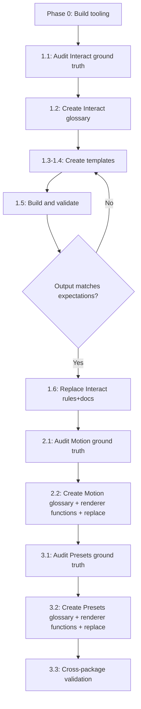

# Context SSOT Restructure

## Motivation and Idea

### The problem

This monorepo publishes three packages (`@wix/interact`, `@wix/motion`, `@wix/motion-presets`) alongside context files designed for two audiences: **LLM-facing rules** (so AI agents can correctly integrate the packages) and **human-facing docs** (for developer onboarding and reference). Today these context files suffer from five interconnected problems:

1. **Multiple contradicting sources of truth.** The same concept is described in different files with different phrasing, different defaults, and sometimes outright conflicting claims. For example, `allowA11yTriggers` defaults to `false` in one file and `true` in another; `ParallaxScroll` accepts a `speed` param in docs but the code uses `parallaxFactor`; trigger counts vary between 7, 8, and 9 depending on which file you read. A deep audit found **8 critical discrepancies** where docs would cause broken integrations, and **10 more significant ones**.
2. **No common structure.** Each package organizes its context differently. Interact has flat trigger-specific rule files plus two overlapping hub files; Motion has no rules at all; Motion-Presets has YAML-frontmatter rule files split by category. The docs folders vary in depth, naming, and section layout. There is no template or convention that applies across packages.
3. **Stale or incorrect information.** Defaults, param names, return types, and API signatures in the context files do not match the current implementation. There is no mechanism to detect this drift.
4. **Heavy repetition.** FOUC prevention is explained in 6 different files; element resolution order appears in 4; entry-point setup is repeated across every package's getting-started material. Each copy drifts independently.
5. **Broken links and scaffolding.** Over 36 internal links point to files that do not exist. Multiple sections are marked "TBD". README index pages link to planned-but-never-written guides. This erodes trust in the documentation for both humans and LLMs.

Together, these create a **continuous development problem**: making any change to the context requires touching many files across multiple directories, producing large PRs that are hard to review and prone to introducing new inconsistencies. The cost of keeping context accurate compounds over time.

### The idea

Replace the current ad-hoc markdown files with a **structured, build-based system** where:

- **Each piece of information is defined once** in a YAML glossary file (one per package). The glossary holds the data that is most prone to going stale: parameter names and types, default values, API signatures, term definitions (with separate LLM and human phrasings), and known caveats.
- **Markdown template files** provide the document structure and prose. They contain markers (e.g., `{{term:trigger-viewEnter.params-table}}`) where glossary data should be injected. Templates are authored separately for rules (compact, LLM-optimized) and docs (narrative, human-friendly).
- **A lightweight build script** reads the glossary and templates, performs marker replacement, and writes the final `rules/` and `docs/` output files.
- **A validation script** checks glossary entries against TypeScript source code, catching drift before it reaches the published context.

This means:

- Changing a default value or param name is a **one-line YAML edit** that propagates everywhere.
- Rules and docs always agree because they draw from the same data.
- The validation script catches code-vs-context drift in CI.
- Each package follows the same structure, making the system predictable and reviewable.

### Why YAML for the glossary

The glossary contains prose-heavy entries (descriptions, caveats) that humans will frequently hand-edit. YAML supports multi-line strings and inline comments natively, which makes authoring and PR review substantially easier than JSON. The motion-presets rules already use YAML frontmatter, so the pattern is familiar in this repo. Since the build script parses YAML into a plain JS object, switching to JSON later would be a trivial change.

### Sequencing

The migration is designed to proceed **one package at a time** (Interact, then Motion, then Motion-Presets), with each package's old context files replaced only after the new mechanism is fully built, validated, and reviewed. This keeps PRs scoped and reviewable, and ensures no package is left in a half-migrated state.

---

## Audit Findings (Baseline)

This section captures the findings from the deep analysis of all 72 context files across the three packages and their comparison against source code. These findings serve as the ground truth for the migration.

### Current State Inventory

**File counts:**

| Package                                | `rules/` files | `docs/` files | Total  |
| -------------------------------------- | -------------- | ------------- | ------ |
| Interact (`@wix/interact`)             | 7              | 26            | 33     |
| Motion (`@wix/motion`)                 | 0              | 20            | 20     |
| Motion-Presets (`@wix/motion-presets`) | 5              | 14            | 19     |
| **Total**                              | **12**         | **60**        | **72** |

**Structural asymmetry:**

- **Interact** has both `rules/` (flat trigger-focused files: `click.md`, `hover.md`, `viewenter.md`, `viewprogress.md`, `pointermove.md`, plus two hub files `full-lean.md` at 692 lines and `integration.md` at 329 lines) and `docs/` (nested into `guides/`, `api/`, `examples/`, `integration/`, `advanced/`).
- **Motion** has only `docs/` (nested into `api/`, `categories/`, `guides/`, `examples/`) plus a stale internal `PLAN_DOCS.md`. No `rules/` directory exists at all.
- **Motion-Presets** has both `rules/` (5 files under `presets/` with YAML frontmatter, split by category) and `docs/` (14 files nested per category with individual preset pages).

**Existing patterns for selective LLM reading:**

- Interact rules: `## Table of Contents` with `#anchor` links; `---` thematic breaks between sections; no YAML frontmatter.
- Motion-Presets rules: YAML frontmatter with `name`/`description` (agent-loading hints); per-file TOCs down to per-preset anchors.
- Typical file sizes: 190-280 lines for single-trigger interact docs, 330 lines for integration hub, 690 lines for `full-lean`, 210-398 lines for presets rule files.

### Discrepancies: Docs/Rules vs Code

#### Critical (would cause broken integrations if an LLM follows the docs)

| #   | Topic                         | What docs/rules say                                                                                               | What the code does                                                                               | Source files                                                      |
| --- | ----------------------------- | ----------------------------------------------------------------------------------------------------------------- | ------------------------------------------------------------------------------------------------ | ----------------------------------------------------------------- |
| 1   | `allowA11yTriggers` default   | `rules/integration.md`: **false**; `docs/api/types.md`: **true**                                                  | Code: **true** -- `click` auto-maps to `activate`, `hover` to `interest`                         | `src/handlers/index.ts`                                           |
| 2   | `ParallaxScroll` param name   | All docs consistently use `**speed`\*\*                                                                           | Code: `**parallaxFactor`\*\* (default `0.5`)                                                     | `motion-presets/src/library/scroll/ParallaxScroll.ts`, `types.ts` |
| 3   | `Pulse` intensity default     | `docs/ongoing/pulse.md`: **1.0**                                                                                  | Code: **0**                                                                                      | `motion-presets/src/library/ongoing/Pulse.ts`                     |
| 4   | `ArcIn` default direction     | **RESOLVED in rules** (`entrance-presets.md` now states `'right'`). `docs/entrance/arc-in.md` still needs update. | Code: `**'right'`\*\*                                                                            | `motion-presets/src/library/entrance/ArcIn.ts`                    |
| 5   | `namedEffect` shape           | Many docs use bare string: `namedEffect: 'FadeIn'`                                                                | Code requires object: `namedEffect: { type: 'FadeIn' }`                                          | `motion/src/api/common.ts` `getNamedEffect`                       |
| 6   | `getCSSAnimation` return type | `api/core-functions.md`, `performance.md`: **string**                                                             | Code: **array of objects** `({ target, animation, keyframes, ... })`                             | `motion/src/api/cssAnimations.ts`                                 |
| 7   | `AnimationEndParams.effectId` | Typed and documented as wiring mechanism                                                                          | Handler **ignores it** (`__` param)                                                              | `interact/src/handlers/animationEnd.ts`                           |
| 8   | `viewProgress` params         | `api/types.md` maps `viewProgress: ViewEnterParams`                                                               | Handler ignores those params; scroll options come from `Interact.setup({ scrollOptionsGetter })` | `interact/src/handlers/viewProgress.ts`                           |

#### Significant (causes confusion, may lead to subtle bugs)

| #   | Topic                                   | Discrepancy                                                                                                                                                                                                                                                                                                                                                                                                                                                                                     |
| --- | --------------------------------------- | ----------------------------------------------------------------------------------------------------------------------------------------------------------------------------------------------------------------------------------------------------------------------------------------------------------------------------------------------------------------------------------------------------------------------------------------------------------------------------------------------- |
| 9   | Sticky/tall-wrapper ViewTimeline source | `viewprogress.md` Rule 3: `key` on tall wrapper = source. `full-lean.md`: sticky child = source. Contradicts itself.                                                                                                                                                                                                                                                                                                                                                                            |
| 10  | Trigger taxonomy undocumented           | No file explains the trigger taxonomy. Counts vary (7 or 9) because `activate`/`interest` are a11y variants (not independent user triggers) and `pageVisible` is deprecated. The correct framing: **6 primary user-facing triggers** (hover, click, viewEnter, viewProgress, pointerMove, animationEnd) + 2 a11y variants (activate, interest) enabled by `allowA11yTriggers: true`. `guides/README.md`'s "7" and `understanding-triggers.md`'s "9" are both partially correct but unexplained. |
| 11  | `pageVisible` trigger                   | **Soon to be deprecated.** Currently absent from most trigger tables; only in `api/types.md`. Uses viewEnter's IntersectionObserver handler. Docs should note deprecation status and point to `viewEnter` as the replacement.                                                                                                                                                                                                                                                                   |
| 12  | Ongoing preset count                    | `presets-main.md`: **RESOLVED** (now correctly lists 13). `docs/presets/README.md`: still says 16. Barrel exports: **13**; DVD exists but is not barrel-exported.                                                                                                                                                                                                                                                                                                                               |
| 13  | Total documented preset count           | `docs/presets/README.md`: "82+"; `README.md` (package root): **62** (19+19+13+11, bg-scroll and CustomMouse intentionally excluded). Barrel exports: 75 (includes 12 bg-scroll and CustomMouse). **Background-scroll (12) is intentionally excluded (not production-ready). CustomMouse is intentionally excluded (internal use for `customEffect`).** `docs/presets/README.md`'s "82+" figure is the remaining wrong value.                                                                    |
| 14  | **RESOLVED** Angle convention           | ~~`presets-main.md`: 0 = right; `_template.md`: 0 = up.~~ `presets-main.md` now correctly documents 0° = right throughout.                                                                                                                                                                                                                                                                                                                                                                      |
| 15  | `customEffect` signature                | Varies: 2-arg in rules, 3-arg in some docs. Actual depends on context (time: `progress` number; pointer: `Progress { x, y, v, active }`)                                                                                                                                                                                                                                                                                                                                                        |
| 16  | `TurnScroll.rotation` param             | Typed in `types.ts` but **ignored** in implementation (fixed +/-45deg)                                                                                                                                                                                                                                                                                                                                                                                                                          |
| 17  | `ParallaxScroll.range` param            | Typed but **unused** in `ParallaxScroll.ts` implementation                                                                                                                                                                                                                                                                                                                                                                                                                                      |
| 18  | `generate-llms.mjs` trigger list        | `scripts/generate-llms.mjs` `STATIC_BODY` hardcodes "**Five trigger types**: hover, click, viewEnter, viewProgress, pointerMove" — `animationEnd` is missing. This string is published to `llms.txt` via CI and directly misleads LLMs. Should become "Six primary trigger types: hover, click, viewEnter, viewProgress, pointerMove, animationEnd — plus accessible variants activate and interest."                                                                                           |

#### Minor (quality / completeness)

| #   | Topic                                                                                                                                                               |
| --- | ------------------------------------------------------------------------------------------------------------------------------------------------------------------- |
| 19  | **36+ broken internal links** across all packages: references to nonexistent files like `testing.md`, `performance.md`, `playground/`, `scroll-animations.md`, etc. |
| 20  | **5+ TBD placeholder sections** in interact docs (`configuration-structure`, `effects-and-animations`, `state-management`, `lists`, `custom-elements`)              |
| 21  | **Code typos in docs**: `sytle`, `hitAea`, `docuement`, `getScrgetWebAnimationubScene`, truncated/invalid snippets                                                  |
| 22  | **RESOLVED** `unit` vs `type` for length objects: `presets-main.md` now consistently uses `{ value, unit: 'px' }` throughout.                                       |
| 23  | `Interact.getElement` referenced in docs but does not exist as a public API                                                                                         |

### Repetition Analysis

The same information is repeated across multiple files with inconsistent phrasing:

| Concept                                  | Files that describe it                                                                                                                                                | Copies                    |
| ---------------------------------------- | --------------------------------------------------------------------------------------------------------------------------------------------------------------------- | ------------------------- |
| FOUC prevention (`generate` + `initial`) | `rules/integration.md`, `rules/viewenter.md`, `rules/full-lean.md`, `docs/api/functions.md`, `docs/examples/entrance-animations.md`, `docs/guides/getting-started.md` | 6                         |
| Element resolution order                 | `rules/integration.md`, `rules/full-lean.md`, `docs/api/element-selection.md`, `docs/guides/configuration-structure.md`                                               | 4                         |
| Entry-point setup                        | `rules/integration.md`, `docs/README.md`, `docs/guides/getting-started.md`, `docs/integration/react.md`                                                               | 4                         |
| Trigger inventory table                  | `rules/full-lean.md`, `rules/integration.md`, `docs/guides/understanding-triggers.md`, `docs/api/types.md`                                                            | 4 (with different counts) |
| `registerEffects` usage                  | motion `docs/getting-started.md`, interact `rules/integration.md`, presets `docs/presets/README.md`, presets `rules/presets-main.md`                                  | 4                         |
| Scroll range semantics                   | interact `rules/viewprogress.md`, presets `rules/scroll-presets.md`, motion `docs/core-concepts.md`, presets `docs/scroll/README.md`                                  | 4                         |
| Stagger/sequence formula                 | motion `docs/core-concepts.md`, `docs/api/sequence.md`, `docs/api/get-sequence.md`, interact `docs/guides/sequences.md`                                               | 4                         |
| Reduced motion / a11y                    | Described independently across ~8 files in all three packages                                                                                                         | ~8                        |

### Verified Ground Truth: What Each Package Actually Contains

#### `@wix/interact` -- Declarative Interaction Layer

**Entry points:** `@wix/interact` (vanilla), `@wix/interact/react`, `@wix/interact/web`

**Exports:**

- `Interact` class (static + instance API)
- Functions: `add`, `remove`, `generate`
- React: `Interaction` component, `createInteractRef`
- Web: `InteractElement` custom element (registered via `Interact.defineInteractElement`)

**Config schema (`InteractConfig`):** `{ effects: Record<string, Effect>, interactions: Interaction[], sequences?: Record<string, SequenceConfig>, conditions?: Record<string, Condition> }`

**Trigger taxonomy (9 members in `TriggerType` union, but distinct roles):**

- **6 primary user-facing triggers:** `hover`, `click`, `viewEnter`, `viewProgress`, `pointerMove`, `animationEnd` — these are the triggers users configure directly
- **2 a11y variant triggers:** `activate` (accessible version of `click`: adds `keydown`), `interest` (accessible version of `hover`: adds `focusin`/`focusout`) — enabled transparently by `allowA11yTriggers: true`; users do not configure them directly
- **1 deprecated trigger:** `pageVisible` — soon to be removed; currently shares the IntersectionObserver handler with `viewEnter`; documentation should note deprecated status and point to `viewEnter` as the replacement

**Handler mappings (from `handlers/index.ts`):**

- `viewEnter`, `pageVisible` (deprecated) -> IntersectionObserver handler
- `hover` -> `mouseenter`/`mouseleave`; when `allowA11yTriggers: true`, remaps to `interest` handler
- `click` -> `['click']`; when `allowA11yTriggers: true`, remaps to `activate` handler
- `activate` (a11y variant) -> `['click', 'keydown']`
- `interest` (a11y variant) -> enter: `mouseenter`+`focusin`, leave: `mouseleave`+`focusout`
- `animationEnd` -> listens on source `animationend`, plays on target
- `viewProgress` -> ViewTimeline scrub or `getScrubScene` fallback
- `pointerMove` -> `getScrubScene` + pointer library

**3 effect types:** `TimeEffect` (has `duration`), `ScrubEffect` (has `rangeStart`/`rangeEnd`), `StateEffect` (has `transition`/`transitionProperties`)

`triggerType` values: `'once' | 'repeat' | 'alternate' | 'state'`; defaults: `'once'` for viewEnter/animationEnd (and deprecated pageVisible), `'alternate'` for hover/click/activate/interest

`**stateAction` values:\*\* `'add' | 'remove' | 'toggle' | 'clear'`; default: `'toggle'`

**Condition types:** `'media' | 'container' | 'selector'` only (no `'custom'`)

**Key param defaults:**

- `ViewEnterParams.threshold`: `0.2`
- `PointerMoveParams.axis`: `'y'`
- `PointerMoveParams.hitArea`: undefined (covers document body)

#### `@wix/motion` -- Core Animation Engine

**Exported functions:** `getWebAnimation`, `getScrubScene`, `getCSSAnimation`, `prepareAnimation`, `getElementCSSAnimation`, `getElementAnimation`, `getSequence`, `createAnimationGroups`, `registerEffects`

**Exported utilities:** `getCssUnits`, `getEasing`, `getJsEasing`, all Penner-style easings + `jsEasings`/`cssEasings` maps

**Type-only exports (not constructable):** `AnimationGroup`, `Sequence`

**Key behaviors:**

- `getAnimation` (internal, used by interact): chooses CSS path (if preset has `style`) or WAAPI path (`getWebAnimation`)
- `getCSSAnimation` returns array of CSS rule descriptor objects, not a string
- ViewTimeline: native (`window.ViewTimeline`) with `duration: 'auto'`; fallback: `duration: 99.99` with manual scrub via `getScrubScene`
- Pointer: without keyframes uses factory `MouseAnimationInstance`; with keyframes uses `AnimationGroup.progress()`
- `registerEffects(effects)` merges into internal registry; presets resolve by `namedEffect.type` string
- `fastdom` used for DOM batching (measure/mutate), not re-exported

`**AnimationGroup` API:\*\* `play`, `pause`, `reverse`, `cancel`, `progress(p)`, `setPlaybackRate`, `getProgress`, `onFinish`, `ready`, `finished`, `playState`

`**Sequence`:\*_ extends `AnimationGroup`; stagger formula: `offset[i] = easing(i / last) _ last \* offsetMs`(integer-truncated); supports`addGroups`/`removeGroups`

`**RangeOffset` names:\*\* `'entry' | 'exit' | 'contain' | 'cover' | 'entry-crossing' | 'exit-crossing'`

#### `@wix/motion-presets` -- Ready-Made Effects

**5 categories, 75 barrel-exported presets. Production-facing (documented in rules and docs): 62 across 4 categories.**

Intentional exclusions from documentation:

- **Background-scroll (12):** Not production-ready. Present in barrel but excluded from all rules and docs.
- **`CustomMouse` (1):** Internal use only (for `customEffect`). Present in barrel but excluded from rules and docs.

**Entrance (19):** ArcIn, BlurIn, BounceIn, CurveIn, DropIn, ExpandIn, FadeIn, FlipIn, FloatIn, FoldIn, GlideIn, RevealIn, ShapeIn, ShuttersIn, SlideIn, SpinIn, TiltIn, TurnIn, WinkIn

**Scroll (19):** ArcScroll, BlurScroll, FadeScroll, FlipScroll, GrowScroll, MoveScroll, PanScroll, ParallaxScroll, RevealScroll, ShapeScroll, ShuttersScroll, ShrinkScroll, SkewPanScroll, SlideScroll, Spin3dScroll, SpinScroll, StretchScroll, TiltScroll, TurnScroll

**Ongoing (13):** Bounce, Breathe, Cross, Flash, Flip, Fold, Jello, Poke, Pulse, Rubber, Spin, Swing, Wiggle (DVD exists but is NOT barrel-exported)

**Mouse (11 documented, 12 exported):** AiryMouse, BlobMouse, BlurMouse, BounceMouse, ScaleMouse, SkewMouse, SpinMouse, SwivelMouse, Tilt3DMouse, Track3DMouse, TrackMouse (CustomMouse excluded from docs — internal)

**Registration:** `registerEffects` is in `@wix/motion`, not in this package. Presets are plain modules keyed by `namedEffect.type`. Typical usage: `registerEffects({ FadeIn, ParallaxScroll, ... })`.

**Preset module shapes:** namespace with `web`/`style`/`getNames` (most), mouse presets export `create` factories, some presets have `prepare` (background-scroll).

**Shared params:** All mouse presets share `inverted?: boolean` (default `false`). Scroll presets support `range?: 'in' | 'out' | 'continuous'` (default varies per preset). Ongoing presets support `iterationDelay?: number` (default `0`).

**Angle convention in code:** 0 = right, counterclockwise increases (90 = top).

**Known type-vs-implementation mismatches in presets:**

- `TurnScroll.rotation`: typed but ignored (fixed +/-45deg)
- `ParallaxScroll.range`: typed but unused
- `DVD`: typed and implemented but not barrel-exported

### Cross-Package Shared Concepts (need SSOT)

| Concept                                                | Owner (should be SSOT) | Referenced by     |
| ------------------------------------------------------ | ---------------------- | ----------------- |
| `registerEffects` API                                  | motion                 | interact, presets |
| `AnimationGroup` / `Sequence` types                    | motion                 | interact          |
| `namedEffect` shape (`{ type: '...' }`)                | motion                 | interact, presets |
| Scroll ranges (`RangeOffset`, range names)             | motion                 | interact, presets |
| Pointer progress (`Progress { x, y, v, active }`)      | motion                 | interact, presets |
| `EffectScrollRange` (`in`/`out`/`continuous`)          | presets                | presets only      |
| Direction type families (`EffectFourDirections`, etc.) | presets                | presets only      |
| Easing values (CSS + JS)                               | motion                 | interact, presets |
| `prefers-reduced-motion` pattern                       | interact               | motion, presets   |
| Length/unit convention (`{ value, unit }`)             | motion                 | presets           |

### Build and Test Infrastructure (Existing)

- **Monorepo:** Yarn 4 workspaces, no Turbo/Nx
- **Build:** Vite for library bundles, `tsc` for types
- **Unit tests:** Vitest in all three packages (`jsdom` environment for interact)
- **E2E:** Playwright exists for `@wix/motion` only (`packages/motion/e2e/`). Interact has a CI workflow referencing Playwright but no actual Playwright config or tests.
- **Docs deployment:** `apps/docs` copies `packages/interact/docs` into Vite dist via `apps/docs/scripts/copy-docs.js`. Rules are served raw from the docs app under `/rules/`.
- **LLM context generation:** `scripts/generate-llms.mjs` (207 lines, plain ESM, zero deps) reads all `.md` files in `packages/interact/rules/`, generates `llms.txt` and `llms-full.txt` at repo root and copies `llms.txt` into `packages/interact/`. Wired to a `generate:llms` root script and used by CI workflows (`interactdocs.yml`, `preview-llms.yml`). **Any structural change to interact rules must remain compatible with this script.** Note: this script's static body currently says "Five trigger types" — see discrepancy #18.
- **No existing codegen, templating, or doc validation tooling** in the repo beyond `generate-llms.mjs`.

---

## Recommendation: Glossary Format

Use **YAML data files for structured/verifiable data** (parameter tables, defaults, type signatures, term definitions). A lightweight Node.js build script turns YAML into final `rules/` output (fully generated) and injects structured sections into hand-authored `docs/` files.

Why YAML for the data layer:

- Machine-parseable: the Vitest audit tests can import YAML and assert values match source
- Maps naturally to the structured data already present in current rules (param tables, trigger maps, preset catalogs)
- motion-presets rules already use YAML frontmatter, so the pattern is familiar
- Prose stays in markdown where it belongs — the YAML only holds data that is prone to going stale

Why **no template files and no marker syntax:**

- The existing motion-presets rules files already have a fixed, completely regular structure: frontmatter → H1 → intro → TOC → per-item sections (visual description, params, code example). This structure is the same for every category file.
- Encoding that layout as **renderer functions** in the build script (`renderPresetCategoryFile`, `renderTriggerFile`, etc.) is simpler and more maintainable than maintaining a separate template file per output file.
- No custom template syntax to parse; no marker replacement logic; the build script is plain string-building, following the same style as the existing `generate-llms.mjs`.
- For `docs/`, structured sections (param tables, API signatures) are injected between HTML comment markers (`<!-- PARAMS:START -->` / `<!-- PARAMS:END -->`). All prose outside the markers is hand-authored and untouched by the build script.

---

## Directory Structure (per package)

```
packages/<pkg>/
  context/                          # NEW - single source of truth
    glossary.yaml                   # All terms, params, defaults, descriptions
  rules/                            # OUTPUT - fully generated from glossary.yaml
  docs/                             # HAND-AUTHORED - structured sections injected from glossary.yaml
    guides/
    api/
    ...
```

A shared build script lives at the monorepo root:

```
scripts/
  build-context.js                  # Reads glossary YAML, renders rules/ (full), injects into docs/ (partial)
  generate-llms.mjs                 # EXISTING - reads interact rules/, generates llms.txt + llms-full.txt
```

No `templates/` directory. The output layout for `rules/` files is encoded as renderer functions inside `build-context.js`.

> **Gitignore strategy:** Commit the generated `rules/` output and have CI verify it matches the source by running `build-context.js` and checking `git diff --exit-code`. This is the same pattern as lockfiles and avoids a pre-publish build step. The `docs/` files are always committed as they are hand-authored.

---

## Glossary YAML Schema

Each `glossary.yaml` contains entries like:

```yaml
terms:
  - id: trigger-viewEnter
    name: viewEnter
    category: trigger # trigger | effect-type | config | api | concept | preset
    description: 'Fires when element crosses viewport threshold via IntersectionObserver.'
    params:
      - name: threshold
        type: number
        default: 0.2
        description: 'Fraction of element that must be visible'
      - name: inset
        type: string
        default: null
        description: 'Mapped to IntersectionObserver rootMargin'
    caveats:
      - "Same source+target: only triggerType 'once' is reliable"
    sourceFile: src/types/triggers.ts # used by Vitest audit tests
    related: [concept-fouc]
```

Presets get a `presets` section (motion-presets only) with the same structure but preset-specific fields (`category: entrance|scroll|ongoing|mouse`, `visual`, `example`, etc.).

> **Implementation note:** The exact YAML schema should be finalized during the Interact package phase after the full audit confirms which fields are actually needed. The schema above is a starting point. A single `description` field is used — the output format (compact rules vs. narrative docs) provides audience differentiation, not the data layer.

---

## Build Script Behavior

`scripts/build-context.js` uses two distinct strategies for its two output targets:

**For `rules/` (fully generated):**

1. For a given package, reads `context/glossary.yaml`
2. Calls a renderer function for each output file — e.g., `renderPresetCategoryFile(entries)`, `renderTriggerFile(entries)`, `renderOverviewFile(data)`
3. Each renderer function builds a complete markdown string using the **fixed layout already established by the existing rules files** (frontmatter → H1 → intro → TOC → per-item sections)
4. Writes output files to `rules/`

No template files. No marker syntax. The output structure is encoded in the renderer functions, which are plain string-building code following the same style as `scripts/generate-llms.mjs`.

**For `docs/` (structured sections injected, prose hand-authored):**

1. Reads `context/glossary.yaml`
2. Finds HTML comment markers in existing docs files:
   ```html
   <!-- PARAMS:START preset=ArcIn -->
   ...any existing content here is replaced...
   <!-- PARAMS:END -->
   ```
3. Generates a param table from YAML and replaces the content between markers
4. All prose, examples, and narrative outside the markers is untouched
5. Writes the updated docs files back in place

**Validation:** The Vitest audit tests from Phase 1.1 serve as the validation layer — they import source modules and assert documented behavior. There is no separate `validate-context.js` script. CI runs `yarn test` as part of normal checks.

> **Scope constraint:** The build script should be under 200 lines. Renderer functions should follow `generate-llms.mjs` style: plain ESM, zero external dependencies, simple file I/O.

---

## Phase 0: Infrastructure Setup

Before any package migration, set up the shared tooling.

### 0.1 Design the YAML glossary schema

- Draft the schema based on the Interact package audit (from the previous conversation's findings)
- Decide the fields needed for each renderer function: what data does `renderTriggerFile`, `renderPresetCategoryFile`, and `renderOverviewFile` consume?
- Use the existing motion-presets rules files as the reference for what renderer output should look like — the schema should map directly to that structure
- Single `description` field per term (no llm/human split — the output format handles audience differentiation)

### 0.2 Build the context build script

- `scripts/build-context.js` -- reads YAML, calls renderer functions for `rules/`, injects structured sections into `docs/`
- Renderer functions per file type (e.g., `renderPresetCategoryFile`, `renderTriggerFile`, `renderOverviewFile`): plain string-building, no template files, no marker parsing
- Docs injection: find `<!-- PARAMS:START -->` / `<!-- PARAMS:END -->` comment pairs in docs files and replace content between them with a generated param table
- Must support running per-package: `node scripts/build-context.js --package interact`
- Add a `build:context` script to root `package.json`
- Target: under 200 lines, plain ESM, zero external dependencies — same style as `scripts/generate-llms.mjs`

### 0.3 CI verification

- Add a CI step that runs `build-context.js` and then `git diff --exit-code` to verify `rules/` output is up to date
- The Vitest audit tests from Phase 1.1 serve as the data validation layer — no separate validation script is needed

---

## Phase 1: Interact Package (`@wix/interact`)

### 1.1 Audit and verify ground truth

Before writing any glossary entries, verify every claim in the current rules against the actual code. This is critical because the previous analysis found **8 critical discrepancies** and **10 significant ones**.

**Verification approach:** Write ad-hoc Vitest tests (in a temporary test file, e.g., `packages/interact/test/context-audit.spec.ts`) that import source modules and assert the documented behavior. These tests serve as one-time verification and can be kept as regression tests afterward.

Items to verify (from discrepancy list):

| #   | What to verify                                                                         | How                                                                                                                                                         |
| --- | -------------------------------------------------------------------------------------- | ----------------------------------------------------------------------------------------------------------------------------------------------------------- |
| 1   | `allowA11yTriggers` default is `true`                                                  | Check `Interact` class static field and handler mapping in [handlers/index.ts](packages/interact/src/handlers/index.ts)                                     |
| 2   | `namedEffect` requires object `{ type: '...' }`, not bare string                       | Test that `getRegisteredEffect` resolves `{ type: 'FadeIn' }` but not `'FadeIn'`                                                                            |
| 3   | 6 primary user-facing triggers + 2 a11y variants + 1 deprecated in `TriggerType` union | Import and enumerate from [types/triggers.ts](packages/interact/src/types/triggers.ts); confirm `interest`/`activate` only activate via `allowA11yTriggers` |
| 4   | `pageVisible` deprecated: verify handler + confirm no new usage should be added        | Check handler mapping in [handlers/index.ts](packages/interact/src/handlers/index.ts); note removal timeline if known                                       |
| 5   | `AnimationEndParams.effectId` is unused at runtime                                     | Read [handlers/animationEnd.ts](packages/interact/src/handlers/animationEnd.ts) and verify the param is ignored                                             |
| 6   | `viewProgress` handler ignores `ViewEnterParams`                                       | Read [handlers/viewProgress.ts](packages/interact/src/handlers/viewProgress.ts)                                                                             |
| 7   | `triggerType` defaults: `'once'` for viewEnter, `'alternate'` for event triggers       | Check [core/resolvers.ts](packages/interact/src/core/resolvers.ts) and handler code                                                                         |
| 8   | `stateAction` default is `'toggle'`                                                    | Check [handlers/effectHandlers.ts](packages/interact/src/handlers/effectHandlers.ts) `createTransitionHandler`                                              |
| 9   | `Condition.type` accepts only `'media'                                                 | 'container'                                                                                                                                                 |
| 10  | Sticky/tall-wrapper ViewTimeline: which element is the source                          | Read [handlers/viewProgress.ts](packages/interact/src/handlers/viewProgress.ts) to determine actual behavior                                                |
| 11  | Element resolution order (key cascade)                                                 | Read [core/Interact.ts](packages/interact/src/core/Interact.ts) `parseConfig` and [core/add.ts](packages/interact/src/core/add.ts)                          |
| 12  | `generate()` signature and return type                                                 | Import from [core/css.ts](packages/interact/src/core/css.ts)                                                                                                |

### 1.2 Create the Interact glossary

Based on verified ground truth, populate `packages/interact/context/glossary.yaml` with entries for:

**Categories and approximate entry counts:**

- **Triggers** (8 active entries): hover, click, viewEnter, viewProgress, pointerMove, animationEnd (6 primary), activate, interest (2 a11y variants) — each with params, defaults, caveats. `pageVisible` gets one entry marked as deprecated with a pointer to `viewEnter`.
- **Effect types** (3 entries): TimeEffect, ScrubEffect, StateEffect -- each with all typed fields and defaults
- **Config types** (5-6 entries): InteractConfig, Interaction, Effect/EffectRef, SequenceConfig, Condition -- schema shapes
- **API** (8-10 entries): Interact.create, Interact.destroy, Interact.setup, add, remove, generate, Interact.registerEffects, Interact.getSequence, etc. -- signatures and behavior
- **Concepts** (5-6 entries): FOUC prevention, element resolution, a11y trigger mapping, conditions cascading, custom elements lifecycle
- **Enums/unions** (4-5 entries): triggerType (once/repeat/alternate/state), stateAction, Fill, CompositeOperation

### 1.3 Design the Interact rules output structure

The current rules have two overlapping "hub" files (`full-lean.md` at ~700 lines, `integration.md` at ~334 lines) plus 5 trigger-specific files. The new structure should eliminate the overlap. All files are **fully generated** from `glossary.yaml` via renderer functions.

**Proposed rules/ file set for Interact:**

| File          | Purpose                                                                                                                                                                | Approx. lines |
| ------------- | ---------------------------------------------------------------------------------------------------------------------------------------------------------------------- | ------------- |
| `overview.md` | Package purpose, entry points, imports, quick-start snippet                                                                                                            | 60-80         |
| `config.md`   | InteractConfig schema, Interaction shape, Effect/EffectRef, sequences, conditions                                                                                      | 150-200       |
| `triggers.md` | 6 primary triggers (full params/defaults/caveats) + a11y variants section (activate/interest, when enabled by `allowA11yTriggers`) + deprecated note for `pageVisible` | 200-250       |
| `effects.md`  | TimeEffect, ScrubEffect, StateEffect: fields, defaults, triggerType/stateAction semantics                                                                              | 150-200       |
| `pitfalls.md` | FOUC, overflow:clip, same-element source+target, hit-area jitter, a11y mapping                                                                                         | 80-100        |

Each file gets:

- YAML frontmatter (`name`, `description`) for agent-loading hints (matches existing presets pattern)
- A `## Table of Contents` with `#anchor` links for selective section reading
- `{{term:...}}` markers where glossary data should be injected

**Key structural rule for LLM readability:**

- Each file must be self-contained for its topic (no "see other file for the rest of this table")
- Cross-references between files use relative links but only for "related reading", never for completing a thought
- Param tables are compact: `| name | type | default | notes |` -- one row per param, no verbose descriptions
- Code examples are minimal (3-8 lines) and correct

### 1.4 Design the Interact docs structure

The current docs have 26 files but many are scaffolding (broken links, TBD sections, placeholder READMEs linking to nonexistent files). The new structure should contain only files with actual content.

**Docs are hand-authored.** The build script only injects structured sections (param tables, type listings) between `<!-- PARAMS:START -->` / `<!-- PARAMS:END -->` markers. All prose, examples, and explanatory content is written directly in the docs files.

**Proposed docs/ file set for Interact:**

| File                        | Purpose                                                 |
| --------------------------- | ------------------------------------------------------- |
| `README.md`                 | Getting started, install, entry points, navigation      |
| `guides/configuration.md`   | Config structure explained for humans                   |
| `guides/triggers.md`        | Trigger concepts, choosing triggers, combining triggers |
| `guides/effects.md`         | Effect types explained, when to use which               |
| `guides/sequences.md`       | Sequence math, staggering, list integration             |
| `guides/conditions.md`      | Media queries, container queries, selector conditions   |
| `guides/fouc.md`            | FOUC prevention guide (generate + initial)              |
| `guides/custom-elements.md` | `<interact-element>` usage and lifecycle                |
| `api/README.md`             | API overview and imports                                |
| `api/interact-class.md`     | Static + instance methods                               |
| `api/functions.md`          | add, remove, generate                                   |
| `api/types.md`              | Type reference                                          |
| `integration/react.md`      | React-specific guide                                    |
| `examples/entrance.md`      | Entrance animation recipes                              |
| `examples/hover-click.md`   | Hover and click interaction recipes                     |

All other current files (broken-link READMEs, TBD placeholders, the nonexistent targets) are **dropped**. Content from `full-lean.md` that overlaps with docs is reconciled — the rules version (generated from YAML) becomes the SSOT for correctness; the docs version is prose written for humans, with param tables injected from the same YAML.

### 1.5 Build and verify

1. Run `node scripts/build-context.js --package interact` to generate `rules/` and inject structured sections into `docs/`
2. Run `yarn workspace @wix/interact test` — the Vitest audit tests from 1.1 are the validation layer
3. Manually review generated rules for LLM readability:

- Are tables compact and scannable?
- Can an LLM read just `triggers.md` and get everything it needs about triggers?
- Is the TOC + anchor pattern working for selective section reading?

4. Run `node scripts/generate-llms.mjs` to verify `llms.txt` still generates correctly from the new rules structure. Update `STATIC_BODY` in `generate-llms.mjs` to reflect the correct trigger count (six primary trigger types) as part of this phase.
5. Run the existing `apps/docs` build to verify docs still copy correctly

### 1.6 Replace and verify

1. Back up current `rules/` and `docs/` (they are in git, so this is just a safety step)
2. Replace `rules/` with generated output; update `docs/` files with injected structured sections
3. Run existing Vitest tests (`yarn workspace @wix/interact test`) to ensure nothing depends on specific rules/docs file paths internally
4. Verify `apps/docs` build still works (it copies from `packages/interact/docs`)
5. Verify the docs app `copy-docs.js` script handles the new file structure
6. Keep the `context-audit.spec.ts` tests as ongoing regression

---

## Phase 2: Motion Package (`@wix/motion`)

### 2.1 Audit and verify ground truth

Motion currently has **no rules/** directory. Its docs have significant issues: `getCSSAnimation` return type is wrong in multiple files, `TriggerVariant` shape differs between tutorial and type docs, preset counts don't match, and several linked files don't exist.

**Key items to verify:**

| #   | What to verify                                                             |
| --- | -------------------------------------------------------------------------- |
| 1   | `getCSSAnimation` return type (array of objects, not string)               |
| 2   | `AnimationGroup` is type-only export (not constructable by consumers)      |
| 3   | `getWebAnimation` signature and return type union                          |
| 4   | `getScrubScene` signature, scroll vs pointer branches                      |
| 5   | `TriggerVariant` actual shape (`id`, `trigger`, `componentId`, `element?`) |
| 6   | `Sequence` stagger formula                                                 |
| 7   | `RangeOffset` range name enum                                              |
| 8   | `prepareAnimation` behavior and `DomApi` contract                          |
| 9   | `CustomAnimation` rAF loop behavior for `customEffect`                     |
| 10  | ViewTimeline detection and fallback path                                   |

### 2.2 Create glossary, templates, build, replace

Same pattern as Interact:

- `packages/motion/context/glossary.yaml` -- API functions, animation types, scroll/pointer concepts, `AnimationGroup`/`Sequence` APIs
- **New `rules/` directory** (Motion currently lacks one): fully generated from glossary via renderer functions — `overview.md`, `api.md`, `animation-types.md`, `pitfalls.md`
- Restructured `docs/` -- hand-authored prose; param tables and API signatures injected from glossary. Drop `PLAN_DOCS.md`, fix or remove broken links, consolidate category docs that overlap with motion-presets docs

**Important:** Motion's `docs/categories/` files (entrance-animations.md, scroll-animations.md, etc.) overlap heavily with motion-presets docs. These should be **removed or reduced to pointers** -- the preset details belong in motion-presets. Motion docs should cover the **engine API**, not preset catalogs.

---

## Phase 3: Motion-Presets Package (`@wix/motion-presets`)

### 3.1 Audit and verify ground truth

Motion-presets rules are the most structured of the three (YAML frontmatter, per-category files), but have known data errors. The target scope for this phase is the **62 production-facing presets** (19 entrance + 19 scroll + 13 ongoing + 11 mouse). Background-scroll (12) and CustomMouse (1) are intentionally excluded from rules and docs.

**Key items to verify:**

| #   | What to verify                                                                                                                                                                           |
| --- | ---------------------------------------------------------------------------------------------------------------------------------------------------------------------------------------- |
| 1   | All 62 production-facing preset names match rules and docs (barrel exports 75; bg-scroll 12 and CustomMouse 1 are intentionally excluded)                                                |
| 2   | Per-preset params and defaults match implementation (ParallaxScroll `parallaxFactor` not `speed`, ArcIn default `'right'` already fixed in rules, Pulse intensity default `0` not `1.0`) |
| 3   | **RESOLVED** Angle convention is 0 = right — confirmed in `presets-main.md`. Verify against individual preset source files.                                                              |
| 4   | DVD is NOT exported from barrel                                                                                                                                                          |
| 5   | `range` param on ParallaxScroll is typed but unused                                                                                                                                      |
| 6   | `TurnScroll.rotation` is typed but unused                                                                                                                                                |
| 7   | `docs/presets/README.md` still says "82+" total presets — update to 62 production presets across 4 categories                                                                            |

**Verification approach:** Vitest test file that:

- Imports the 62 production-facing presets from `@wix/motion-presets` barrel (excluding CustomMouse and bg-scroll)
- For each, checks it matches the glossary entry (name, category)
- For param defaults, asserts against the source destructuring patterns

### 3.2 Create glossary, renderer functions, build, replace

- `packages/motion-presets/context/glossary.yaml` -- includes a `presets` section with every production-facing preset's params and defaults
- **Rules:** Keep the current split-by-category approach (it already works well). Fully generate from glossary using renderer functions: `presets-main.md`, `entrance-presets.md`, `scroll-presets.md`, `ongoing-presets.md`, `mouse-presets.md`. No background-scroll rules file.
- **Docs:** Per-preset pages only for presets that warrant detailed explanation (not all 62 need a dedicated page). Category READMEs updated with param tables injected from glossary. Drop broken-link placeholder pages. `docs/presets/README.md` count updated to 62 across 4 categories.

### 3.3 Cross-package validation

After all three packages are migrated:

- Verify cross-package references (interact rules referencing motion concepts, presets referencing motion API)
- Ensure `registerEffects` is described consistently: defined in motion glossary, referenced in interact and presets
- Ensure shared concepts (scroll ranges, pointer progress, namedEffect shape) use the same terminology everywhere

---

## Sequencing and Safety



**Safety rule:** The old `rules/` and `docs/` files for a package are only deleted/replaced after:

1. The Vitest audit tests pass (these are the validation layer)
2. The build script produces output that passes manual review
3. Existing tests still pass
4. The docs app build still works (for interact)

Each phase is a separate PR (or set of PRs) that can be reviewed independently.
