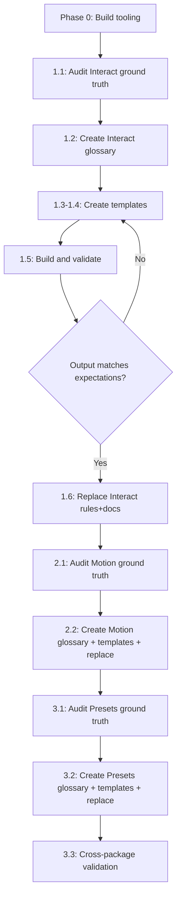

# Context SSOT Restructure

## Motivation and Idea

### The problem

This monorepo publishes three packages (`@wix/interact`, `@wix/motion`, `@wix/motion-presets`) alongside context files designed for two audiences: **LLM-facing rules** (so AI agents can correctly integrate the packages) and **human-facing docs** (for developer onboarding and reference). Today these context files suffer from five interconnected problems:

1. **Multiple contradicting sources of truth.** The same concept is described in different files with different phrasing, different defaults, and sometimes outright conflicting claims. For example, `allowA11yTriggers` defaults to `false` in one file and `true` in another; `ParallaxScroll` accepts a `speed` param in docs but the code uses `parallaxFactor`; trigger counts vary between 7, 8, and 9 depending on which file you read. A deep audit found **8 critical discrepancies** where docs would cause broken integrations, and **10 more significant ones**.
2. **No common structure.** Each package organizes its context differently. Interact has flat trigger-specific rule files plus two overlapping hub files; Motion has no rules at all; Motion-Presets has YAML-frontmatter rule files split by category. The docs folders vary in depth, naming, and section layout. There is no template or convention that applies across packages.
3. **Stale or incorrect information.** Defaults, param names, return types, and API signatures in the context files do not match the current implementation. There is no mechanism to detect this drift.
4. **Heavy repetition.** FOUC prevention is explained in 6 different files; element resolution order appears in 4; entry-point setup is repeated across every package's getting-started material. Each copy drifts independently.
5. **Broken links and scaffolding.** Over 36 internal links point to files that do not exist. Multiple sections are marked "TBD". README index pages link to planned-but-never-written guides. This erodes trust in the documentation for both humans and LLMs.

Together, these create a **continuous development problem**: making any change to the context requires touching many files across multiple directories, producing large PRs that are hard to review and prone to introducing new inconsistencies. The cost of keeping context accurate compounds over time.

### The idea

Replace the current ad-hoc markdown files with a **structured, build-based system** where:

- **Each piece of information is defined once** in a YAML glossary file (one per package). The glossary holds the data that is most prone to going stale: parameter names and types, default values, API signatures, term definitions (with separate LLM and human phrasings), and known caveats.
- **Markdown template files** provide the document structure and prose. They contain markers (e.g., `{{term:trigger-viewEnter.params-table}}`) where glossary data should be injected. Templates are authored separately for rules (compact, LLM-optimized) and docs (narrative, human-friendly).
- **A lightweight build script** reads the glossary and templates, performs marker replacement, and writes the final `rules/` and `docs/` output files.
- **A validation script** checks glossary entries against TypeScript source code, catching drift before it reaches the published context.

This means:

- Changing a default value or param name is a **one-line YAML edit** that propagates everywhere.
- Rules and docs always agree because they draw from the same data.
- The validation script catches code-vs-context drift in CI.
- Each package follows the same structure, making the system predictable and reviewable.

### Why YAML for the glossary

The glossary contains prose-heavy entries (descriptions, caveats) that humans will frequently hand-edit. YAML supports multi-line strings and inline comments natively, which makes authoring and PR review substantially easier than JSON. The motion-presets rules already use YAML frontmatter, so the pattern is familiar in this repo. Since the build script parses YAML into a plain JS object, switching to JSON later would be a trivial change.

### Sequencing

The migration is designed to proceed **one package at a time** (Interact, then Motion, then Motion-Presets), with each package's old context files replaced only after the new mechanism is fully built, validated, and reviewed. This keeps PRs scoped and reviewable, and ensures no package is left in a half-migrated state.

---

## Audit Findings (Baseline)

This section captures the findings from the deep analysis of all 72 context files across the three packages and their comparison against source code. These findings serve as the ground truth for the migration.

### Current State Inventory

**File counts:**


| Package                                | `rules/` files | `docs/` files | Total  |
| -------------------------------------- | -------------- | ------------- | ------ |
| Interact (`@wix/interact`)             | 7              | 26            | 33     |
| Motion (`@wix/motion`)                 | 0              | 20            | 20     |
| Motion-Presets (`@wix/motion-presets`) | 5              | 14            | 19     |
| **Total**                              | **12**         | **60**        | **72** |


**Structural asymmetry:**

- **Interact** has both `rules/` (flat trigger-focused files: `click.md`, `hover.md`, `viewenter.md`, `viewprogress.md`, `pointermove.md`, plus two hub files `full-lean.md` at 692 lines and `integration.md` at 329 lines) and `docs/` (nested into `guides/`, `api/`, `examples/`, `integration/`, `advanced/`).
- **Motion** has only `docs/` (nested into `api/`, `categories/`, `guides/`, `examples/`) plus a stale internal `PLAN_DOCS.md`. No `rules/` directory exists at all.
- **Motion-Presets** has both `rules/` (5 files under `presets/` with YAML frontmatter, split by category) and `docs/` (14 files nested per category with individual preset pages).

**Existing patterns for selective LLM reading:**

- Interact rules: `## Table of Contents` with `#anchor` links; `---` thematic breaks between sections; no YAML frontmatter.
- Motion-Presets rules: YAML frontmatter with `name`/`description` (agent-loading hints); per-file TOCs down to per-preset anchors.
- Typical file sizes: 190-280 lines for single-trigger interact docs, 330 lines for integration hub, 690 lines for `full-lean`, 210-398 lines for presets rule files.

### Discrepancies: Docs/Rules vs Code

#### Critical (would cause broken integrations if an LLM follows the docs)


| #   | Topic                         | What docs/rules say                                              | What the code does                                                                               | Source files                                                      |
| --- | ----------------------------- | ---------------------------------------------------------------- | ------------------------------------------------------------------------------------------------ | ----------------------------------------------------------------- |
| 1   | `allowA11yTriggers` default   | `rules/integration.md`: **false**; `docs/api/types.md`: **true** | Code: **true** -- `click` auto-maps to `activate`, `hover` to `interest`                         | `src/handlers/index.ts`                                           |
| 2   | `ParallaxScroll` param name   | All docs consistently use `**speed`**                            | Code: `**parallaxFactor`** (default `0.5`)                                                       | `motion-presets/src/library/scroll/ParallaxScroll.ts`, `types.ts` |
| 3   | `Pulse` intensity default     | `docs/ongoing/pulse.md`: **1.0**                                 | Code: **0**                                                                                      | `motion-presets/src/library/ongoing/Pulse.ts`                     |
| 4   | `ArcIn` default direction     | `docs/entrance/arc-in.md`: `**'bottom'`**                        | Code: `**'right'`**                                                                              | `motion-presets/src/library/entrance/ArcIn.ts`                    |
| 5   | `namedEffect` shape           | Many docs use bare string: `namedEffect: 'FadeIn'`               | Code requires object: `namedEffect: { type: 'FadeIn' }`                                          | `motion/src/api/common.ts` `getNamedEffect`                       |
| 6   | `getCSSAnimation` return type | `api/core-functions.md`, `performance.md`: **string**            | Code: **array of objects** `({ target, animation, keyframes, ... })`                             | `motion/src/api/cssAnimations.ts`                                 |
| 7   | `AnimationEndParams.effectId` | Typed and documented as wiring mechanism                         | Handler **ignores it** (`__` param)                                                              | `interact/src/handlers/animationEnd.ts`                           |
| 8   | `viewProgress` params         | `api/types.md` maps `viewProgress: ViewEnterParams`              | Handler ignores those params; scroll options come from `Interact.setup({ scrollOptionsGetter })` | `interact/src/handlers/viewProgress.ts`                           |


#### Significant (causes confusion, may lead to subtle bugs)


| #   | Topic                                   | Discrepancy                                                                                                                              |
| --- | --------------------------------------- | ---------------------------------------------------------------------------------------------------------------------------------------- |
| 9   | Sticky/tall-wrapper ViewTimeline source | `viewprogress.md` Rule 3: `key` on tall wrapper = source. `full-lean.md`: sticky child = source. Contradicts itself.                     |
| 10  | Trigger count                           | `guides/README.md` says 7; `understanding-triggers.md` says 9; actual `TriggerType` union: **9** members                                 |
| 11  | `pageVisible` trigger                   | Omitted from most trigger tables; only in `api/types.md`. Actually exists in code, uses viewEnter's IntersectionObserver handler         |
| 12  | Mouse preset count                      | Rules: 9; `mouse/README.md`: 12; barrel export: **11** (plus CustomMouse = 12 total)                                                     |
| 13  | Ongoing preset count                    | `presets-main.md`: 14; `ongoing/README.md`: 16; barrel exports: **13**; DVD is not exported                                              |
| 14  | Total preset count                      | Docs: "82+"; rules enumerate 61; barrel exports: **19 + 19 + 13 + 12 + 12 = 75**                                                         |
| 15  | Angle convention                        | `presets-main.md`: 0 = right; `_template.md`: 0 = up. Code: **0 = right** in most presets                                                |
| 16  | `customEffect` signature                | Varies: 2-arg in rules, 3-arg in some docs. Actual depends on context (time: `progress` number; pointer: `Progress { x, y, v, active }`) |
| 17  | `TurnScroll.rotation` param             | Typed in `types.ts` but **ignored** in implementation (fixed +/-45deg)                                                                   |
| 18  | `ParallaxScroll.range` param            | Typed but **unused** in `ParallaxScroll.ts` implementation                                                                               |


#### Minor (quality / completeness)


| #   | Topic                                                                                                                                                               |
| --- | ------------------------------------------------------------------------------------------------------------------------------------------------------------------- |
| 19  | **36+ broken internal links** across all packages: references to nonexistent files like `testing.md`, `performance.md`, `playground/`, `scroll-animations.md`, etc. |
| 20  | **5+ TBD placeholder sections** in interact docs (`configuration-structure`, `effects-and-animations`, `state-management`, `lists`, `custom-elements`)              |
| 21  | **Code typos in docs**: `sytle`, `hitAea`, `docuement`, `getScrgetWebAnimationubScene`, truncated/invalid snippets                                                  |
| 22  | `**unit` vs `type` for length objects**: rules use both `{ value, type: 'px' }` and `{ value, unit: 'px' }` interchangeably                                         |
| 23  | `**Interact.getElement`** referenced in docs but does not exist as a public API                                                                                     |


### Repetition Analysis

The same information is repeated across multiple files with inconsistent phrasing:


| Concept                                  | Files that describe it                                                                                                                                                | Copies                    |
| ---------------------------------------- | --------------------------------------------------------------------------------------------------------------------------------------------------------------------- | ------------------------- |
| FOUC prevention (`generate` + `initial`) | `rules/integration.md`, `rules/viewenter.md`, `rules/full-lean.md`, `docs/api/functions.md`, `docs/examples/entrance-animations.md`, `docs/guides/getting-started.md` | 6                         |
| Element resolution order                 | `rules/integration.md`, `rules/full-lean.md`, `docs/api/element-selection.md`, `docs/guides/configuration-structure.md`                                               | 4                         |
| Entry-point setup                        | `rules/integration.md`, `docs/README.md`, `docs/guides/getting-started.md`, `docs/integration/react.md`                                                               | 4                         |
| Trigger inventory table                  | `rules/full-lean.md`, `rules/integration.md`, `docs/guides/understanding-triggers.md`, `docs/api/types.md`                                                            | 4 (with different counts) |
| `registerEffects` usage                  | motion `docs/getting-started.md`, interact `rules/integration.md`, presets `docs/presets/README.md`, presets `rules/presets-main.md`                                  | 4                         |
| Scroll range semantics                   | interact `rules/viewprogress.md`, presets `rules/scroll-presets.md`, motion `docs/core-concepts.md`, presets `docs/scroll/README.md`                                  | 4                         |
| Stagger/sequence formula                 | motion `docs/core-concepts.md`, `docs/api/sequence.md`, `docs/api/get-sequence.md`, interact `docs/guides/sequences.md`                                               | 4                         |
| Reduced motion / a11y                    | Described independently across ~8 files in all three packages                                                                                                         | ~8                        |


### Verified Ground Truth: What Each Package Actually Contains

#### `@wix/interact` -- Declarative Interaction Layer

**Entry points:** `@wix/interact` (vanilla), `@wix/interact/react`, `@wix/interact/web`

**Exports:**

- `Interact` class (static + instance API)
- Functions: `add`, `remove`, `generate`
- React: `Interaction` component, `createInteractRef`
- Web: `InteractElement` custom element (registered via `Interact.defineInteractElement`)

**Config schema (`InteractConfig`):** `{ effects: Record<string, Effect>, interactions: Interaction[], sequences?: Record<string, SequenceConfig>, conditions?: Record<string, Condition> }`

**9 trigger types (from `TriggerType` union):** `hover`, `click`, `viewEnter`, `viewProgress`, `pointerMove`, `activate`, `interest`, `animationEnd`, `pageVisible`

**Handler mappings (from `handlers/index.ts`):**

- `viewEnter`, `pageVisible` -> IntersectionObserver handler
- `hover` -> `mouseenter`/`mouseleave` (or `interest` preset if `allowA11yTriggers`)
- `click` -> `['click']` (or `activate` preset if `allowA11yTriggers`)
- `activate` -> `['click', 'keydown']`
- `interest` -> enter: `mouseenter`+`focusin`, leave: `mouseleave`+`focusout`
- `animationEnd` -> listens on source `animationend`, plays on target
- `viewProgress` -> ViewTimeline scrub or `getScrubScene` fallback
- `pointerMove` -> `getScrubScene` + pointer library

**3 effect types:** `TimeEffect` (has `duration`), `ScrubEffect` (has `rangeStart`/`rangeEnd`), `StateEffect` (has `transition`/`transitionProperties`)

`**triggerType` values:** `'once' | 'repeat' | 'alternate' | 'state'`; defaults: `'once'` for viewEnter/pageVisible/animationEnd, `'alternate'` for hover/click/activate/interest

`**stateAction` values:** `'add' | 'remove' | 'toggle' | 'clear'`; default: `'toggle'`

**Condition types:** `'media' | 'container' | 'selector'` only (no `'custom'`)

**Key param defaults:**

- `ViewEnterParams.threshold`: `0.2`
- `PointerMoveParams.axis`: `'y'`
- `PointerMoveParams.hitArea`: undefined (covers document body)

#### `@wix/motion` -- Core Animation Engine

**Exported functions:** `getWebAnimation`, `getScrubScene`, `getCSSAnimation`, `prepareAnimation`, `getElementCSSAnimation`, `getElementAnimation`, `getSequence`, `createAnimationGroups`, `registerEffects`

**Exported utilities:** `getCssUnits`, `getEasing`, `getJsEasing`, all Penner-style easings + `jsEasings`/`cssEasings` maps

**Type-only exports (not constructable):** `AnimationGroup`, `Sequence`

**Key behaviors:**

- `getAnimation` (internal, used by interact): chooses CSS path (if preset has `style`) or WAAPI path (`getWebAnimation`)
- `getCSSAnimation` returns array of CSS rule descriptor objects, not a string
- ViewTimeline: native (`window.ViewTimeline`) with `duration: 'auto'`; fallback: `duration: 99.99` with manual scrub via `getScrubScene`
- Pointer: without keyframes uses factory `MouseAnimationInstance`; with keyframes uses `AnimationGroup.progress()`
- `registerEffects(effects)` merges into internal registry; presets resolve by `namedEffect.type` string
- `fastdom` used for DOM batching (measure/mutate), not re-exported

`**AnimationGroup` API:** `play`, `pause`, `reverse`, `cancel`, `progress(p)`, `setPlaybackRate`, `getProgress`, `onFinish`, `ready`, `finished`, `playState`

`**Sequence`:** extends `AnimationGroup`; stagger formula: `offset[i] = easing(i / last) * last * offsetMs` (integer-truncated); supports `addGroups`/`removeGroups`

`**RangeOffset` names:** `'entry' | 'exit' | 'contain' | 'cover' | 'entry-crossing' | 'exit-crossing'`

#### `@wix/motion-presets` -- Ready-Made Effects

**5 categories, 75 exported presets (from barrel):**

- **Entrance (19):** ArcIn, BlurIn, BounceIn, CurveIn, DropIn, ExpandIn, FadeIn, FlipIn, FloatIn, FoldIn, GlideIn, RevealIn, ShapeIn, ShuttersIn, SlideIn, SpinIn, TiltIn, TurnIn, WinkIn
- **Scroll (19):** ArcScroll, BlurScroll, FadeScroll, FlipScroll, GrowScroll, MoveScroll, PanScroll, ParallaxScroll, RevealScroll, ShapeScroll, ShuttersScroll, ShrinkScroll, SkewPanScroll, SlideScroll, Spin3dScroll, SpinScroll, StretchScroll, TiltScroll, TurnScroll
- **Ongoing (13):** Bounce, Breathe, Cross, Flash, Flip, Fold, Jello, Poke, Pulse, Rubber, Spin, Swing, Wiggle (DVD exists but is NOT barrel-exported)
- **Mouse (12):** AiryMouse, BlobMouse, BlurMouse, BounceMouse, CustomMouse, ScaleMouse, SkewMouse, SpinMouse, SwivelMouse, Tilt3DMouse, Track3DMouse, TrackMouse
- **Background Scroll (12):** BgCloseUp, BgFade, BgFadeBack, BgFake3D, BgPan, BgParallax, BgPullBack, BgReveal, BgRotate, BgSkew, BgZoom, ImageParallax

**Registration:** `registerEffects` is in `@wix/motion`, not in this package. Presets are plain modules keyed by `namedEffect.type`. Typical usage: `registerEffects({ FadeIn, ParallaxScroll, ... })`.

**Preset module shapes:** namespace with `web`/`style`/`getNames` (most), mouse presets export `create` factories, some presets have `prepare` (background-scroll).

**Shared params:** All mouse presets share `inverted?: boolean` (default `false`). Scroll presets support `range?: 'in' | 'out' | 'continuous'` (default varies per preset). Ongoing presets support `iterationDelay?: number` (default `0`).

**Angle convention in code:** 0 = right, counterclockwise increases (90 = top).

**Known type-vs-implementation mismatches in presets:**

- `TurnScroll.rotation`: typed but ignored (fixed +/-45deg)
- `ParallaxScroll.range`: typed but unused
- `DVD`: typed and implemented but not barrel-exported

### Cross-Package Shared Concepts (need SSOT)


| Concept                                                | Owner (should be SSOT) | Referenced by     |
| ------------------------------------------------------ | ---------------------- | ----------------- |
| `registerEffects` API                                  | motion                 | interact, presets |
| `AnimationGroup` / `Sequence` types                    | motion                 | interact          |
| `namedEffect` shape (`{ type: '...' }`)                | motion                 | interact, presets |
| Scroll ranges (`RangeOffset`, range names)             | motion                 | interact, presets |
| Pointer progress (`Progress { x, y, v, active }`)      | motion                 | interact, presets |
| `EffectScrollRange` (`in`/`out`/`continuous`)          | presets                | presets only      |
| Direction type families (`EffectFourDirections`, etc.) | presets                | presets only      |
| Easing values (CSS + JS)                               | motion                 | interact, presets |
| `prefers-reduced-motion` pattern                       | interact               | motion, presets   |
| Length/unit convention (`{ value, type }`)             | motion                 | presets           |


### Build and Test Infrastructure (Existing)

- **Monorepo:** Yarn 4 workspaces, no Turbo/Nx
- **Build:** Vite for library bundles, `tsc` for types
- **Unit tests:** Vitest in all three packages (`jsdom` environment for interact)
- **E2E:** Playwright exists for `@wix/motion` only (`packages/motion/e2e/`). Interact has a CI workflow referencing Playwright but no actual Playwright config or tests.
- **Docs deployment:** `apps/docs` copies `packages/interact/docs` into Vite dist via `scripts/copy-docs.js`. Rules are served raw from the docs app under `/rules/`.
- **No existing codegen, templating, or doc validation tooling** in the repo.

---

## Recommendation: Glossary Format

Use **YAML data files for structured/verifiable data** (parameter tables, defaults, type signatures, term definitions) combined with **markdown template files for prose and document structure**. A lightweight Node.js build script assembles the final rules/ and docs/ output.

Why this over pure-markdown-with-frontmatter:

- YAML is machine-parseable, so defaults and params can be **validated against TypeScript source** automatically
- The current rules already contain substantial structured data (param tables, trigger maps, preset catalogs) that maps naturally to YAML
- Prose stays in markdown where it belongs -- the YAML only holds the data that is prone to going stale
- motion-presets rules already use YAML frontmatter, so the pattern is familiar

Why not a heavier templating system:

- No existing codegen tooling in the repo; adding Handlebars/Nunjucks/etc. is overhead
- A simple marker-replacement script (find `{{glossary:term-id.field}}` in markdown, inject from YAML) is sufficient and easy to maintain

---

## Directory Structure (per package)

```
packages/<pkg>/
  context/                          # NEW - single source of truth
    glossary.yaml                   # All terms, params, defaults, descriptions
    templates/
      rules/                        # Markdown templates for LLM-facing output
        overview.md                 # Template with {{markers}} for glossary data
        ...per-package files...
      docs/                         # Markdown templates for human-facing output
        README.md
        guides/
        api/
        ...
  rules/                            # OUTPUT (generated, gitignored during dev)
  docs/                             # OUTPUT (generated, gitignored during dev)
```

A shared build script lives at the monorepo root:

```
scripts/
  build-context.js                  # Reads glossary YAML + templates, writes rules/ + docs/
  validate-context.js               # Checks glossary data against TS source code
```

> **Open question for implementation:** Whether `rules/` and `docs/` should be gitignored (generated on CI) or committed (generated locally and checked in). The current `package.json` `"files"` field includes `"rules"` and `"docs"`, meaning they are published to npm. The simplest path is to **commit the generated output** and have CI verify it matches the source, similar to how lockfiles work. This avoids needing a pre-publish build step. Final decision deferred to implementation.

---

## Glossary YAML Schema

Each `glossary.yaml` contains entries like:

```yaml
terms:
  - id: trigger-viewEnter
    name: viewEnter
    category: trigger          # trigger | effect-type | config | api | concept | preset
    llm: "Fires when element crosses viewport threshold via IntersectionObserver."
    human: "Triggers an animation when an element scrolls into the visible area of the page."
    params:
      - name: threshold
        type: number
        default: 0.2
        description: "Fraction of element that must be visible"
      - name: inset
        type: string
        default: null
        description: "Mapped to IntersectionObserver rootMargin"
    caveats:
      - "Same source+target: only triggerType 'once' is reliable"
    sourceFile: src/types/triggers.ts   # for validation
    related: [trigger-pageVisible, concept-fouc]
```

Presets get a `presets` section (motion-presets only) with the same structure but preset-specific fields (`category: entrance|scroll|ongoing|mouse|backgroundScroll`, `triggerBinding`, etc.).

> **Implementation note:** The exact YAML schema should be finalized during the Interact package phase after the full audit confirms which fields are actually needed. The schema above is a starting point.

---

## Build Script Behavior

`scripts/build-context.js`:

1. For a given package, reads `context/glossary.yaml`
2. Reads each template file in `context/templates/rules/` and `context/templates/docs/`
3. Replaces markers like `{{term:trigger-viewEnter.params-table}}` with formatted markdown (table for params, inline text for descriptions, etc.)
4. Also supports `{{include:path/to/fragment.md}}` for shared prose blocks within the same package
5. Writes output to `rules/` and `docs/`

`scripts/validate-context.js`:

1. Reads `context/glossary.yaml` for a package
2. For each entry with a `sourceFile`, parses the TypeScript source (using regex or ts-morph -- to be decided during implementation) to extract:
  - Type definitions (verify param names and types match)
  - Default values in destructuring patterns (verify defaults match)
3. Reports mismatches as errors

> **Scope constraint:** The build script should be simple -- under 300 lines. If the templating needs grow beyond simple marker replacement, reconsider the approach before adding complexity.

---

## Phase 0: Infrastructure Setup

Before any package migration, set up the shared tooling.

### 0.1 Design the YAML glossary schema

- Draft the schema based on the Interact package audit (from the previous conversation's findings)
- Decide on the marker syntax for templates (e.g., `{{term:id.field}}`, `{{table:id.params}}`)
- Decide on the set of "field renderers" needed (param-table, description, caveats-list, code-example)

### 0.2 Build the context build script

- `scripts/build-context.js` -- reads YAML, processes templates, writes output
- Must support running per-package: `node scripts/build-context.js --package interact`
- Add a `build:context` script to root `package.json`

### 0.3 Build the validation script

- `scripts/validate-context.js` -- reads YAML, checks against source
- Strategy for extracting ground truth from TS: Start with regex-based extraction of type members and destructuring defaults. If that proves brittle, evaluate [ts-morph](https://ts-morph.com/) (adds a devDep but is reliable). Decision deferred to implementation.
- Add a `validate:context` script to root `package.json`

### 0.4 Decide on gitignore strategy

- Test both approaches (committed vs generated) during Interact migration
- If committed: add a CI check that runs `build-context` and `git diff --exit-code` on the output

---

## Phase 1: Interact Package (`@wix/interact`)

### 1.1 Audit and verify ground truth

Before writing any glossary entries, verify every claim in the current rules against the actual code. This is critical because the previous analysis found **8 critical discrepancies** and **10 significant ones**.

**Verification approach:** Write ad-hoc Vitest tests (in a temporary test file, e.g., `packages/interact/test/context-audit.spec.ts`) that import source modules and assert the documented behavior. These tests serve as one-time verification and can be kept as regression tests afterward.

Items to verify (from discrepancy list):


| #   | What to verify                                                                   | How                                                                                                                                |
| --- | -------------------------------------------------------------------------------- | ---------------------------------------------------------------------------------------------------------------------------------- |
| 1   | `allowA11yTriggers` default is `true`                                            | Check `Interact` class static field and handler mapping in [handlers/index.ts](packages/interact/src/handlers/index.ts)            |
| 2   | `namedEffect` requires object `{ type: '...' }`, not bare string                 | Test that `getRegisteredEffect` resolves `{ type: 'FadeIn' }` but not `'FadeIn'`                                                   |
| 3   | All 9 trigger types exist in `TriggerType` union                                 | Import and enumerate from [types/triggers.ts](packages/interact/src/types/triggers.ts)                                             |
| 4   | `pageVisible` uses same handler as `viewEnter`                                   | Check handler mapping in [handlers/index.ts](packages/interact/src/handlers/index.ts)                                              |
| 5   | `AnimationEndParams.effectId` is unused at runtime                               | Read [handlers/animationEnd.ts](packages/interact/src/handlers/animationEnd.ts) and verify the param is ignored                    |
| 6   | `viewProgress` handler ignores `ViewEnterParams`                                 | Read [handlers/viewProgress.ts](packages/interact/src/handlers/viewProgress.ts)                                                    |
| 7   | `triggerType` defaults: `'once'` for viewEnter, `'alternate'` for event triggers | Check [core/resolvers.ts](packages/interact/src/core/resolvers.ts) and handler code                                                |
| 8   | `stateAction` default is `'toggle'`                                              | Check [handlers/effectHandlers.ts](packages/interact/src/handlers/effectHandlers.ts) `createTransitionHandler`                     |
| 9   | `Condition.type` accepts only `'media'                                           | 'container'                                                                                                                        |
| 10  | Sticky/tall-wrapper ViewTimeline: which element is the source                    | Read [handlers/viewProgress.ts](packages/interact/src/handlers/viewProgress.ts) to determine actual behavior                       |
| 11  | Element resolution order (key cascade)                                           | Read [core/Interact.ts](packages/interact/src/core/Interact.ts) `parseConfig` and [core/add.ts](packages/interact/src/core/add.ts) |
| 12  | `generate()` signature and return type                                           | Import from [core/css.ts](packages/interact/src/core/css.ts)                                                                       |


### 1.2 Create the Interact glossary

Based on verified ground truth, populate `packages/interact/context/glossary.yaml` with entries for:

**Categories and approximate entry counts:**

- **Triggers** (9 entries): hover, click, viewEnter, viewProgress, pointerMove, activate, interest, animationEnd, pageVisible -- each with params, defaults, caveats
- **Effect types** (3 entries): TimeEffect, ScrubEffect, StateEffect -- each with all typed fields and defaults
- **Config types** (5-6 entries): InteractConfig, Interaction, Effect/EffectRef, SequenceConfig, Condition -- schema shapes
- **API** (8-10 entries): Interact.create, Interact.destroy, Interact.setup, add, remove, generate, Interact.registerEffects, Interact.getSequence, etc. -- signatures and behavior
- **Concepts** (5-6 entries): FOUC prevention, element resolution, a11y trigger mapping, conditions cascading, custom elements lifecycle
- **Enums/unions** (4-5 entries): triggerType (once/repeat/alternate/state), stateAction, Fill, CompositeOperation

### 1.3 Design the Interact rules templates

The current rules have two overlapping "hub" files (`full-lean.md` at 692 lines, `integration.md` at 329 lines) plus 5 trigger-specific files. The new structure should eliminate the overlap.

**Proposed rules/ file set for Interact:**


| File          | Purpose                                                                                   | Approx. lines |
| ------------- | ----------------------------------------------------------------------------------------- | ------------- |
| `overview.md` | Package purpose, entry points, imports, quick-start snippet                               | 60-80         |
| `config.md`   | InteractConfig schema, Interaction shape, Effect/EffectRef, sequences, conditions         | 150-200       |
| `triggers.md` | All 9 triggers: params, defaults, behavior, per-trigger caveats                           | 200-250       |
| `effects.md`  | TimeEffect, ScrubEffect, StateEffect: fields, defaults, triggerType/stateAction semantics | 150-200       |
| `pitfalls.md` | FOUC, overflow:clip, same-element source+target, hit-area jitter, a11y mapping            | 80-100        |


Each file gets:

- YAML frontmatter (`name`, `description`) for agent-loading hints (matches existing presets pattern)
- A `## Table of Contents` with `#anchor` links for selective section reading
- `{{term:...}}` markers where glossary data should be injected

**Key structural rule for LLM readability:**

- Each file must be self-contained for its topic (no "see other file for the rest of this table")
- Cross-references between files use relative links but only for "related reading", never for completing a thought
- Param tables are compact: `| name | type | default | notes |` -- one row per param, no verbose descriptions
- Code examples are minimal (3-8 lines) and correct

### 1.4 Design the Interact docs templates

The current docs have 26 files but many are scaffolding (broken links, TBD sections, placeholder READMEs linking to nonexistent files). The new structure should contain only files with actual content.

**Proposed docs/ file set for Interact:**


| File                        | Purpose                                                 |
| --------------------------- | ------------------------------------------------------- |
| `README.md`                 | Getting started, install, entry points, navigation      |
| `guides/configuration.md`   | Config structure explained for humans                   |
| `guides/triggers.md`        | Trigger concepts, choosing triggers, combining triggers |
| `guides/effects.md`         | Effect types explained, when to use which               |
| `guides/sequences.md`       | Sequence math, staggering, list integration             |
| `guides/conditions.md`      | Media queries, container queries, selector conditions   |
| `guides/fouc.md`            | FOUC prevention guide (generate + initial)              |
| `guides/custom-elements.md` | `<interact-element>` usage and lifecycle                |
| `api/README.md`             | API overview and imports                                |
| `api/interact-class.md`     | Static + instance methods                               |
| `api/functions.md`          | add, remove, generate                                   |
| `api/types.md`              | Type reference                                          |
| `integration/react.md`      | React-specific guide                                    |
| `examples/entrance.md`      | Entrance animation recipes                              |
| `examples/hover-click.md`   | Hover and click interaction recipes                     |


All other current files (broken-link READMEs, TBD placeholders, the nonexistent targets) are **dropped**. Content from `full-lean.md` that overlaps with docs is reconciled -- the rules version becomes the SSOT; the docs version becomes a prose rewrite of the same data.

### 1.5 Build and validate

1. Run `node scripts/build-context.js --package interact` to generate `rules/` and `docs/`
2. Run `node scripts/validate-context.js --package interact` to verify glossary against source
3. Manually review generated rules for LLM readability:
  - Are tables compact and scannable?
  - Can an LLM read just `triggers.md` and get everything it needs about triggers?
  - Is the TOC + anchor pattern working for selective section reading?
4. Run the existing `apps/docs` build to verify docs still copy correctly

### 1.6 Replace and verify

1. Back up current `rules/` and `docs/` (they are in git, so this is just a safety step)
2. Replace with generated output
3. Run existing Vitest tests (`yarn workspace @wix/interact test`) to ensure nothing depends on specific rules/docs file paths internally
4. Verify `apps/docs` build still works (it copies from `packages/interact/docs`)
5. Verify the docs app `copy-docs.js` script handles the new file structure
6. Keep the `context-audit.spec.ts` tests as ongoing regression

---

## Phase 2: Motion Package (`@wix/motion`)

### 2.1 Audit and verify ground truth

Motion currently has **no rules/** directory. Its docs have significant issues: `getCSSAnimation` return type is wrong in multiple files, `TriggerVariant` shape differs between tutorial and type docs, preset counts don't match, and several linked files don't exist.

**Key items to verify:**


| #   | What to verify                                                             |
| --- | -------------------------------------------------------------------------- |
| 1   | `getCSSAnimation` return type (array of objects, not string)               |
| 2   | `AnimationGroup` is type-only export (not constructable by consumers)      |
| 3   | `getWebAnimation` signature and return type union                          |
| 4   | `getScrubScene` signature, scroll vs pointer branches                      |
| 5   | `TriggerVariant` actual shape (`id`, `trigger`, `componentId`, `element?`) |
| 6   | `Sequence` stagger formula                                                 |
| 7   | `RangeOffset` range name enum                                              |
| 8   | `prepareAnimation` behavior and `DomApi` contract                          |
| 9   | `CustomAnimation` rAF loop behavior for `customEffect`                     |
| 10  | ViewTimeline detection and fallback path                                   |


### 2.2 Create glossary, templates, build, replace

Same pattern as Interact:

- `packages/motion/context/glossary.yaml` -- API functions, animation types, scroll/pointer concepts, `AnimationGroup`/`Sequence` APIs
- **New `rules/` directory** (Motion currently lacks one): `overview.md`, `api.md`, `animation-types.md`, `pitfalls.md`
- Restructured `docs/` -- drop `PLAN_DOCS.md`, fix or remove broken links, remove nonexistent targets, consolidate category docs that overlap with motion-presets docs

**Important:** Motion's `docs/categories/` files (entrance-animations.md, scroll-animations.md, etc.) overlap heavily with motion-presets docs. These should be **removed or reduced to pointers** -- the preset details belong in motion-presets. Motion docs should cover the **engine API**, not preset catalogs.

---

## Phase 3: Motion-Presets Package (`@wix/motion-presets`)

### 3.1 Audit and verify ground truth

Motion-presets rules are the most structured of the three (YAML frontmatter, per-category files), but have known data errors.

**Key items to verify:**


| #   | What to verify                                                                                                                                                                   |
| --- | -------------------------------------------------------------------------------------------------------------------------------------------------------------------------------- |
| 1   | All preset names match barrel exports (currently 19+19+13+11+12 = 74)                                                                                                            |
| 2   | Per-preset params and defaults match implementation (ParallaxScroll `parallaxFactor` not `speed`, ArcIn default `'right'` not `'bottom'`, Pulse intensity default `0` not `1.0`) |
| 3   | Mouse preset count (11 exported, not 9 or 12)                                                                                                                                    |
| 4   | DVD is NOT exported from barrel                                                                                                                                                  |
| 5   | Angle convention is 0 = right (not up)                                                                                                                                           |
| 6   | `range` param on ParallaxScroll is typed but unused                                                                                                                              |
| 7   | `TurnScroll.rotation` is typed but unused                                                                                                                                        |
| 8   | Background-scroll `data-motion-part` values and targeting                                                                                                                        |


**Verification approach:** For presets, the most effective verification is a script that:

- Imports all barrel exports from `@wix/motion-presets`
- For each, checks it matches the glossary entry (name, category)
- For param defaults, reads the source destructuring patterns

This can be a Vitest test file that programmatically checks all presets.

### 3.2 Create glossary, templates, build, replace

- `packages/motion-presets/context/glossary.yaml` -- includes a `presets` section with every preset's params and defaults
- **Rules:** Keep the current split-by-category approach (it works well) but generate tables from glossary: `overview.md`, `entrance.md`, `scroll.md`, `ongoing.md`, `mouse.md`, `background-scroll.md`
- **Docs:** Per-preset pages only for presets that warrant detailed explanation (not all 74 need a dedicated page). Category READMEs with param tables generated from glossary. Drop broken-link placeholder pages.

### 3.3 Cross-package validation

After all three packages are migrated:

- Verify cross-package references (interact rules referencing motion concepts, presets referencing motion API)
- Ensure `registerEffects` is described consistently: defined in motion glossary, referenced in interact and presets
- Ensure shared concepts (scroll ranges, pointer progress, namedEffect shape) use the same terminology everywhere

---

## Sequencing and Safety




**Safety rule:** The old `rules/` and `docs/` files for a package are only deleted/replaced after:

1. The new glossary is validated against source code
2. The build script produces output that passes manual review
3. Existing tests still pass
4. The docs app build still works (for interact)

Each phase is a separate PR (or set of PRs) that can be reviewed independently.