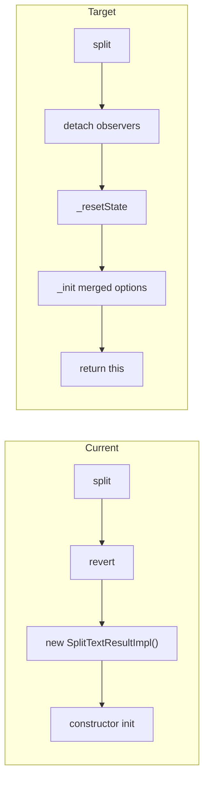

# In-place `split()` refactor

## Goal

Change [`split()`](packages/splittext/src/splitText.ts) from creating a new `SplitTextResultImpl` to mutating and returning the existing instance. The public `SplitTextResult` interface stays unchanged (`split()` still returns `SplitTextResult`).

## Current vs target flow



Today, `split()` delegates all post-revert setup to the constructor:

```267:270:packages/splittext/src/splitText.ts
  split(optionsOverride?: SplitTextOptions): SplitTextResult {
    this.revert();
    return new SplitTextResultImpl(this.element, { ...this._options, ...optionsOverride });
  }
```

The constructor performs option storage, text capture, eager `type` split, and `autoSplit` observer setup (lines 188–214). [`_resplit()`](packages/splittext/src/splitText.ts) already demonstrates the in-place reset pattern (`_resetState` + re-read text + re-compute), but does not merge options or handle eager `type`.

## Implementation

### 1. Extract `_init(options: SplitTextOptions)`

Add a private method in [`splitText.ts`](packages/splittext/src/splitText.ts) that contains the post-construction initialization currently in the constructor:

- Assign `this._options = options`
- Re-capture `this._originalText` and `this._splitText` via `getTextContent` / `getFilteredTextContent`
- If `options.type` is set: `_compute` each type, then `_activate` the last one (same loop as constructor lines 201–207)
- If `options.autoSplit`: `_attachObservers()`

**Do not** move into `_init`:
- `this.element = element` (constructor-only)
- `this.originalHTML = element.innerHTML` (constructor-only; `_resetState` restores to this snapshot)
- `injectBaseStyles()` (document-level, idempotent; constructor-only)

### 2. Slim down the constructor

```typescript
constructor(element: HTMLElement, options: SplitTextOptions = {}) {
  this.element = element;
  this.originalHTML = element.innerHTML;
  injectBaseStyles(element.ownerDocument);
  this._init(options);
}
```

Note: constructor still captures `_originalText`/`_splitText` implicitly via `_init` — remove the duplicate lines currently before `_options` assignment.

### 3. Rewrite `split()` to return `this`

```typescript
split(optionsOverride?: SplitTextOptions): SplitTextResult {
  this._detachObservers();
  this._resetState();
  this._init({ ...this._options, ...optionsOverride });
  return this;
}
```

Use `_detachObservers` + `_resetState` directly instead of `revert()` so the method name reflects intent (re-split, not full teardown). Behavior matches today: observers detached, DOM restored, caches cleared, then re-initialized.

**Preserved semantics:**
- `originalHTML` baseline unchanged (same as current: revert restores snapshot before init)
- Option merging is shallow (`{ ...this._options, ...optionsOverride }`)
- `autoSplit` observers re-attached only when the merged options include `autoSplit: true`
- `onSplit` fires via `_activate` when eager `type` is provided (unchanged)

### 4. Update tests

In [`splitText.spec.ts`](packages/splittext/test/splitText.spec.ts), update the `split() method` describe block (lines 728–746):

| Test | Change |
|------|--------|
| "returns a new SplitTextResult with updated options" | Rename to reflect same-instance behavior; add `expect(result2).toBe(result1)`; keep DOM assertions |
| "restores DOM before re-splitting" | No logic change |

Add one focused test for stable identity + `onSplit`:

```typescript
it('returns the same instance and calls onSplit with it', () => {
  const onSplit = vi.fn();
  const result = splitText(el('Hello'), { type: 'chars', onSplit });
  onSplit.mockClear();
  const returned = result.split({ type: 'words', onSplit });
  expect(returned).toBe(result);
  expect(onSplit).toHaveBeenCalledWith(result);
});
```

Optional: test that `split({ autoSplit: true })` re-attaches `ResizeObserver` (mirrors existing autoSplit tests at line 818).

### 5. JSDoc tweak (optional, minimal)

Update the `split` JSDoc in [`types.ts`](packages/splittext/src/types.ts) to clarify it reconfigures and returns the same result object. No API signature change.

## Files touched

- [`packages/splittext/src/splitText.ts`](packages/splittext/src/splitText.ts) — `_init` extraction, `split()` rewrite
- [`packages/splittext/test/splitText.spec.ts`](packages/splittext/test/splitText.spec.ts) — test updates
- [`packages/splittext/src/types.ts`](packages/splittext/src/types.ts) — optional JSDoc only

## Verification

```bash
nvm use && yarn workspace @wix/splittext test
```

No downstream consumers outside `splittext` call `SplitTextResult.split()`; [`useSplitText`](packages/splittext/src/react/useSplitText.ts) is unaffected.

## Out of scope

- Refactoring `_resplit()` to share `_init` logic (different purpose: re-compute cached types on resize, no option merge)
- Changing `revert()` behavior or `originalHTML` re-capture semantics
- README updates (`split()` is not documented there today)
