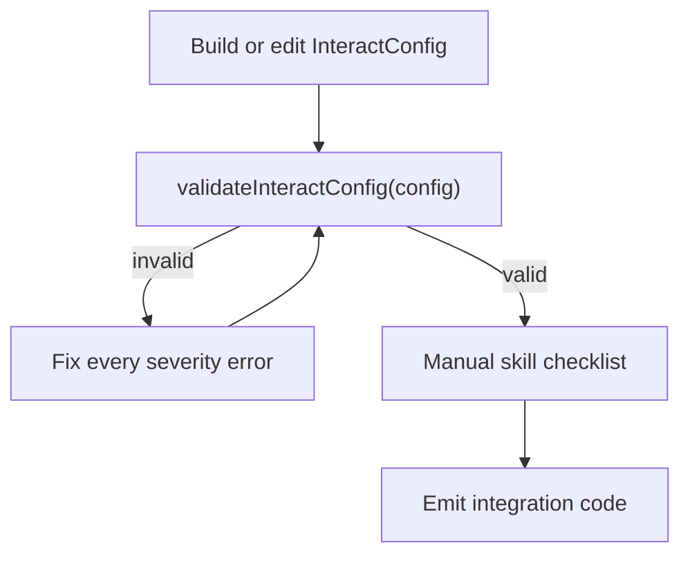
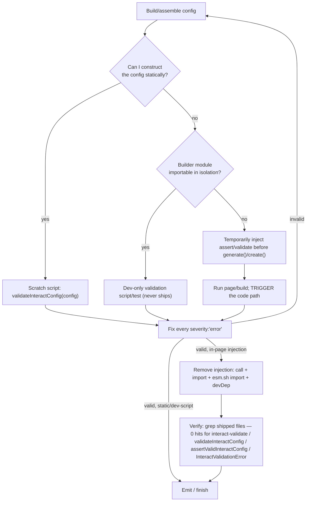

# Add config validation to the interactor skill

## Goal

Teach the agent to **always validate `InteractConfig` before calling `generate()` / `Interact.create()` and before declaring done**, while keeping the existing semantic/DOM checklist for things the validator cannot see. Do **not** add a CLI or change `@wix/interact-validate` itself.

## Validation model



**Two layers, both required:**

| Layer     | Tool                               | Covers                                                                                                                               |
| --------- | ---------------------------------- | ------------------------------------------------------------------------------------------------------------------------------------ |
| Automated | `@wix/interact-validate`           | Schema shape, referential IDs, trigger/effect compatibility, numeric bounds, media-query syntax                                      |
| Manual    | Existing skill checklist (trimmed) | Preset registry, `registerEffects` order, `generate()` / FOUC, markup keys, hit-area shift, `overflow: clip`, list/selector patterns |

## Static vs dynamic config — the axis that decides _how_ to run the validator

Whether the automated layer runs _before emit_ or via a _temporary injection_ depends on
**whether the agent can construct the config statically**, NOT on the entry point (CDN /
React / vanilla). Both cases can occur under any entry point.

| Config shape                                                                                                                                                           | How the agent obtains it              | Validation strategy                                                                                                                                                                                                                                                                                                                                                            |
| ---------------------------------------------------------------------------------------------------------------------------------------------------------------------- | ------------------------------------- | ------------------------------------------------------------------------------------------------------------------------------------------------------------------------------------------------------------------------------------------------------------------------------------------------------------------------------------------------------------------------------ |
| **Static literal** — a config object the agent authored and can read in full                                                                                           | Directly, in the turn                 | **Validate before emit.** Copy the literal into a scratch script and run `validateInteractConfig` (see mechanism table in `references/validate.md`). Nothing is injected into user files.                                                                                                                                                                                      |
| **Dynamic** — config assembled at runtime from data / props / fetches / DOM measurements, or built by a `for`-loop / factory the agent can't fully evaluate by reading | Only exists once the page/module runs | **Temporarily inject** `assertValidInteractConfig(config)` (or `validateInteractConfig(config)` + `console.error`) immediately before `generate()`/`create()`, run the page/build so the config is actually constructed, fix every error, then **remove the injection** (call + import + any `esm.sh` import + any `package.json` devDep) so nothing validation-related ships. |

**Middle case (preferred when it applies):** if the dynamic config's builder module is
_importable in isolation_, write a **dev-only validation script/test** that imports the
builder, constructs the config, and validates it. This never ships → satisfies "not
shipped" with **no removal step and no risk**. Reserve in-page temp-injection for configs
that are constructible _only_ in-page.

**Runtime-reachability caveat (must be stated in the skill):** a temporary injection only
validates the config if that code path **executes** during the test run. A config built
lazily, conditionally, or inside an event handler will not be reached by a plain page
load — the agent must trigger that path, or the loop silently passes having validated
nothing.



## Files to change

### 1. [skills/interactor/SKILL.md](skills/interactor/SKILL.md)

**Mental model table** — add a fourth row for `@wix/interact-validate` (optional dev/CI package; validates config shape only; no DOM).

**Workflow** — insert a validation step between _Add/Edit_ and _Verify_:

- After building/editing the config, validate it before `generate()`/`create()`. **How** depends on whether the config is static or dynamic — see the decision rule below.
- Fix every issue with `severity: 'error'` before proceeding; prefer fixing warnings too.
- Running the validator: in this monorepo, import `@wix/interact-validate` (workspace/built `dist`) from a scratch script; in a user project, temp-install `-D @wix/interact-validate` for the check and uninstall it (or use it if already a devDep).
- Point to `references/validate.md` for the per-environment run mechanics, the temp-injection loop, options, and limitations.

**Decision rule (short in SKILL.md; full mechanics in `references/validate.md`):**

- **Always:** no `InteractConfig` reaches `generate()` / `create()` unvalidated, and no
  `@wix/interact-validate` reference is present in the code you ship. These two hold on
  every path, CDN included.
- **Static config (you can read the whole literal):** validate it **before emit** in a
  scratch script — never add validator imports to user files.
- **Dynamic config (built at runtime — from data/props/fetch/DOM/loops — so you can't
  construct it by reading):** you cannot validate before emit. **Temporarily inject**
  `assertValidInteractConfig(config)` (or `validateInteractConfig` + log) right before
  `generate()`/`create()`, run so the path executes, fix errors, then **remove** the
  injection (call + import + any `esm.sh` import + any temp devDep) — this is the last
  step of the validation loop. Prefer a dev-only validation script over in-page injection
  when the config builder is importable in isolation (no removal risk).
- **Permanent guard (separate, optional):** leaving `assertValidInteractConfig` in shipped
  code as a devDependency dev/CI gate is a _different_, opt-in thing — only when
  scaffolding a new project or the user asks for CI. Do not conflate it with the temporary
  injection above, which is always removed.

**Verify before finishing:** grep the files you're shipping for `interact-validate`,
`validateInteractConfig`, `assertValidInteractConfig`, and `InteractValidationError` — a
non-empty result means a temporary injection leaked (unless the user explicitly asked for
the permanent guard).

**Step 1 — Install** — add one line after the main install command:

```bash
npm install -D @wix/interact-validate   # optional — dev/CI config guard
```

(CDN path explicitly skips this.)

**Restructure "Verify your work"** into two subsections:

1. **Automated config validation** — run `validateInteractConfig`; link to reference; note `valid: false` blocks emit.
2. **Semantic & integration checklist** — keep items the validator cannot check; **remove** redundant items now covered by validate:
   - ~~Every `effectId` / `sequenceId` / condition id exists~~
   - ~~Each effect has exactly one payload~~
   - ~~`triggerType` and `stateAction` not both set~~

**Reference files list** — add `references/validate.md`.

**Frontmatter `description`** — one clause: validate generated configs with `@wix/interact-validate` before shipping.

Keep SKILL.md under ~300 lines (currently 253); target ~40–50 lines net after deduping the checklist. Keep the decision rule to the short bullets above — the per-environment run mechanics and the temp-injection loop live in `references/validate.md`, not SKILL.md.

---

### 2. New [skills/interactor/references/validate.md](skills/interactor/references/validate.md)

Trimmed, agent-focused reference (~120–150 lines). Source of truth for full error catalogue remains [packages/interact/rules/validate.md](packages/interact/rules/validate.md) — link out, do not duplicate all 20+ codes.

**Sections:**

- **When to validate** — agent pre-emit, optional dev/CI, not for CDN runtime
- **Quick API** — `validateInteractConfig`, `assertValidInteractConfig`, `ValidationError` shape

- **How to actually RUN the validator (by environment)** — the piece the plan previously
  glossed. "Validate agent-side" presumes the agent can _execute_ the validator; spell out
  each environment:

  | Environment                                             | Config is…     | How the agent runs validation                                                                                                                                            |
  | ------------------------------------------------------- | -------------- | ------------------------------------------------------------------------------------------------------------------------------------------------------------------------ |
  | This monorepo                                           | any            | `@wix/interact-validate` is built + symlinked in root `node_modules`; run a scratch `node`/`node -e` script that requires it and calls `validateInteractConfig(config)`. |
  | User project, package already a (dev)dependency         | any            | Scratch script / dev test importing the installed package.                                                                                                               |
  | User project, package NOT installed, **static** config  | static literal | `npm i -D @wix/interact-validate` → validate in a scratch script → **`npm uninstall`** it. Nothing touches shipped files.                                                |
  | User project, package NOT installed, **dynamic** config | runtime-built  | If the builder module is importable in isolation → dev-only validation script (never ships). Else → **temporary in-page injection** (next section).                      |

- **Temporary injection loop (dynamic configs)** — the core new content. Steps, spelled out:
  1. Inject **`assertValidInteractConfig(config)`** (throwing gives the cleanest signal in a
     running page) — or `validateInteractConfig(config)` + `console.error(result.errors)` —
     on the line immediately before `generate()` / `create()`.
  2. Add the import _for the run only_: bundled → temp `-D` devDep + `import { assertValidInteractConfig } from '@wix/interact-validate'`; CDN → temp `import { assertValidInteractConfig } from 'https://esm.sh/@wix/interact-validate'`.
  3. **Run and reach the code path** — dev server / build / test. Because the config is built
     at runtime, validation only happens if that path executes. **Runtime-reachability
     caveat:** lazy / conditional / event-handler-built configs must be triggered, or the
     loop passes without validating anything. Call this out explicitly.
  4. Fix every `severity: 'error'` (prefer warnings too); re-run.
  5. **Removal is the loop-terminal step.** Once valid, remove the call **and** the import
     **and** any `esm.sh` import **and** any temporary `package.json` devDep. Then verify:

     ```bash
     grep -REn 'interact-validate|validateInteractConfig|assertValidInteractConfig|InteractValidationError' <shipped files>
     # expect: no matches
     ```
  - Note "possibly as a tool" resolves to exactly this: a repeatable scratch/Bash mechanism
    (scratch validate script for static; inject→run→fix→remove recipe for dynamic) — **not**
    a registered Claude tool. Don't overbuild.

- **Optional PERMANENT in-code guard (bundled only, opt-in — distinct from the temp injection above)** — kept as a devDependency dev/CI gate; only when scaffolding or the user asks for CI:

```ts
import { assertValidInteractConfig } from '@wix/interact-validate';

assertValidInteractConfig(config); // throws InteractValidationError
Interact.registerEffects({ FadeIn });
const css = generate(config, false);
Interact.create(config);
```

- **Options** — `strict`, `max`, `severityOverrides` (one-line each)
- **What validate does NOT check** — preset names, DOM/markup, FOUC, overflow, hit-area, `registerEffects` — bullet list mirroring [validate.md limitations](packages/interact/rules/validate.md#limitations--what-is-not-checked)
- **Full docs link** — `https://wix.github.io/interact/rules/validate.md`

---

### 3. [skills/interactor/references/integration-recipes.md](skills/interactor/references/integration-recipes.md)

**Shared rules block** (top) — add bullet:

- Validate config with `@wix/interact-validate` before `generate()` / `create()` (agent-side always; see `references/validate.md`).

**Per-recipe notes (minimal):**

- **A (Web bundled), C (React), D (Vanilla):** one-line footnote — static configs: validate agent-side (scratch script). Dynamic configs (e.g. React config built from props/fetch, a vanilla loop): temporarily inject `assertValidInteractConfig(config)` before `generate()`/`create()`, run, fix, **remove**. Separately, an _optional permanent_ dev/CI guard may stay as a devDependency (opt-in).
- **B (CDN):** explicit note — the **shipped page must never import validate**. Static config → agent validates before writing the file. Dynamic config built in-page → agent may _temporarily_ add an `https://esm.sh/@wix/interact-validate` import + `assertValidInteractConfig` call to run validation, then **must remove both** before finishing (verify with the grep). This is the one path where a validator reference could accidentally ship, so the removal check is mandatory here.

**"Verifying the integration"** (bottom) — replace step 4 "Run the validation checklist" with:

1. Config passes `validateInteractConfig` (no errors)
2. Semantic checklist in SKILL.md

---

### 4. [skills/interactor/evals/evals.json](skills/interactor/evals/evals.json)

Add assertions. The **"shipped output contains no `@wix/interact-validate` reference"**
assertion goes on **every** eval — it is the invariant that enforces "not shipped," not a
CDN-only concern.

| Eval                         | New assertion(s)                                                                                                                                                                                      |
| ---------------------------- | ----------------------------------------------------------------------------------------------------------------------------------------------------------------------------------------------------- |
| 1 (CDN)                      | Config is structurally valid (would pass `validateInteractConfig`); shipped `index.html` contains **no** `@wix/interact-validate` / `validateInteractConfig` / `assertValidInteractConfig` reference. |
| 2 (React/Vite)               | Config is structurally valid; shipped source contains no validator reference (unless the user explicitly asked for a CI guard).                                                                       |
| 3 (edit-config)              | Edited config is structurally valid; all `effectId`/`sequenceId` references resolve; no validator reference left in edited files.                                                                     |
| **4 (NEW — dynamic config)** | See below.                                                                                                                                                                                            |

**New eval 4 — dynamic config, exercises the temp-injection loop.** Prompt: a project
(React or vanilla) that builds its `InteractConfig` **at runtime** — e.g. maps over a
`cards` array / fetched data to generate `interactions`, so the final config is not a
literal the model can read. Assertions:

- The generated dynamic config would pass `validateInteractConfig` (references resolve, one
  payload per effect, valid trigger/effect pairing).
- The model's _process_ shows it validated the runtime-built config (temporary injection or
  a dev-only validation script), not just eyeballed it.
- **The final shipped files contain no `@wix/interact-validate` reference** — any temporary
  injection was removed. (This is the assertion that specifically guards the new behavior.)
- No invented/forbidden presets; existing invariants hold.

Provide starter `files/` for eval 4 (a component/module with a loop-built config) mirroring
the `edit-config` fixture style.

Update `expected_output` strings briefly to mention validation where natural (evals 2/3/4).

Assertions remain LLM-judged per the existing eval pattern (no CLI harness). The
"no validator reference" checks are simple substring judgments the LLM judge can make from
the emitted files.

---

## Out of scope

- `@wix/interact-validate` CLI / `bin` entry
- Changes to the validator package or monorepo scripts
- Replacing the semantic checklist entirely
- **Permanent, shipped** `assertValidInteractConfig` in every bundled snippet — the _permanent_ dev/CI guard stays opt-in only. (In contrast, the **temporary** injection for dynamic configs IS in scope — but it is always removed before finishing, so it is never shipped either.)

## Verification

After edits:

1. Read through SKILL.md workflow end-to-end — the agent path is unambiguous for **static (validate before emit)** vs **dynamic (temp-inject → run → fix → remove)** configs, independent of entry point.
2. Confirm checklist has no duplicate items covered by validate.
3. Confirm the "no `@wix/interact-validate` reference in shipped files" invariant is stated in SKILL.md, both the CDN and dynamic recipes, and asserted in **all** evals (not just eval 1).
4. Confirm `references/validate.md` documents (a) how to _run_ the validator per environment, (b) the temp-injection loop with the mandatory removal grep, and (c) the runtime-reachability caveat.
5. Confirm the temporary-injection loop and the optional _permanent_ dev/CI guard are described as **distinct** things wherever both appear.
6. Spot-check a known-good config from [skills/interactor/evals/files/edit-config/interactions.js](skills/interactor/evals/files/edit-config/interactions.js) against the validate API (optional: run `validateInteractConfig` in Node during implementation — the package is built + symlinked, so `node -e` works in this repo).
