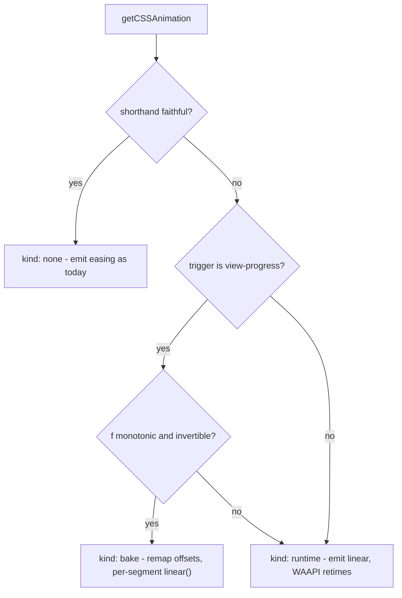

# Iteration Easing Parity Between WAAPI and Generated CSS

## Problem recap

`getEffectsData` builds one timing object used by both renderers:

```97:102:packages/motion/src/api/common.ts
    const effectOptions = {
      fill: effect.fill,
      easing: getEasing(effect.easing),
      iterations: effect.iterations === 0 ? Infinity : effect.iterations || 1,
```

WAAPI consumes it as iteration easing; `getAnimationAsCSS` drops the same string into the `animation` shorthand, where it becomes the per-segment fallback `animation-timing-function`. The two agree only in narrow cases.

## When the CSS is actually wrong

Let `f` be the resolved CSS easing and `o_i` the keyframe offsets. The shorthand is faithful **iff**:

- `f` is `linear`, **or**
- there is exactly one interpolation interval **and** no non-final keyframe carries its own `easing`.

The second clause matters because a keyframe's own `animation-timing-function` _overrides_ the element-level one in CSS, whereas WAAPI _composes_ the two. So even a 2-keyframe effect deviates if the first keyframe has an `easing` (e.g. `ShuttersIn` uses `easing: 'step-start'` on keyframe 0).

## Two remediations

### Bake (pure CSS, exact to sampling tolerance)

Re-sampling keyframe _values_ is not viable — preset values are opaque strings like `calc(var(--motion-direction-x) * var(--motion-distance-factor) * 50px)` in [packages/motion-presets/src/library/entrance/BounceIn.ts](packages/motion-presets/src/library/entrance/BounceIn.ts). Instead, move the keyframes in _time_ and push the residual curve into per-segment timing functions. Keyframe count is unchanged; no value math.

- New offsets: `u_i = f⁻¹(o_i)`
- Segment residual: `g_i(s) = (f(u_i + s·Δu_i) − o_i) / Δo_i`, a monotonic `[0,1] → [0,1]` map
- Emitted per-keyframe easing: `h_i = e_i ∘ g_i`, serialized as `linear(<stops>)` (`e_i` = the keyframe's original easing, identity if absent)
- Element-level easing becomes `linear`

`linear()` accepts numbers outside `[0,1]`, so an overshooting _keyframe_ easing (`backOut`) still serializes fine. Direction is safe: CSS reverses keyframe timing functions for `reverse`/`alternate-reverse`, which exactly reverses the baked value-vs-time curve, matching WAAPI applying `f` to directed progress.

**Not bakeable** when `f` is non-monotonic or non-invertible. From `cssEasings`, that is `backIn` / `backOut` / `backInOut` (cubic-beziers with control points outside `[0,1]`), plus any `steps()` / `step-start` / `step-end`, plus a non-monotonic `linear()`. Also bail when any non-final keyframe easing is a step function.

### Runtime override (WAAPI)

Emit `linear` in the shorthand and call `effect.updateTiming({ easing })` on the adopted `CSSAnimation`. The keyframes then carry `linear` per segment, so composing the iteration easing on top reproduces WAAPI semantics exactly.

No visual jump for time-based animations: `getAnimationAsCSS` emits `paused`, and `getAnimation` adopts + retimes at handler-registration time, long before `animation.play()` in [packages/interact/src/handlers/viewEnter.ts](packages/interact/src/handlers/viewEnter.ts) and [packages/interact/src/handlers/effectHandlers.ts](packages/interact/src/handlers/effectHandlers.ts). A scroll-driven animation is _not_ paused, so the non-bakeable scroll case can show a one-frame linear value before retiming.

## Routing



Per your direction: JS-triggered goes to WAAPI; `view-progress` tries CSS first and only falls back to the runtime override when the curve cannot be inverted.

## Implementation

### 1. Motion primitives — new [packages/motion/src/api/iterationEasing.ts](packages/motion/src/api/iterationEasing.ts)

- `cssEasingToFunction(css: string)` — resolves `linear`, `ease`, `ease-in`, `ease-out`, `ease-in-out`, `cubic-bezier(...)`, `linear(...)`, `steps(...)`. Reuses `cubicBezierEasing` and the private `parseCssLinear` from [packages/motion/src/utils.ts](packages/motion/src/utils.ts). Returns `{ fn, monotonic, isStep }` or `null`.
- `invertEasing(fn)` — bisection on `[0,1]`, ~40 iterations; build-time only, so cost is irrelevant.
- `easingToLinearStops(fn, samples = 16)` — emits `linear(y0 0%, y1 6.25%, …, yN 100%)`. Note this is distinct from the existing `jsEasingsInCSS`, which builds `calc()` fragments for sequence stagger.
- `fillKeyframeOffsets(keyframes)` — explicit offsets for every keyframe; same algorithm as Interact's `interpolateKeyframesOffsets`.

### 2. The planner (single source of truth)

```ts
type IterationEasingPlan =
  | { kind: 'none' }
  | { kind: 'bake'; keyframes: Keyframe[] }
  | { kind: 'runtime'; easing: string };

function planIterationEasing(
  easing: string, // already through getEasing()
  keyframes: Keyframe[],
  preferCSS: boolean, // trigger?.trigger === 'view-progress'
): IterationEasingPlan;
```

Pure and deterministic, so the build-time and runtime callers cannot disagree — this is why no flag needs to be encoded into the emitted CSS.

### 3. Build side — [packages/motion/src/api/cssAnimations.ts](packages/motion/src/api/cssAnimations.ts)

In the `data.map(...)` callback, call the planner. For `bake`, return the baked keyframes and pass `easing: 'linear'` into `getAnimationAsCSS`; for `runtime`, keep the original keyframes and pass `'linear'`. Thread an `easing` override parameter into `getAnimationAsCSS` rather than mutating `data.options`, since `options` is shared with the WAAPI path.

### 4. Runtime side — [packages/motion/src/motion.ts](packages/motion/src/motion.ts)

`getElementCSSAnimation` currently takes no trigger:

```22:25:packages/motion/src/motion.ts
function getElementCSSAnimation(
  target: HTMLElement | string | null,
  animationOptions: AnimationOptions,
): AnimationGroup | null {
```

Thread `trigger` through from `getAnimation`, run the planner, and when `kind === 'runtime'` call `animation.effect.updateTiming({ easing })` on every adopted `CSSAnimation` — in both the `namedEffect.style` branch and the `getElementAnimation(target, effectId)` fallback that catches `keyframeEffect`-generated CSS.

`getWebAnimation` needs no change; it is already correct.

### 5. Keyframe-to-CSS key mapping gap

Baking makes Motion emit keyframe-level `easing` for effects that previously had none. Motion's exported `toCSSPropertyName` does not map it, so these consumers would emit a literal `easing:` declaration:

- the `keyframesToCss` example in [packages/motion/rules/css-generation.md](packages/motion/rules/css-generation.md) and [packages/motion/docs/guides/ssr-css.md](packages/motion/docs/guides/ssr-css.md)
- `formatKeyframeBlock` in [packages/motion/e2e/fixtures/effects.ts](packages/motion/e2e/fixtures/effects.ts)

Export `toCSSKeyframeKey` from Motion (inverse of the existing private `KEYFRAME_CSS_TO_WAAPI`) and have [packages/interact/src/core/cssUtils.ts](packages/interact/src/core/cssUtils.ts) `keyframePropertyToCSS` delegate to it, so the mapping lives in one place.

### 6. Interact

Minimal. `keyframePropertyToCSS` already handles `easing`, `interpolateKeyframesOffsets` is a no-op on baked keyframes (they arrive with explicit offsets), and `viewProgress.ts` needs no change because the retiming happens inside `getElementCSSAnimation`. Only change: delegate offset filling and the key mapper to Motion to avoid two copies.

## Testing

**Parity harness (the core deliverable).** Compare in _progress space_ rather than value space, which sidesteps opaque `calc(var(…))` values entirely. For each sample time `t`, both models yield a `(segmentIndex, localProgress)` pair:

- WAAPI: `p = f(t)`; locate segment `j` in the original offsets; `local = e_j((p − o_j) / Δo_j)`
- Baked CSS: locate segment `j` in the baked offsets; `s = (t − u_j) / Δu_j`; `local = h_j(s)`, evaluating the emitted `linear()`

Assert identical `j` and `|Δlocal| < 1e-3`. Requires exposing the `linear()` parser for tests.

Coverage:

- Every value in `cssEasings` crossed with 2-keyframe, 3-keyframe, and 13-keyframe (`Bounce`) shapes, with and without keyframe-level easings.
- Planner classification: assert `none` for linear and single-interval cases, `bake` for monotonic multi-interval under `view-progress`, `runtime` for `back*` / `steps` and for all time-based triggers.
- Sweep every `@wix/motion-presets` `style()` output, asserting the plan kind and bake parity.
- E2E in [packages/motion/e2e](packages/motion/e2e): drive a WAAPI animation and the baked CSS animation to matched `currentTime` values and diff computed styles.

**Existing tests.** `packages/motion/test/motion.spec.ts:335` asserts `'fade-in 1000ms 0ms ease-in forwards 2 paused'`; that mock has two keyframes and no keyframe easing, so it classifies as `none` and stays green. Preset unit tests assert pre-CSS `AnimationData` and are unaffected. Interact's `css.spec.ts` may need updating for multi-keyframe presets.

## Optional: validator diagnostic

Add a warning in [packages/interact-validate/src/semantic/cssGeneration.ts](packages/interact-validate/src/semantic/cssGeneration.ts) when a `viewProgress` effect combines a non-invertible easing with multiple keyframe intervals, since that combination cannot stay pure CSS and will need a runtime retime.

## Docs and changelog

Semantics need restating in: [packages/motion/docs/core-concepts.md](packages/motion/docs/core-concepts.md), [packages/motion/docs/api/types.md](packages/motion/docs/api/types.md), [packages/motion/docs/api/core-functions.md](packages/motion/docs/api/core-functions.md), [packages/motion/docs/guides/ssr-css.md](packages/motion/docs/guides/ssr-css.md), [packages/motion/rules/motion-main.md](packages/motion/rules/motion-main.md), [packages/motion/rules/waapi.md](packages/motion/rules/waapi.md), [packages/motion/rules/css-generation.md](packages/motion/rules/css-generation.md), [packages/interact/rules/full-lean.md](packages/interact/rules/full-lean.md).

In particular the descriptor table in `rules/css-generation.md` documents the shorthand as `<name> <duration> <delay> <easing> …`; that `<easing>` slot is now `linear` whenever a fix is applied.

CHANGELOG: shipping default-on as a correctness fix, calling out that generated CSS changes for multi-keyframe effects with non-linear easing, and that `linear()` raises the floor to Chrome 113 / Safari 17.2 / Firefox 112 (already close to the existing floor, given `jsEasingsInCSS` emits `pow()`, `acos()`, and `round()`).

## Adjacent bug worth fixing

`getJsEasing('ease-out')` returns the linear function: `jsEasings` has no `ease*` keys, `parseCubicBezier` rejects the keyword, and the fallback is `jsEasings.linear`. This silently degrades `offsetEasing: 'ease-out'` and `transitionEasing`. `cssEasingToFunction` from step 1 is the natural fix — route `getJsEasing` through it for keyword inputs. Small, separable, worth doing in the same pass. »
