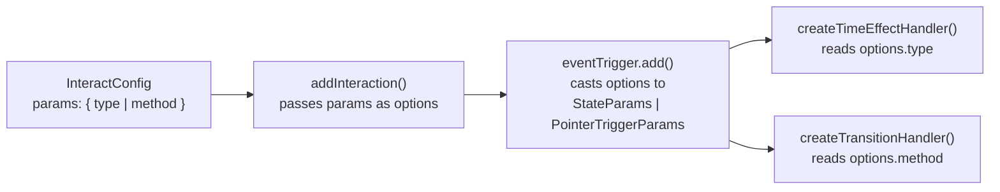
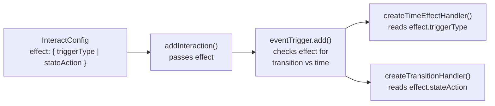

# Move `type` and `method` from Trigger Params to Effect Types

## Summary of Current Design

Currently, `PointerTriggerParams.type` and `StateParams.method` live on the trigger params object and are passed through the handler chain as part of `options`. The handler code in `eventTrigger.ts` and `effectHandlers.ts` casts `options` to the appropriate type and reads `.type` or `.method`.



## Target Design

Move `type` and `method` onto the effect objects themselves, renamed to `triggerType` and `stateAction`. Handlers read from the `effect` parameter instead of `options`.



---

## 1. Type Definition Changes

**File:** `[packages/interact/src/types.ts](packages/interact/src/types.ts)`

- Add `triggerType?: ViewEnterType | 'state'` to `TimeEffect` (line 104)
- Add `stateAction?: TransitionMethod` to `TransitionEffect` (line 141)
- Add `triggerType?: ViewEnterType | 'state'` to `SequenceOptionsConfig` (line 169) -- needed because sequence interactions pass a synthetic empty effect to handlers and `triggerType` controls sequence play behavior
- **Remove** `StateParams` type (lines 51-53)
- **Remove** `PointerTriggerParams` type (lines 55-57)
- Update `EventTriggerParams` to `{ eventConfig: EventTriggerConfig }` (remove the `StateParams | PointerTriggerParams` union, line 59)
- Update `TriggerParams` union: remove `StateParams` and `PointerTriggerParams` entries (lines 79-84), leaving `ViewEnterParams | PointerMoveParams | AnimationEndParams`
- Update `InteractionParamsTypes`: change `hover`, `click`, `activate`, `interest` from `StateParams | PointerTriggerParams` to `Record<string, never>` (or an empty object type `{}`) (lines 252-262)
- Replace all `StateParams['method']` references with `TransitionMethod`:
  - `IInteractionController.toggleEffect` (line 231)
  - `IInteractElement.toggleEffect` (line 248)
- Remove `StateParams` and `PointerTriggerParams` from the module's exports (they are re-exported via `export * from './types'`)

## 2. Handler Logic Changes

### `[packages/interact/src/handlers/effectHandlers.ts](packages/interact/src/handlers/effectHandlers.ts)`

- `createTimeEffectHandler` (line 15): Remove `options: PointerTriggerParams` parameter. Read `triggerType` from `effect.triggerType` instead of `options.type` (line 38: `const type = effect.triggerType || 'alternate'`)
- `createTransitionHandler` (line 94): Remove `options: StateParams` parameter. Read `stateAction` from `effect.stateAction` instead of `options.method` (line 107: `const method = effect.stateAction || 'toggle'`). Update the destructured effect type to include `stateAction` from `TransitionEffect`
- Remove imports of `StateParams` and `PointerTriggerParams`

### `[packages/interact/src/handlers/eventTrigger.ts](packages/interact/src/handlers/eventTrigger.ts)`

- `addEventTriggerHandler` (line 109): Update to read `triggerType`/`stateAction` from the `effect` instead of casting `options`
  - Line 131-138: Remove `options as StateParams` argument from `createTransitionHandler` call
  - Line 140-149: Remove `options as PointerTriggerParams` argument from `createTimeEffectHandler` call; read `once` from `(effect as TimeEffect).triggerType === 'once'`
  - Lines 183-187: Read `stateAction` from `(effect as TransitionEffect).stateAction` and `triggerType` from `(effect as TimeEffect).triggerType` instead of casting options
- Remove imports of `StateParams` and `PointerTriggerParams`

### `[packages/interact/src/handlers/index.ts](packages/interact/src/handlers/index.ts)`

- `withEventTriggerConfig` (line 21): Change `options: StateParams | PointerTriggerParams` to just accept whatever params remain (empty object for event triggers). Simplify the spread into `eventTrigger.add(source, target, effect, { eventConfig }, ...)` since there are no trigger-level params to forward
- Remove imports of `StateParams` and `PointerTriggerParams`

## 3. Core Logic Changes

### `[packages/interact/src/core/InteractionController.ts](packages/interact/src/core/InteractionController.ts)`

- Change `import type { ..., StateParams }` to `import type { ..., TransitionMethod }`
- Update `toggleEffect` method signature (line 97): `method: StateParams['method']` becomes `method: TransitionMethod`

### `[packages/interact/src/web/InteractElement.ts](packages/interact/src/web/InteractElement.ts)`

- Change `import type { ..., StateParams }` to `import type { ..., TransitionMethod }`
- Update `toggleEffect` method signature (line 57): `method: StateParams['method']` becomes `method: TransitionMethod`

### `[packages/interact/src/core/add.ts](packages/interact/src/core/add.ts)`

- `_processSequences` (line 446-457): Instead of passing `{} as Effect`, pass `{ triggerType: sequenceConfig.triggerType } as Effect` (or `{}` if no triggerType). Remove reliance on `interaction.params` for the type info
- `_processSequencesForTarget` (line 536-547): Same change as above -- pass `{ triggerType: sequenceConfig.triggerType } as Effect`

## 4. Config Format Migration

The user-facing config changes from:

```typescript
// Before
{
  trigger: 'click',
  params: { type: 'alternate' },
  effects: [{ effectId: 'my-effect', duration: 500, namedEffect: {...} }],
}
{
  trigger: 'hover',
  params: { method: 'toggle' },
  effects: [{ effectId: 'my-transition', transition: {...} }],
}
```

To:

```typescript
// After
{
  trigger: 'click',
  effects: [{ effectId: 'my-effect', duration: 500, namedEffect: {...}, triggerType: 'alternate' }],
}
{
  trigger: 'hover',
  effects: [{ effectId: 'my-transition', transition: {...}, stateAction: 'toggle' }],
}
```

For sequences:

```typescript
// Before
{ trigger: 'click', params: { type: 'alternate' }, sequences: [{ effects: [...] }] }

// After
{ trigger: 'click', sequences: [{ triggerType: 'alternate', effects: [...] }] }
```

## 5. Test Updates

### `[packages/interact/test/mini.spec.ts](packages/interact/test/mini.spec.ts)`

- Lines ~116-120: Move `params: { type: 'alternate' }` into each effect as `triggerType: 'alternate'`
- Lines ~129-134: Move `params: { method: 'toggle' }` into each effect as `stateAction: 'toggle'`
- Lines ~142-146: Move `params: { type: 'alternate' }` into each effect as `triggerType: 'alternate'`
- Lines ~164-168: Move `params: { method: 'toggle' }` into each effect as `stateAction: 'toggle'`

### `[packages/interact/test/web.spec.ts](packages/interact/test/web.spec.ts)`

- Lines ~123-127: Move `params: { type: 'alternate' }` to effect `triggerType: 'alternate'`
- Lines ~136-140: Move `params: { method: 'toggle' }` to effect `stateAction: 'toggle'`
- Lines ~150-154: Move `params: { type: 'alternate' }` to effect `triggerType: 'alternate'`
- Lines ~171-175: Move `params: { method: 'toggle' }` to effect `stateAction: 'toggle'`
- Lines ~2695-2707: Move `params: { method: 'toggle' }` to effect `stateAction: 'toggle'`

### `[packages/interact/test/react.spec.tsx](packages/interact/test/react.spec.tsx)`

- Lines ~73-83: Move `params: { type: 'alternate' }` to effect `triggerType: 'alternate'`
- Lines ~86-96: Move `params: { type: 'alternate' }` to effect `triggerType: 'alternate'`

## 6. Demo Updates

- `[apps/demo/src/web/components/SequenceClickDemo.tsx](apps/demo/src/web/components/SequenceClickDemo.tsx)` (line 9): Move `params: { type: 'alternate' }` to sequence config: `sequences: [{ triggerType: 'alternate', ... }]`
- `[apps/demo/src/web/components/SequenceEasingComparison.tsx](apps/demo/src/web/components/SequenceEasingComparison.tsx)` (line 34): Same for `params: { type: 'repeat' }` → `triggerType: 'repeat'`
- `[apps/demo/src/react/components/SequenceClickDemo.tsx](apps/demo/src/react/components/SequenceClickDemo.tsx)` (line 10): Same
- `[apps/demo/src/react/components/SequenceEasingComparison.tsx](apps/demo/src/react/components/SequenceEasingComparison.tsx)` (line 35): Same

## 7. Documentation Updates

- `[packages/interact/docs/api/types.md](packages/interact/docs/api/types.md)`: Remove `StateParams` and `PointerTriggerParams` sections. Add `triggerType` to `TimeEffect` docs and `stateAction` to `TransitionEffect` docs. Update `TriggerParams`, `EventTriggerParams`, `InteractionParamsTypes` docs. Update `toggleEffect` signatures to use `TransitionMethod`.
- `[packages/interact/docs/api/interaction-controller.md](packages/interact/docs/api/interaction-controller.md)`: Update `toggleEffect` signature from `StateParams['method']` to `TransitionMethod`
- `[packages/interact/docs/api/README.md](packages/interact/docs/api/README.md)`: Remove link to `StateParams`
- `[packages/interact/rules/full-lean.md](packages/interact/rules/full-lean.md)`: Update type descriptions
- `[packages/interact/rules/click.md](packages/interact/rules/click.md)`: Update `StateParams` reference
- `[packages/interact/rules/MASTER-CLEANUP-PLAN.md](packages/interact/rules/MASTER-CLEANUP-PLAN.md)`: Update `StateParams.method` row

## 8. Verification

- Run `yarn build` to verify TypeScript compilation
- Run tests to ensure no regressions
