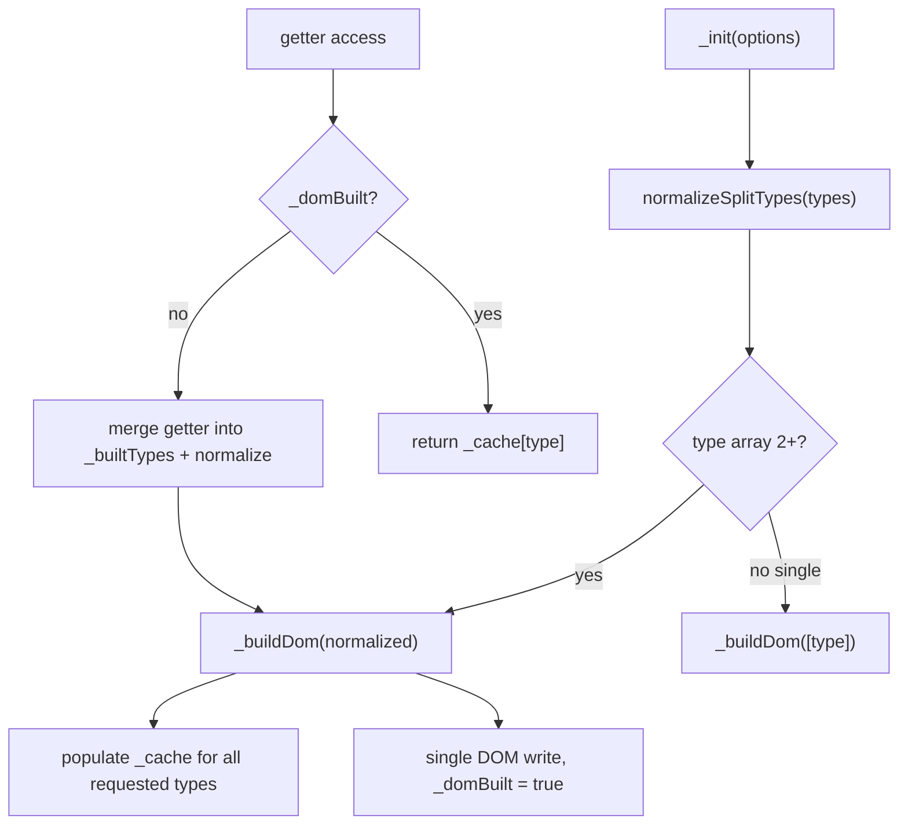

# Nested split composition

## Goal

When `type` is an array of **2+ split types**, build a **nested DOM tree** (coarse → fine) in a single pass — e.g. line spans containing word spans containing char spans. This is the **only** multi-type behavior; there is no opt-in flag and no single-type DOM swapping.

Input order is **ignored** — types are always normalized to canonical hierarchy order before building.

**Remove entirely:** `_activeType`, `_activate`, `_activatePreserve`, and the compute-then-swap model. Replace with one `_buildDom(types)` pipeline.

## API (no new options)

Existing `type` option drives behavior:

| `type`                        | DOM behavior                                          |
| ----------------------------- | ----------------------------------------------------- |
| Omitted                       | Lazy — no DOM mutation until a getter is accessed     |
| Single value (`'chars'`)      | Flat split of that one type                           |
| Array, length 1 (`['chars']`) | Same as single value                                  |
| Array, length 2+              | **Nested** tree; types auto-sorted to canonical order |

**Canonical type order** (coarse → fine):

```
lines → sentences → words → chars
```

`normalizeSplitTypes(['chars', 'words'])` → `['words', 'chars']`

`normalizeSplitTypes(['chars', 'lines', 'words'])` → `['lines', 'words', 'chars']`

Duplicates are removed. Unknown values would still throw (not a valid `SplitType`).

**v1 constraint:** Multi-type arrays (2+ types) require flatten semantics. Throw if `nested` is `'preserve'` or a number. Single-type splits continue to support all `nested` modes (`'preserve'`, `'flatten'`, number) unchanged.

Update JSDoc on `type` in [`packages/splittext/src/types.ts`](packages/splittext/src/types.ts) — document that array order is normalized automatically.

## Breaking changes

| Before                                                          | After                                                                     |
| --------------------------------------------------------------- | ------------------------------------------------------------------------- |
| `type: ['chars', 'words']` computes both, mounts **words** only | Builds nested tree: words containing chars (same as `['words', 'chars']`) |
| `result.chars` then `result.words` swaps active type in DOM     | Rebuilds as nested `['words', 'chars']` regardless of access order        |
| README: "only last type inserted into DOM"                      | Remove; document nested default + auto-sort                               |

## Lazy evaluation rules

Without eager `type`:

- **First getter** accessed builds a flat split of that one type.
- **Subsequent getter** for a different type: merge into `_builtTypes`, **normalize** to canonical order, **rebuild** DOM as nested tree (e.g. accessed `chars` then `words` → `['words', 'chars']`).
- Once a multi-type DOM is built (`_domBuilt` with 2+ types), getters are **read-only** — no further type additions.

Track requested types in `_builtTypes: SplitType[]` instead of `_activeType`.

## Architecture



### New module: [`packages/splittext/src/nestedSplit.ts`](packages/splittext/src/nestedSplit.ts)

Pure functions (unit-testable without full `SplitTextResultImpl`):

- `SPLIT_TYPE_ORDER: readonly SplitType[]` — `['lines', 'sentences', 'words', 'chars']`
- `normalizeSplitTypes(types: SplitType[]): SplitType[]` — dedupe, sort by `SPLIT_TYPE_ORDER`, return canonical list
- `buildNestedNodes(text: string, types: SplitType[], options: SplitTextOptions, indexOffsets: IndexOffsets): { nodes: Node[]; spansByType: Partial<Record<SplitType, HTMLSpanElement[]>> }`

**`normalizeSplitTypes` implementation:**

```typescript
const SPLIT_TYPE_ORDER = ['lines', 'sentences', 'words', 'chars'] as const;

function normalizeSplitTypes(types: SplitType[]): SplitType[] {
  const unique = [...new Set(types)];
  return SPLIT_TYPE_ORDER.filter((t) => unique.includes(t));
}
```

**Core nesting algorithm** (string → DOM fragment):

```typescript
// Pseudocode for types = ['words', 'chars'] (always canonical order)
function buildNestedNodes(text, types, options, offsets) {
  if (types.length === 1) return splitSingleType(text, types[0], ...);

  const outer = types[0];
  const rest = types.slice(1);

  if (outer === 'lines') {
    // handled at element level, not here
  }

  const segments = segmentForType(outer, text, options);
  return segments.map((seg, i) => {
    const wrapper = createWrapper(seg.text, outer, offsets[outer] + i, options);
    if (rest.length === 1 && rest[0] === 'chars') {
      const charSpans = splitChars(seg.text, options, offsets.chars);
      wrapper.textContent = '';
      wrapper.append(...charSpans);
    } else {
      const inner = buildNestedNodes(seg.text, rest, options, offsets);
      wrapper.append(...inner.nodes);
    }
    return wrapper;
  });
}
```

**Lines** are special: detected at **element** level via existing [`detectLines()`](packages/splittext/src/lineDetection.ts) before any mutation, then each line string is passed to `buildNestedNodes` for the remaining types.

**Index continuity**: maintain running offsets per type across all segments/lines (same contract as today's global `--char-index` / `--word-index`).

**`wordGlue: 'none'`**: inter-word text nodes stay between word spans; char nesting only applies inside each word span's text.

### Changes to [`packages/splittext/src/splitText.ts`](packages/splittext/src/splitText.ts)

**Remove:**

- `_activeType`, `_activate`, `_activatePreserve`
- Per-type `_compute` + `_computePreserve` + `_preserveMap` for multi-type paths (preserve single-type `_buildDomPreserve` can remain for `nested: 'preserve'` single-type splits)

**New state:**

```typescript
private _domBuilt = false;
private _builtTypes: SplitType[] = [];
```

**Unified `_buildDom(types: SplitType[])`:**

- Always normalize first: `const ordered = normalizeSplitTypes(types)`
- `ordered.length === 1` → delegate to existing single-type logic (preserve or flatten, including lines Range detection)
- `ordered.length >= 2` → `assertFlattenMode(options)` then nested pipeline:
  1. If `lines` in ordered: `detectLines(element)` on live layout → per-line `buildNestedNodes` for remaining types
  2. Else: `buildNestedNodes(_splitText, ordered, ...)`
  3. Apply `bidiResolver` at top level if set
  4. `element.innerHTML = ''` → `applyAccessibility` → append nodes
  5. Populate `_cache` from `spansByType`; set `_domBuilt = true`, `_builtTypes = ordered`, `_isSplit = true`
  6. Call `onSplit`

**`_init` changes:**

```typescript
if (options.type) {
  const types = Array.isArray(options.type) ? options.type : [options.type];
  this._buildDom(types); // normalizes internally
}
```

**Getter changes (side-effect-free after build):**

```typescript
get chars(): HTMLSpanElement[] {
  if (this._domBuilt) return this._cache.chars ?? [];
  this._buildDom(this._resolveLazyTypes('chars'));
  return this._cache.chars!;
}
```

`_resolveLazyTypes(requested: SplitType)` merges `_builtTypes` with the newly requested type, calls `normalizeSplitTypes`, returns the canonical list to build.

**`_resetState`**: clear `_domBuilt`, `_builtTypes`, caches.

**`_resplit` (autoSplit)**: re-run `_buildDom(this._builtTypes)` after reset + text re-capture.

## Files

| File                                                                                         | Change                                                                           |
| -------------------------------------------------------------------------------------------- | -------------------------------------------------------------------------------- |
| [`packages/splittext/src/types.ts`](packages/splittext/src/types.ts)                         | Update `type` JSDoc only                                                         |
| [`packages/splittext/src/nestedSplit.ts`](packages/splittext/src/nestedSplit.ts)             | **New** — normalization + `buildNestedNodes` + line orchestration                |
| [`packages/splittext/src/splitText.ts`](packages/splittext/src/splitText.ts)                 | `_buildDom`, remove activate/activeType, refactor getters / `_init` / `_resplit` |
| [`packages/splittext/test/nestedSplit.spec.ts`](packages/splittext/test/nestedSplit.spec.ts) | **New** — unit tests                                                             |
| [`packages/splittext/test/splitText.spec.ts`](packages/splittext/test/splitText.spec.ts)     | Nested tests + update breaking tests                                             |
| [`packages/splittext/README.md`](packages/splittext/README.md)                               | Multi-type nesting docs, auto-sort note, breaking change                         |

## Tests

### Unit ([`nestedSplit.spec.ts`](packages/splittext/test/nestedSplit.spec.ts))

- `normalizeSplitTypes`: dedupes, sorts `['chars','words']` → `['words','chars']`, sorts `['chars','lines','words']` → `['lines','words','chars']`
- `buildNestedNodes('Hello', ['words','chars'])`: word spans contain char spans; flat `chars` array length = 5
- `['words']` only: flat word spans
- `wordGlue: 'none'`: text nodes between words, chars inside word spans
- Index properties continuous

### Integration ([`splitText.spec.ts`](packages/splittext/test/splitText.spec.ts))

- `{ type: ['words','chars'], nested: 'flatten' }`: both `.split-w` and `.split-c` in DOM; char is descendant of word
- `{ type: ['chars','words'], nested: 'flatten' }`: **same result** as above (auto-sorted)
- `{ type: ['lines','words'] }`: line spans contain word spans
- `{ type: ['lines','words','chars'] }`: three levels deep
- Getters return flat arrays; repeated getter access does not mutate DOM
- `{ type: ['words','chars'], nested: 'preserve' }` throws
- **Update** `multiple split types` describe block: chars-then-words lazy access builds same nested tree as words-then-chars
- **Remove** tests for last-type-wins, re-activate, cached-span swap on type switch
- `autoSplit` with multi-type: resize rebuilds nested tree
- `revert()` clears nested state
- Single-type preserve/flatten tests unchanged

## Documentation (README)

Replace the "last type active" note with:

```typescript
// Multi-type — words containing chars (order in array does not matter)
splitText('.headline', {
  nested: 'flatten',
  type: ['chars', 'words'], // normalized to ['words', 'chars']
});
```

Note: the `nested` option controls **HTML structure** handling (`preserve` vs `flatten`); multi-type `type` arrays control **split-type nesting** (lines wrapping words wrapping chars), always applied in canonical coarse-to-fine order.

## Out of scope (v1)

- Multi-type nesting with `nested: 'preserve'` or numeric depth (throws; follow-up)
- Sentences + lines edge cases across inline element boundaries (inherits line-detection limitations)

## Verification

```bash
nvm use && yarn workspace @wix/splittext test
```
