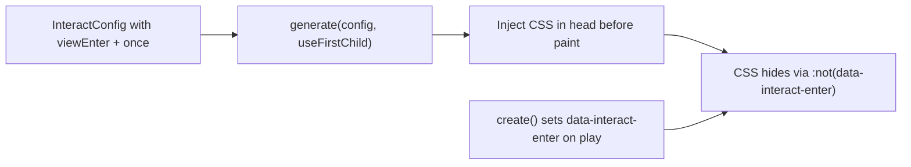

# Remove `pageVisible` trigger and `initial` attribute

## Current state

### `pageVisible` — docs-only, not implemented

A repo-wide search shows **zero** runtime references. The canonical `TriggerType` in [`packages/interact/src/types/triggers.ts`](packages/interact/src/types/triggers.ts) and [`packages/interact-validate/src/schema/interactions.ts`](packages/interact-validate/src/schema/interactions.ts) lists 8 triggers; `pageVisible` is not among them. [`packages/interact/src/handlers/index.ts`](packages/interact/src/handlers/index.ts) has no handler or alias.

The only in-repo mentions are in **agent skill references**:

- [`skills/interactor/references/config-schema.md`](skills/interactor/references/config-schema.md) — listed in `TriggerType` union and trigger-param sections (lines ~82, ~139)

No package docs, rules, tests, or validate schema need code changes for `pageVisible` removal — only skill/reference cleanup and a repo grep to confirm nothing was missed.

### `data-interact-initial` / React `initial` — marker only, never read by runtime

The attribute is **written** by the React wrapper but **never read** by interact runtime:

```48:48:packages/interact/src/react/Interaction.tsx
      data-interact-initial={initial ? 'true' : undefined}
```

FOUC prevention is already driven entirely by `generate()` via internal `shouldUseInitial()` → `ResolvedEffect.initial` → CSS rules gated on `:not([data-interact-enter])` in [`packages/interact/src/core/css.ts`](packages/interact/src/core/css.ts). The docs incorrectly claim both `generate()` **and** the marker attribute are required — that is stale/incorrect guidance.

**In scope:** remove the DOM/prop surface and all docs/examples that reference it.

**Out of scope (keep as-is):** internal `shouldUseInitial`, `ResolvedEffect.initial`, `DEFAULT_INITIAL`, and `generate()` FOUC CSS rules — these are config-driven, not attribute-driven.

---

## Part A — Remove `pageVisible` references

| Location                                                                                                                         | Action                                                                                          |
| -------------------------------------------------------------------------------------------------------------------------------- | ----------------------------------------------------------------------------------------------- |
| [`skills/interactor/references/config-schema.md`](skills/interactor/references/config-schema.md)                                 | Remove `pageVisible` from `TriggerType` union and any trigger-param lists; use `viewEnter` only |
| Any other skill/reference files                                                                                                  | Grep `pageVisible` and remove (currently only `config-schema.md`)                               |
| Draft plan [`render-timeline-animation-triggers.md`](.cursor/plans/render-timeline-animation-triggers.md) (if present on branch) | Update or drop references to `pageVisible` as a sibling of `viewEnter`                          |

No changes needed to handlers, types, validate schema, or tests — `zod.enum` already rejects unknown triggers.

---

## Part B — Remove `initial` attribute / React prop

### 1. Package code

**[`packages/interact/src/react/Interaction.tsx`](packages/interact/src/react/Interaction.tsx)**

- Remove `initial?: boolean` from `InteractionProps`
- Remove destructuring of `initial`
- Remove `data-interact-initial={...}` from rendered element

No other runtime files reference `data-interact-initial`.

### 2. Docs and rules — rewrite FOUC guidance

Update FOUC sections to a **single-step** flow: inject `generate(config, useFirstChild)` CSS into `<head>`. Remove “Step 2: Mark elements with `initial`” and the claim that both steps are required.

Files to update:

| File                                                                                                               | Changes                                                                                    |
| ------------------------------------------------------------------------------------------------------------------ | ------------------------------------------------------------------------------------------ |
| [`packages/interact/rules/viewenter.md`](packages/interact/rules/viewenter.md)                                     | Remove Step 2, `initial` rules, and HTML/React examples with the attribute                 |
| [`packages/interact/rules/integration.md`](packages/interact/rules/integration.md)                                 | Same FOUC section rewrite                                                                  |
| [`packages/interact/rules/full-lean.md`](packages/interact/rules/full-lean.md)                                     | Same                                                                                       |
| [`packages/interact/rules/viewprogress.md`](packages/interact/rules/viewprogress.md)                               | Remove “unlike viewEnter … `initial` attribute” comparison (or rephrase without `initial`) |
| [`packages/interact/docs/api/functions.md`](packages/interact/docs/api/functions.md)                               | FOUC section: `generate()` only; remove `initial` prop mentions                            |
| [`packages/interact/docs/integration/react.md`](packages/interact/docs/integration/react.md)                       | Remove `initial` row from props table                                                      |
| [`packages/interact/docs/examples/entrance-animations.md`](packages/interact/docs/examples/entrance-animations.md) | Remove `data-interact-initial` from examples                                               |

Corrected FOUC story (for docs):



### 3. Agent skill and evals

| File                                                                                                           | Changes                                                                 |
| -------------------------------------------------------------------------------------------------------------- | ----------------------------------------------------------------------- |
| [`skills/interactor/SKILL.md`](skills/interactor/SKILL.md)                                                     | FOUC checklist: `generate()` only; remove `initial` marker instructions |
| [`skills/interactor/references/config-schema.md`](skills/interactor/references/config-schema.md)               | Remove `initial` / `data-interact-initial` FOUC section                 |
| [`skills/interactor/references/integration-recipes.md`](skills/interactor/references/integration-recipes.md)   | Remove attribute from all recipes; drop React `initial` prop docs       |
| [`skills/interactor/evals/evals.json`](skills/interactor/evals/evals.json)                                     | Update expected_output / graders: FOUC = injected `generate()` only     |
| [`skills/interactor/evals/files/edit-config/index.html`](skills/interactor/evals/files/edit-config/index.html) | Remove `data-interact-initial="true"`                                   |

### 4. Website — migrate to build-time `generate()` (your choice)

The landing page, examples shell, and `view-enter` demo currently use hand-written critical CSS keyed on `[data-interact-initial='true']`:

```17:26:apps/website/index.html
        @media (prefers-reduced-motion: no-preference) {
            [data-interact-initial='true'] > :first-child:not([data-interact-enter]) {
                visibility: hidden;
                ...
            }
        }
```

**Migration approach:**

1. Add a small build script (e.g. `apps/website/scripts/generate-critical-css.mjs`) that:
   - Imports the landing/examples `InteractConfig` (extract shared config from [`apps/website/assets/main.mjs`](apps/website/assets/main.mjs) into a dedicated `interact-config.mjs` if needed)
   - Calls `generate(config, true)` from `@wix/interact`
   - Writes `apps/website/assets/css/critical-interact.css` (or injects into a generated partial)

2. Wire into [`scripts/build-landing.sh`](scripts/build-landing.sh) (or `yarn workspace @wix/interact-website build`) so CI produces the file before deploy.

3. Replace inline `<style>` FOUC blocks in:
   - [`apps/website/index.html`](apps/website/index.html)
   - [`apps/website/examples.html`](apps/website/examples.html)
   - [`apps/website/assets/examples/basic/view-enter.html`](apps/website/assets/examples/basic/view-enter.html)

   with `<link rel="stylesheet" href=".../critical-interact.css">` (or equivalent path).

4. Strip all `data-interact-initial="true"` attributes from those HTML files (~20 occurrences on `index.html` alone).

---

## Part C — Verification

```bash
nvm use
yarn workspace @wix/interact test
yarn workspace @wix/interact-website run build   # after adding generate script
```

**Grep sanity checks (expect zero hits after cleanup):**

```bash
rg 'pageVisible|data-interact-initial|initial=\{true\}|initial prop' --glob '!node_modules'
```

**Manual smoke:**

- Landing page (`/`) — entrance elements hidden until scroll-in; no FOUC flash
- Examples page (`/examples.html`) — same
- `view-enter.html` iframe demo — still works
- React `Interaction` — still sets `data-interact-key`; no `data-interact-initial` in DOM

---

## Risk notes

- **Breaking change for consumers** using `initial` on `<Interaction>` or `data-interact-initial` in HTML. This is intentional; FOUC now relies solely on `generate()` CSS (which was always the mechanism that actually worked).
- **Website config extraction** may be the largest mechanical task — `main.mjs` is ~1.7k lines with config embedded inline. Extract only the `InteractConfig` object(s) needed for `generate()`, not the full demo logic.
- **`pageVisible` configs** from external consumers (if any) already fail validate today; no migration path needed beyond skill-doc cleanup.
