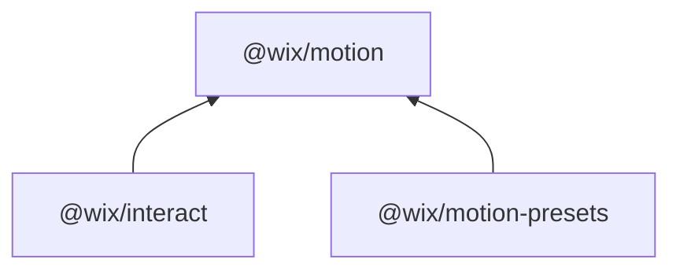

# Root README.md Implementation Plan

## Current State

The existing [README.md](README.md) is 57 lines of generic monorepo boilerplate — `yarn install`, `yarn build`, `yarn test`, and a link to CONTRIBUTING.md. It says nothing about what the project is, what problem it solves, or how to use it.

## Target

A single-file landing page that serves three audiences simultaneously:
- **Developers**: quick-start examples, package navigation, API surface
- **Designers / non-coders**: what-it-does framing, link to live demos
- **AI agents / LLMs**: structured config schema, rules file links, canonical constraints

## Section Structure

### 1. Title + Tagline

```
# Wix Interact
Web-native animation and interaction libraries — declarative, AI-ready, framework-agnostic.
```

Use the root `package.json` description as the basis. No hero image for now (can be added later).

### 2. Badges

npm versions for all 3 packages, MIT license badge, bundle size badge for `@wix/interact`. Use shields.io.

### 3. What is Interact? (Elevator Pitch)

2-3 sentences covering:
- Config-driven: define trigger-to-effect bindings in JSON, not imperative code
- Built on native browser APIs (WAAPI, ViewTimeline, pointer tracking) — no custom animation runtime
- Three entry points: vanilla JS, React, Web Components
- Ready-made presets for common patterns (entrance, scroll, hover, pointer)

### 4. Packages Table

Three-column table: Package | Description | Links.

- `@wix/interact` v2.2.2 — Declarative interaction layer (the main package)
- `@wix/motion` v2.1.5 — Low-level animation engine
- `@wix/motion-presets` v1.0.2 — Ready-made animation presets

Include the dependency diagram as a compact mermaid graph:



### 5. Which Package Should I Use?

Decision table with 4 rows:

| Goal | Package |
|------|---------|
| Add animations to a page via config | `@wix/interact` |
| Use ready-made entrance/scroll/hover presets | `@wix/interact` + `@wix/motion-presets` |
| Build a custom animation engine or low-level control | `@wix/motion` |
| Generate interaction configs from AI/LLM | `@wix/interact` + rules files |

### 6. Quick Start (The Core of the README)

This is the most critical section. Three sub-sections showing complete, working examples that an LLM can copy and adapt without errors.

**Important accuracy constraints** (from source code analysis):
- `effects` at config top-level is `Record<string, Effect>` — always include it, even as `{}`
- `add` / `remove` are standalone imports, NOT instance methods
- React requires `useEffect` wrapper with `instance.destroy()` cleanup
- `Interact.registerEffects(presets)` must be called before `Interact.create()` when using `namedEffect`
- `<interact-element>` must have exactly one child (library targets `.firstElementChild`)

#### 6a. React (Primary — shown first since it's the most common path)

Complete working example with:
- `@wix/motion-presets` registration
- `useEffect` + cleanup pattern from [integration.md](packages/interact/rules/integration.md) lines 56-69
- `<Interaction>` component with `tagName`, `interactKey`, `initial`
- `generate()` for FOUC prevention
- A `viewEnter` + `FadeIn` named effect (most common use case)

#### 6b. Web Components

Same interaction config, but using:
- `import { Interact } from '@wix/interact/web'`
- `<interact-element data-interact-key="..." data-interact-initial="true">`

#### 6c. Vanilla JS

Same config, but using:
- `import { Interact, add } from '@wix/interact'`
- `add(element, key)` standalone function
- `<div data-interact-key="...">`

### 7. Common Patterns (Recipes)

3-4 config-only snippets (no framework wrapper — just the `InteractConfig` object) for:

1. **Entrance animation** — `viewEnter` + `namedEffect: { type: 'FadeIn' }` + `triggerType: 'once'`
2. **Hover effect** — `hover` + keyframes with `triggerType: 'in'` (enter) behavior
3. **Scroll-driven parallax** — `viewProgress` + `rangeStart`/`rangeEnd` with cover offsets
4. **Click toggle** — `click` + `stateAction: 'toggle'` + CSS transition

Each snippet must be a valid `InteractConfig` shape (with `interactions` array and `effects` record).

### 8. Configuration Schema

A concise, annotated TypeScript block showing the canonical `InteractConfig` shape. This is the "machine-readable" section agents will parse. Derived from [config.ts](packages/interact/src/types/config.ts) lines 31-51:

```typescript
type InteractConfig = {
  interactions: Interaction[];       // trigger-to-effect bindings (REQUIRED)
  effects?: Record<string, Effect>; // reusable effect definitions
  sequences?: Record<string, SequenceConfig>;
  conditions?: Record<string, Condition>;
};
```

Plus the `Interaction` shape, trigger list, and effect discriminants (`keyframeEffect` | `namedEffect` | `customEffect` | `transition`).

### 9. AI and Agent Support

Structured section with:
- **Rules files** — direct links (relative paths) to all rules files in `packages/interact/rules/` and `packages/motion-presets/rules/presets/`. Use the GitHub Pages URLs for public access and relative paths for local/cloned access.
- **Config generation guidelines** — 4-5 bullet constraints:
  - Always register presets before `Interact.create()`
  - Do not invent `namedEffect` types — use only registered presets
  - Do not manually attach DOM event listeners — use triggers
  - `viewProgress` elements must not have `overflow: hidden` ancestors (use `overflow: clip`)
  - Include `generate()` + `initial` for entrance animations to prevent FOUC
- **For LLM context loading** — point to `AGENTS.md` / `CLAUDE.md` at repo root for full agent guidelines

### 10. Live Demo and Documentation

- Link to https://wix.github.io/interact/ (landing page)
- Link to https://wix.github.io/interact/docs/ (docs site)
- Link to https://wix.github.io/interact/playground/ (playground)

### 11. Development

Condensed section (this is a public README, not internal docs):
- Prerequisites: Node >= 18, Yarn 4.10.3, `nvm use`
- `yarn install && yarn build && yarn test`
- `yarn dev:docs` / `yarn dev:demo` / `yarn dev:playground`
- Link to [CONTRIBUTING.md](CONTRIBUTING.md)

### 12. License

MIT — link to LICENSE file.

## Files Changed

Only one file: [README.md](README.md) (full rewrite, ~250-300 lines).

## Key Sources for Accurate Examples

- [packages/interact/rules/integration.md](packages/interact/rules/integration.md) — canonical entry point patterns, React lifecycle, FOUC
- [packages/interact/rules/full-lean.md](packages/interact/rules/full-lean.md) — complete config spec, pitfalls, constraints
- [packages/interact/src/types/config.ts](packages/interact/src/types/config.ts) — TypeScript types for `InteractConfig`
- [packages/interact/src/types/triggers.ts](packages/interact/src/types/triggers.ts) — trigger type enum
- [packages/interact/src/types/effects.ts](packages/interact/src/types/effects.ts) — effect type unions
- [packages/interact/src/core/Interact.ts](packages/interact/src/core/Interact.ts) — static API surface

## Style Decisions

- No emojis in headers (per spec research — top-tier libraries avoid them)
- Clean markdown, no HTML
- Code examples use TypeScript (matches the library's source language)
- Config examples always show the full `InteractConfig` shape, not bare fragments
- Every example compiles against the actual exported types
