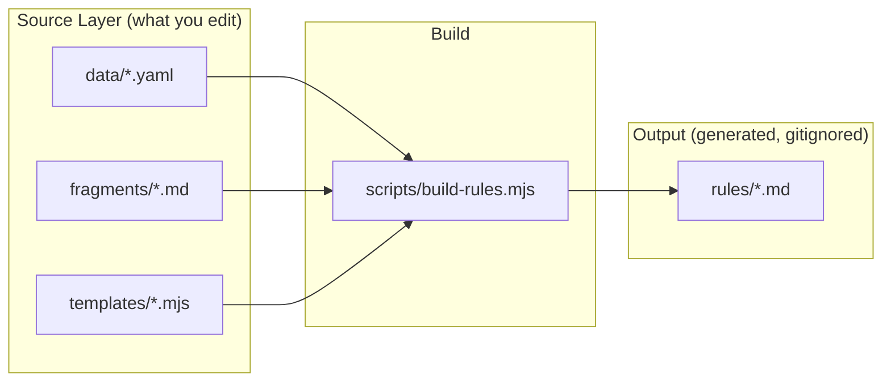

# Rules Build Pipeline

## Architecture

The build produces the same 7 output `.md` files that exist today, from three source layers:



All source files live under `packages/interact/_content/`. The build script reads them and writes the final `.md` files to `packages/interact/rules/`.

## Source Layer

### 1. Data files (`_content/data/`)

`**triggers.yaml**` — one entry per trigger, capturing structured data:

```yaml
triggers:
  - name: hover
    a11yAlias: interest
    a11yNote: "Use `trigger: 'interest'` instead of `trigger: 'hover'` to also respond to keyboard focus."
    defaultTriggerType: alternate
    params: []
    pitfalls:
      - id: hit-area
    showMultipleEffectsNote: true
    templateFields:
      [
        triggerType,
        keyframeEffect,
        namedEffect,
        fill,
        duration,
        easing,
        delay,
        iterations,
        alternate,
      ]
    triggerTypeDescriptions:
      alternate: 'plays forward on enter, reverses on leave. Default. Most common for hover.'
      repeat: 'restarts the animation from the beginning on each enter. On leave, jumps to the beginning and pauses.'
      once: 'plays once on the first enter and never again.'
      state: 'resumes on enter, pauses on leave. Useful for continuous loops (`iterations: Infinity`).'
    stateActionDescriptions:
      toggle: 'applies the style state on enter, removes on leave. Default.'
      # ...
    variableOverrides: # trigger-specific prose for variable descriptions in generated rule files
      sourceKeySuffix: 'The element that listens for hover.'
      targetKeyDesc: "identifier matching the element's key on the element that animates. ..."
      fillModeDesc: "usually `'both'`. Keeps the final state applied while hovering..."
      fillCritical: "Always include `fill: 'both'` for ..."
      easingDesc: "CSS easing string (e.g. `'ease-out'`, ...), or named easing from `@wix/motion`."
      iterationsDesc: 'optional. Number of iterations, or `Infinity` for continuous loops. ...'
      customEffectExamples: ''
      offsetEasingSuffix: ' CSS easing string, or named easing from `@wix/motion`.'
      alternateBoolSuffix: ''

  - name: click
    a11yAlias: activate
    a11yNote: "Use `trigger: 'activate'` instead of `trigger: 'click'` ..."
    defaultTriggerType: alternate
    params: []
    pitfalls: []
    showMultipleEffectsNote: false
    templateFields:
      [
        triggerType,
        keyframeEffect,
        namedEffect,
        fill,
        reversed,
        duration,
        easing,
        delay,
        iterations,
        alternate,
        effectId,
      ]
    # click includes reversed + effectId that hover omits
    triggerTypeDescriptions:
      alternate: 'plays forward on first click, reverses on next click. Default.'
      # ...
    variableOverrides:
      sourceKeySuffix: 'The element that listens for clicks.'
      targetKeyDesc: "identifier matching the element's key on the element that animates. If missing it defaults to ..."
      fillModeDesc: "optional. Always `'both'` with `triggerType: 'alternate'` or `'repeat'`, ..."
      fillCritical: "Always include `fill: 'both'` for ..."
      customEffectExamples: ', randomized behavior'
      alternateBoolSuffix: " Different from `triggerType: 'alternate'` which alternates per click."
    # ... viewEnter, viewProgress, pointerMove, animationEnd entries follow
```

The trigger entries for `viewEnter`, `viewProgress`, `pointerMove`, and `animationEnd` follow the same shape but will include their `params` definitions (from the real TypeScript types in `[packages/interact/src/types/triggers.ts](packages/interact/src/types/triggers.ts)`).

`**effects.yaml**` — shared effect field definitions, fill guidance, easing list:

```yaml
fillGuidance:
  both: 'use for scroll-driven, pointer-driven, and toggling effects (alternate, repeat, state)'
  backwards: "use for entrance animations with triggerType 'once' when the final keyframe matches the element's base style"

triggerTypes: [once, repeat, alternate, state]
stateActions: [toggle, add, remove, clear]

easings:
  - linear
  - ease
  # ... full list from full-lean.md line 350

presets:
  entrance: [FadeIn, GlideIn, SlideIn, ...]
  ongoing: [Pulse, Spin, Breathe, ...]
  scroll: [FadeScroll, RevealScroll, ...]
  mouse: [TrackMouse, Tilt3DMouse, ...]

rangeNames:
  entry: 'Element entering viewport'
  exit: 'Element exiting viewport'
  contain: 'After entry range and before exit range'
  cover: 'Full range from entry through contain and exit'
  entry-crossing: "From element's leading edge entering to trailing edge entering"
  exit-crossing: "From element's leading edge exiting to trailing edge exiting"
```

`**meta.yaml**` — package metadata:

```yaml
packageName: '@wix/interact'
presetsPackage: '@wix/motion-presets'
installCommand: 'npm install @wix/interact @wix/motion-presets'
entryPoints:
  web: '@wix/interact/web'
  react: '@wix/interact/react'
  vanilla: '@wix/interact'
```

### 2. Markdown fragments (`_content/fragments/`)

Each fragment has `<!-- #section -->` markers for different detail levels.

**Planned fragments** (extracted from the ~15 duplicated concepts):

| Fragment file                        | Sections                                                                                   | Used by                                     |
| ------------------------------------ | ------------------------------------------------------------------------------------------ | ------------------------------------------- |
| `fouc.md`                            | `#short`, `#long`, `#code-generate`, `#code-web`, `#code-react`, `#code-vanilla`, `#rules` | full-lean, integration, viewenter           |
| `element-resolution.md`              | `#source`, `#target`, `#intro`                                                             | full-lean, integration                      |
| `pitfalls/hit-area.md`               | `#hover`, `#pointermove`, `#full-lean-hover`, `#full-lean-pointermove`                     | hover, pointermove, full-lean               |
| `pitfalls/overflow-clip.md`          | `#short`, `#long`                                                                          | viewprogress, full-lean                     |
| `pitfalls/same-element-viewenter.md` | `#short`, `#long`                                                                          | viewenter, full-lean                        |
| `pitfalls/dont-guess-presets.md`     | `#default`                                                                                 | full-lean, pointermove (Rule 1 variables)   |
| `pitfalls/reduced-motion.md`         | `#default`                                                                                 | full-lean                                   |
| `pitfalls/perspective.md`            | `#default`                                                                                 | full-lean                                   |
| `quick-start.md`                     | `#web`, `#react`, `#vanilla`, `#cdn`, `#register-presets`                                  | full-lean, integration                      |
| `multiple-effects-note.md`           | `#default` (parameterized with `{{triggerName}}`)                                          | hover, viewenter, viewprogress, pointermove |
| `custom-effect-intro.md`             | `#default`                                                                                 | click, hover, viewenter                     |
| `sequences-intro.md`                 | `#short` (parameterized with `{{triggerName}}`)                                            | click, hover, viewenter                     |

### 3. Templates (`_content/templates/`)

Each template is a `.mjs` file exporting a function that receives data + fragments and returns a markdown string.

| Template                 | Generates              | Key logic                                                                                                                                                                                                                                  |
| ------------------------ | ---------------------- | ------------------------------------------------------------------------------------------------------------------------------------------------------------------------------------------------------------------------------------------ |
| `event-trigger-rule.mjs` | `click.md`, `hover.md` | Parameterized by trigger data. Generates Rule 1 (TimeEffect), Rule 2 (StateEffect), Rule 3 (customEffect), Rule 4 (sequences). The config block fields, variable descriptions, and trigger-specific wording all come from `triggers.yaml`. |
| `viewenter-rule.mjs`     | `viewenter.md`         | Includes FOUC section (from fragment), params on every template, no StateEffect rule.                                                                                                                                                      |
| `viewprogress-rule.mjs`  | `viewprogress.md`      | Scrub effects, range semantics, sticky pattern.                                                                                                                                                                                            |
| `pointermove-rule.mjs`   | `pointermove.md`       | Progress type, centering, device conditions, composite pattern.                                                                                                                                                                            |
| `full-lean.mjs`          | `full-lean.md`         | Comprehensive reference. Pulls from all data + fragments.                                                                                                                                                                                  |
| `integration.mjs`        | `integration.md`       | Integration guide. Pulls from meta + triggers data + fragments.                                                                                                                                                                            |

**Template function signature:**

```javascript
// event-trigger-rule.mjs
export function render(data, fragments) {
  const { trigger } = data;
  const { name, variableOverrides: vo } = trigger;
  return `# ${capitalize(name)} Trigger Rules for ${data.meta.packageName}
...
**CRITICAL — Accessible ${name}**: ${trigger.a11yNote}
${trigger.pitfalls.map((p) => fragments.get(`pitfalls/${p.id}`, name)).join('\n')}
...
**CRITICAL:** ${vo.fillCritical}
...`;
}
```

## Build Script (`scripts/build-rules.mjs`)

~150 lines of Node.js ESM. Core flow:

1. Load all YAML files from `_content/data/` using `js-yaml`
2. Load all fragment `.md` files, parse `<!-- #section -->` markers into a `Map<path, Map<section, string>>`
3. For each template, call its `render()` function with the appropriate data and fragments
4. Write output to `packages/interact/rules/`
5. Report what was generated

**Fragment resolution with parameterization:**

```javascript
class Fragments {
  get(path, section = 'default', params = {}) {
    let content = this.store.get(path)?.get(section);
    for (const [key, val] of Object.entries(params)) {
      content = content.replaceAll(`{{${key}}}`, val);
    }
    return content;
  }
}
```

**Dependencies:** Add `js-yaml` as a devDependency in `packages/interact/package.json`. No other new dependencies needed — Node 22 ESM handles everything.

## Integration with Existing Pipeline

- Add script to `[packages/interact/package.json](packages/interact/package.json)`:

```json
  "build:rules": "node scripts/build-rules.mjs"


```

- Add `build:rules` as a `prebuild` step or keep it manual (recommend manual for now — rules change infrequently)
- Update `[.github/workflows/interactdocs.yml](/.github/workflows/interactdocs.yml)` to run `build:rules` before copying rules to `_site/rules/`
- Generated `rules/*.md` files can be either committed (simpler CI) or gitignored (cleaner repo) — recommend **committed** initially so the npm package always has them, with a CI check that verifies they're up to date (`build:rules && git diff --exit-code rules/`)

## Known Fixes Included in Migration

These existing issues will be fixed as a natural consequence of the migration:

- `[EFFECT_DEFINTION]` typo in click/hover/viewenter sequence blocks (fix in template once)
- `hitAea` typo in pointermove.md (fix in fragment once)
- `type: 'once'` vs `triggerType: 'once'` inconsistency in full-lean.md FOUC section
- hover.md missing `reversed` and `effectId` fields in TimeEffect template (decide once in `triggers.yaml` whether they belong)
- `generate` import path inconsistency (`@wix/interact` vs `@wix/interact/web`) — standardize in FOUC fragment
- Missing "Multiple effects" note in click.md (present in hover.md but absent in click.md)
- Inconsistent "additional effects" comments across files

## Post-PR Fixes (from code review of PR #204)

The initial implementation (PR #204) landed the full architecture. The fixes below address CI failures, dead code, and simplification opportunities found during review.

### Fix 1: Commit updated `yarn.lock` (CI blocker)

The CI `Install dependencies` step runs `yarn install --immutable` which refuses to modify the lockfile. Adding `js-yaml` to `devDependencies` in `package.json` without updating `yarn.lock` causes this failure.

**Action:** Run `nvm use && yarn install` to regenerate the lockfile, then commit the updated `yarn.lock`.

### Fix 2: Remove dead fragments

`_content/fragments/custom-effect-intro.md` and `_content/fragments/sequences-intro.md` are not referenced by any template. The templates use `trigger.customEffectIntro` and `trigger.sequencesIntro` from YAML instead. These fragment files are dead code.

**Action:** Delete both files.

### Fix 3: Move prose descriptions out of `triggers.yaml`

`triggers.yaml` currently stores 15+ full-sentence prose fields per trigger entry (`timeEffectIntro`, `stateEffectIntro`, `sequencesIntro`, `customEffectIntro`, `fillCritical`, `sourceKeyDesc`, `targetKeyDesc`, `fillModeDesc`, `namedEffectDesc`, `easingDesc`, `iterationsDesc`, `alternateDesc`, `customEffectCallbackDesc`, `sequenceEffectDefDesc`, `sequenceOffsetEasingDesc`). YAML is suited for structured data, not paragraphs of English.

These fields only vary between hover and click. The viewEnter/viewProgress/pointerMove triggers don't use them at all (they have their own hardcoded templates).

**Action:**

- Remove all prose description fields from `triggers.yaml` (hover + click entries).
- Move the hover/click prose differences into `event-trigger-rule.mjs` directly, keyed by a simple flag or `trigger.name` check. These are small trigger-specific word choices (e.g. "while hovering" vs "while finished"), not reusable data.
- Keep only structured data in YAML: name, category, support flags, params, templateFields, pitfalls, triggerType/stateAction enum descriptions, `a11yAlias`, `a11yNote`, `defaultTriggerType`, `showMultipleEffectsNote`.

### Fix 4: Unify fill-mode variable placement

[`event-trigger-rule.mjs`](packages/interact/_content/templates/event-trigger-rule.mjs) has two nearly identical functions — `buildVariablesMidFill` (click) and `buildVariablesEndFill` (hover) — that differ only in where `[FILL_MODE]` appears in the variables list. The code block template itself always shows `fill` right after `namedEffect`/`keyframeEffect`, so the variables list should match that order.

**Action:**

- Collapse into a single `buildVariables` function that always places `[FILL_MODE]` after `[NAMED_EFFECT_DEFINITION]` (mid position, matching the config block order).
- Remove `fillModeAtEnd` and `fillModeDash` from `triggers.yaml`.
- Use a consistent em-dash separator for all triggers.

The single function:

```javascript
function buildVariables(trigger, fillModeVar, reversedVar, effectIdVar) {
  const lines = [
    `- \`[SOURCE_KEY]\` — ...`,
    `- \`[TARGET_KEY]\` — ...`,
    `- \`[TRIGGER_TYPE]\` — ...`,
    ...Object.entries(trigger.triggerTypeDescriptions).map(([k, v]) => `  - \`'${k}'\` — ${v}`),
    `- \`[KEYFRAMES]\` — ...`,
    `- \`[EFFECT_NAME]\` — ...`,
    `- \`[NAMED_EFFECT_DEFINITION]\` — ...`,
    fillModeVar,
  ];
  if (reversedVar) lines.push(reversedVar.trim());
  lines.push(
    `- \`[DURATION_MS]\` — ...`,
    `- \`[EASING_FUNCTION]\` — ...`,
    `- \`[DELAY_MS]\` — ...`,
    `- \`[ITERATIONS]\` — ...`,
    `- \`[ALTERNATE_BOOL]\` — ...`,
  );
  if (effectIdVar) lines.push(effectIdVar.trim());
  return lines.join('\n');
}
```

### Fix 5: Data-driven build manifest

Lines 104-148 of [`build-rules.mjs`](packages/interact/scripts/build-rules.mjs) repeat the same import-find-render-push pattern 6 times. Replace with a declarative manifest:

```javascript
const manifest = [
  {
    template: 'event-trigger-rule.mjs',
    triggers: ['click', 'hover'],
    output: (name) => `${name}.md`,
  },
  { template: 'viewenter-rule.mjs', triggers: ['viewEnter'], output: () => 'viewenter.md' },
  {
    template: 'viewprogress-rule.mjs',
    triggers: ['viewProgress'],
    output: () => 'viewprogress.md',
  },
  { template: 'pointermove-rule.mjs', triggers: ['pointerMove'], output: () => 'pointermove.md' },
  { template: 'full-lean.mjs', triggers: null, output: () => 'full-lean.md' },
  { template: 'integration.mjs', triggers: null, output: () => 'integration.md' },
];

for (const entry of manifest) {
  const mod = await import(join(CONTENT_DIR, 'templates', entry.template));
  if (entry.triggers) {
    for (const name of entry.triggers) {
      const trigger = data.triggers.find((t) => t.name === name);
      if (!trigger) throw new Error(`Trigger "${name}" not found in triggers.yaml`);
      outputs.push({ file: entry.output(name), content: mod.render(trigger, data, fragments) });
    }
  } else {
    outputs.push({ file: entry.output(), content: mod.render(data.triggers, data, fragments) });
  }
}
```

Adding a new template becomes a single manifest line.

### Fix 6: Fix stray backtick in `viewprogress-rule.mjs`

Line 86 of [`viewprogress-rule.mjs`](packages/interact/_content/templates/viewprogress-rule.mjs) uses `` easing: `'[EASING_FUNCTION]'` `` (backtick template literal) inside the code fence. All other templates use `easing: '[EASING_FUNCTION]'` (plain single-quoted string).

**Action:** Change to `easing: '[EASING_FUNCTION]'` for consistency.

### Fix 7: Extract shared sections into fragments

`full-lean.mjs` (604 lines) and `integration.mjs` (285 lines) are mostly hardcoded prose with only a handful of `fragments.get()` calls. Several large sections are duplicated between them with minor variation:

- **Conditions** block (~30 lines)
- **Static API** table (~20 lines)
- **Config Structure / InteractConfig** (~15 lines)
- **Sequences** section (~50 lines)

**Action:** Extract each into a new fragment with `<!-- #full-lean -->` / `<!-- #integration -->` section markers (same pattern as `fouc.md`). This brings these templates closer to the single-source-of-truth goal and makes future edits to these shared concepts a one-file change.

New fragment files:

- `_content/fragments/conditions.md` — `#full-lean`, `#integration`
- `_content/fragments/static-api.md` — `#full-lean`, `#integration`
- `_content/fragments/config-structure.md` — `#full-lean`, `#integration`
- `_content/fragments/sequences.md` — `#full-lean`, `#integration`

### Fix 8: Add CI freshness check

The plan and PR description both mention a freshness check, but [`.github/workflows/ci.yml`](.github/workflows/ci.yml) was not updated.

**Action:** Add a step after `Build` in the `build` job:

```yaml
- name: Verify generated rules are up to date
  run: |
    yarn workspace @wix/interact build:rules
    git diff --exit-code packages/interact/rules/
```

This ensures that if someone edits a source file but forgets to re-run `build:rules`, CI catches it.

### Fix 9: Regenerate output

After all fixes above, run `build:rules` and commit the regenerated `rules/*.md` files so they reflect the new `[FILL_MODE]` variable ordering in hover.md.

## Post-PR Fixes — Round 2 (code review refinements)

Fixes from a second review pass, addressing CI failures and simplification opportunities.

### Fix 10: Fix Prettier CI failure on range table

The range table in `full-lean.mjs` had a hardcoded header row (`| Range name | Meaning |`) with fixed column widths, but the generated data rows were wider (due to `entry-crossing` description). Prettier auto-pads markdown tables to the widest cell, so CI's `format:check` failed.

**Action:** Made the header + separator row dynamic — compute column widths from `Math.max(headerWidth, ...dataWidths)` and include the header in the generated `rangeTable` variable.

### Fix 11: Move variable description overrides into `triggers.yaml`

Fix 3 moved 15+ prose description fields out of YAML into `isClick`/`isHover` ternaries in `event-trigger-rule.mjs`. However, the trigger-specific differences are short structured phrases (not paragraphs), and the ternaries made the template harder to extend with new event triggers.

**Action:**

- Added `variableOverrides` map to each event trigger entry in `triggers.yaml` with fields: `sourceKeySuffix`, `targetKeyDesc`, `fillModeDesc`, `easingDesc`, `iterationsDesc`, `fillCritical`, `customEffectExamples`, `offsetEasingSuffix`, `alternateBoolSuffix`.
- Updated `event-trigger-rule.mjs` to read all prose from `trigger.variableOverrides` (aliased as `vo`) instead of `isClick`/`isHover` ternaries.
- Template is now fully data-driven — adding a third event trigger requires only a new YAML entry, no template changes.

### Fix 12: Simplify `buildVariables()` function

The function took 5 positional parameters (`trigger, isClick, isHover, hasReversed, hasEffectId`), 4 of which were derivable from `trigger`.

**Action:** Reduced to `buildVariables(trigger, hasReversed, hasEffectId)`. Reads all prose from `trigger.variableOverrides`. The `hasReversed`/`hasEffectId` booleans are still passed from the caller since they're also used in the template string.

### Fix 13: Remove unused YAML fields

`triggers.yaml` had fields that no template ever consumed: `category`, `supportsTimeEffect`, `supportsStateEffect`, `supportsScrubEffect`, `supportsCustomEffect`. The `templateFields` was also a nested object (`{timeEffect, stateEffect, customEffect}`) but only `timeEffect` was ever read.

**Action:**

- Removed all `category` and `supports*` fields from all 7 trigger entries.
- Flattened `templateFields` from nested object to a flat array (the fields that were under `timeEffect`).

### Fix 14: Regenerate output (round 2)

After all round 2 fixes, ran `build:rules` and verified all 5 CI checks pass: build, lint, format, test, rules freshness.

---

## Post-PR Fixes — Round 3 (data-driven trigger templates)

The trigger-specific templates (viewenter, viewprogress, pointermove) hardcode pitfall fragment calls and param descriptions that already exist in `triggers.yaml`. The event-trigger-rule.mjs template is fully data-driven (iterates `trigger.pitfalls`, reads `trigger.variableOverrides`), but the other templates bypass YAML data entirely. This violates the single-source-of-truth principle.

### Fix 15: Add `section` field to YAML pitfall entries

Different pitfall fragments use different section naming conventions. The event-trigger-rule.mjs uses the trigger name as the section (e.g. `fragments.get('pitfalls/hit-area', 'hover')`), which works because `hit-area.md` has a `#hover` section. But other fragments use generic names (`#short`, `#long`, `#pointermove-source`).

**Action:** Add an optional `section` field to pitfall entries in `triggers.yaml`. Templates use `p.section || name` to resolve the fragment section — defaulting to the trigger name when no explicit section is given.

```yaml
# hover — no section needed, defaults to 'hover'
pitfalls:
  - id: hit-area

# viewEnter — fragment section is 'short', not 'viewEnter'
pitfalls:
  - id: same-element-viewenter
    section: short

# viewProgress
pitfalls:
  - id: overflow-clip
    section: short

# pointerMove — fragment section is 'pointermove-source'
pitfalls:
  - id: hit-area
    section: pointermove-source
```

### Fix 16: Data-drive pitfalls in viewenter/viewprogress/pointermove templates

Replace hardcoded `fragments.get('pitfalls/...', '...')` calls with iteration over `trigger.pitfalls`, matching the pattern in event-trigger-rule.mjs.

### Fix 17: Data-drive param descriptions in viewenter-rule.mjs

The variable descriptions for `[VISIBILITY_THRESHOLD]` and `[VIEWPORT_INSETS]` are hardcoded but match the `description` field in `trigger.params`. Pull descriptions from YAML to maintain a single source of truth.

### Fix 18: Regenerate and verify

Run `build:rules` and verify the generated output is byte-identical to pre-refactor output.

---

## Post-PR Fixes — Round 4 (deduplication & consistency)

Final deduplication pass addressing remaining copy-paste across templates and inconsistent data-driving patterns.

### Fix 19: Shared variable descriptions helper (`varLine`)

Variable descriptions like `[SOURCE_KEY]`, `[TARGET_KEY]`, `[DURATION_MS]`, `[EASING_FUNCTION]`, `[DELAY_MS]`, `[EFFECT_NAME]`, `[NAMED_EFFECT_DEFINITION]`, `[FILL_MODE]`, `[UNIQUE_EFFECT_ID]`, `[CUSTOM_EFFECT_CALLBACK]`, `[TRANSITION_DURATION_MS]`, `[TRANSITION_EASING]`, `[CENTERED_TO_TARGET]`, `[HIT_AREA]` were copy-pasted across 4 trigger templates with minor wording variations.

**Action:** Added `varLine(name, ...args)` helper to `_helpers.mjs`. Each variable has a canonical description with optional trigger-specific suffix/override. All trigger templates now call `varLine('SOURCE_KEY', 'The element that listens for hover.')` instead of repeating the full description.

### Fix 20: Shared `buildPitfallsBlock` helper

All 4 trigger templates had an identical pattern: check `trigger.pitfalls?.length`, iterate, call `fragments.get()` with section resolution. Differed only in newline wrapping.

**Action:** Extracted `buildPitfallsBlock(trigger, fragments)` to `_helpers.mjs`. Returns raw content; templates handle their own spacing.

### Fix 21: Merge FOUC fragment section pairs

`fouc.md` had 6 near-identical section pairs (`#code-web`/`#code-web-example`, etc.) that differed only in using `[SOURCE_KEY]` vs `"hero"` for the key value.

**Action:** Merged each pair using `{{key}}` and `{{classAttr}}` interpolation. Templates now call `fragments.get('fouc', 'code-web', { key: 'hero', classAttr: ' class="hero"' })` for concrete examples and `{ key: '[SOURCE_KEY]', classAttr: '' }` for placeholders. Reduced from 6 sections to 3.

### Fix 22: Add `varName` to YAML params

`viewenter-rule.mjs` had a hardcoded `paramVarNames` map (`{ threshold: 'VISIBILITY_THRESHOLD', inset: 'VIEWPORT_INSETS' }`) that lived in the template rather than YAML.

**Action:** Added `varName` field to each param entry in `triggers.yaml`. Template reads `p.varName || p.name.toUpperCase()`.

### Fix 23: Add `template` field + schema comments to `triggers.yaml`

YAML had two implicit schemas (event triggers with `templateFields`/`variableOverrides` vs other triggers with just `params`) with no documentation.

**Action:** Added `template` field to each trigger entry indicating which `.mjs` template renders it. Added section comments separating event, viewport/scroll, and pointer/chaining trigger groups.

### Fix 24: Data-drive full-lean.mjs tables from YAML

The hover/click `triggerType` and `stateAction` comparison tables in `full-lean.mjs` were hardcoded markdown despite the data existing in `triggers.yaml`.

**Action:** Added `fullLeanBehavior.triggerType` and `fullLeanBehavior.stateAction` maps to hover and click YAML entries with condensed behavior descriptions. Added `buildBehaviorTable()` function that generates Prettier-compatible padded tables from YAML data.

### Fix 25: Data-drive full-lean.mjs pitfalls from YAML

`full-lean.mjs` hardcoded all 4 trigger-specific pitfall fragment calls (`overflow-clip/long`, `same-element-viewenter/long`, `hit-area/detailed-hover`, `hit-area/detailed-pointermove`) rather than deriving them from YAML.

**Action:** Added `fullLeanSection` field to pitfall entries in `triggers.yaml` (the section name used by full-lean.mjs). Added `fullLeanPitfallOrder` array in `effects.yaml` to control ordering. `full-lean.mjs` now iterates this array instead of hardcoding fragment calls.

### Fix 26: Regenerate output (round 4)

Regenerated all 7 rule files. 5 minor consistency improvements from standardized `varLine` descriptions (dropped redundant "/vanilla" in viewenter, standardized em-dash separator, added "from the top-level `effects` map" completeness note). Zero information loss. click.md, hover.md, full-lean.md, integration.md, pointermove.md are byte-identical to pre-refactor output.

---

## Post-PR Fixes — Round 5 (code review refinements)

Fixes from a final review pass, addressing data/template coupling, API inconsistencies, dead code, and missed deduplication.

### Fix 27: Remove unused `when` import

`viewenter-rule.mjs` imported `when` from `_helpers.mjs` but never called it.

**Action:** Removed unused import.

### Fix 28: Use FOUC fragments in integration.mjs

The FOUC code examples in `integration.mjs` (Web/React/Vanilla element markup) were hardcoded instead of using the parameterized `fouc.md` fragments that `full-lean.mjs` and `viewenter-rule.mjs` already use. This caused two inconsistencies: `<section id="hero">` (should be `class="hero"` like all other examples), and the heading said "**Web:**" instead of "**Web (Custom Elements):**".

**Action:** Replaced hardcoded code blocks with `fragments.get('fouc', 'code-web', { key: 'hero', classAttr: ' class="hero"' })` etc., matching `full-lean.mjs`.

### Fix 29: Move `contain` range note into YAML data

`viewprogress-rule.mjs` hardcoded a special case for the `contain` range name (`'. Typically used with a position: sticky container'`). This note is useful context that belongs in the data layer.

**Action:** Appended the sticky-container note to the `contain` description in `effects.yaml`. Removed the hardcoded special case from `viewprogress-rule.mjs`. The `full-lean.md` range table also now includes this note (wider column, auto-adjusted).

### Fix 30: Decouple full-lean.mjs from triggers.yaml

`fullLeanBehavior` data on hover/click trigger entries and `fullLeanSection` on pitfall entries existed solely to serve `full-lean.mjs`. This coupled the data layer to one specific template's rendering needs — adding a new output template would require adding more `fullXxx` fields to trigger entries.

**Action:**

- Moved `fullLeanBehavior` (hover + click triggerType/stateAction condensed descriptions) from `triggers.yaml` into a `FULL_LEAN_BEHAVIOR` constant in `full-lean.mjs`. Updated `buildBehaviorTable()` to read from the local constant instead of trigger data.
- Removed dead `fullLeanSection` field from all pitfall entries in `triggers.yaml` — this data was already present in `effects.yaml`'s `fullLeanPitfallOrder` array, which is what `full-lean.mjs` actually reads.

### Fix 31: Standardize `varLine` API

The `COMMON_VARS` map in `_helpers.mjs` used ad-hoc function signatures — `SOURCE_KEY(suffix)` appended text, `TARGET_KEY(desc)` replaced text, `EASING_FUNCTION(desc)` had a fallback default, `ALTERNATE_BOOL(suffix)` appended without space. This made the API hard to use without checking the source.

**Action:** Replaced function-based `COMMON_VARS` with a declarative object where each variable has a `base` description and an optional `mode` (`'suffix'` or `'override'`). The `varLine(name, extra)` function applies the mode consistently: suffix mode always joins with a space, override mode fully replaces. Variables with no mode ignore the extra argument and always return the base. Updated `alternateBoolSuffix` in `triggers.yaml` to remove the leading space (suffix mode now adds one).

### Fix 32: Add unreplaced placeholder warning

The `Fragments.get()` method in `build-rules.mjs` silently ignored unmatched `{{...}}` placeholders after interpolation. A typo in a param name would produce output with raw `{{placeholder}}` text.

**Action:** Added a post-interpolation check that warns about any remaining `{{...}}` patterns after parameter substitution.

### Fix 33: Regenerate output (round 5)

Regenerated all 7 rule files. Two files changed:

- **full-lean.md**: Range table widened to accommodate `contain` note (all other content identical).
- **integration.md**: FOUC code examples now use fragments — `id="hero"` → `class="hero"`, "**Web:**" → "**Web (Custom Elements):**".

All other 5 files (click.md, hover.md, viewenter.md, viewprogress.md, pointermove.md) are byte-identical.

---

## Post-PR Fixes — Round 6 (consistency & deduplication)

Refactors from a structural review of the final PR, addressing duplicated logic in helpers, inconsistent variable descriptions across templates, and hardcoded content in `full-lean.mjs` that duplicates existing fragments.

### Fix 34: Extend `varLine` usage across all templates

Variable descriptions in `viewprogress-rule.mjs` Rules 2-3 and `pointermove-rule.mjs` Rules 2-4 had fully-written-out descriptions that duplicated `COMMON_VARS` entries or each other. The "same as Rule 1" shorthand pattern (already used by `viewenter-rule.mjs`) was not applied consistently.

**Action:**

- Rule 1 of each template: uses `varLine` for all COMMON_VARS (viewprogress Rule 1 `UNIQUE_EFFECT_ID` converted from hardcoded to `varLine`).
- Rules 2+ of each template: standardized to "same as Rule 1" shorthand for variables already described in Rule 1 (collapsed 15+ standalone lines across viewprogress and pointermove into grouped shorthand references).
- Variables unique to a specific rule (e.g. `TALL_WRAPPER_KEY`, `COMPOSITE_OPERATION`, `AXIS`) remain hardcoded — they're not shared.

### Fix 35: Extract generic `buildMarkdownTable` helper

`full-lean.mjs` had two independent implementations of Prettier-compatible padded markdown tables: `buildBehaviorTable` (3 columns) and the range table construction (2 columns). Both computed column widths with `Math.max` and padded cells — identical logic with different data.

**Action:** Added `buildMarkdownTable(headers, rows)` to `_helpers.mjs`. Takes an array of header strings and an array of row arrays, computes column widths, returns a left-aligned padded table string. Updated `buildBehaviorTable` and the range table in `full-lean.mjs` to use it. Output is byte-identical.

### Fix 36: Add `{ wrapped }` option to `buildPitfallsBlock`

Three templates (`event-trigger-rule.mjs`, `viewenter-rule.mjs`, `viewprogress-rule.mjs`) had an identical 2-line pattern after calling `buildPitfallsBlock`:

```javascript
const pitfallsRaw = buildPitfallsBlock(trigger, fragments);
const pitfallsBlock = pitfallsRaw ? `\n${pitfallsRaw}\n` : '';
```

**Action:** Added `{ wrapped: true }` option to `buildPitfallsBlock` in `_helpers.mjs`. When set, wraps non-empty output with leading/trailing newlines. Updated the 3 templates to use it, eliminating the intermediate variable. Output is byte-identical.

### Fix 37: Standardize JSDoc on `render()` functions

Template `render()` JSDoc annotations documented different subsets of the `data` parameter:

- `event-trigger-rule.mjs`: `{ trigger, meta }`
- `viewprogress-rule.mjs`: `{ trigger, effects, meta }`
- `full-lean.mjs`: `{ triggers, effects, meta }`

All trigger-specific templates actually receive `{ triggers, effects, meta, trigger }` (via `{ ...data, trigger }` in `build-rules.mjs`). Reference templates receive `{ triggers, effects, meta }`.

**Action:** Standardized all trigger-specific templates to `@param {{ triggers: object[], effects: object, meta: object, trigger: object }} data`. Reference templates (`full-lean.mjs`, `integration.mjs`) document `{ triggers, effects, meta }` with a note that `trigger` is absent.

### Fix 38: Extract full-lean.mjs trigger CRITICAL notes into fragments

The viewEnter and viewProgress subsections in `full-lean.mjs`'s Triggers section contained hardcoded CRITICAL notes that duplicated content from `pitfalls/same-element-viewenter.md` and `pitfalls/overflow-clip.md`. If these pitfalls are updated in the fragments, `full-lean.md` would drift.

**Action:** Added `#full-lean` sections to both pitfall fragment files with the condensed wording used by `full-lean.mjs`. Updated `full-lean.mjs` to call `fragments.get('pitfalls/same-element-viewenter', 'full-lean')` and `fragments.get('pitfalls/overflow-clip', 'full-lean')`. Output is byte-identical.

### Fix 39: Regenerate output (round 6)

Regenerated all 7 rule files. Two files changed:

- **pointermove.md**: Collapsed 15 duplicate variable description lines across Rules 2-4 into grouped "same as Rule 1" shorthands. `EFFECT_NAME` in Rule 2 now uses the canonical `varLine` description.
- **viewprogress.md**: `UNIQUE_EFFECT_ID` in Rule 1 now uses canonical `varLine` description. Rules 2-3 collapsed duplicate descriptions into "same as Rule 1" shorthands.

All other 5 files (click.md, hover.md, viewenter.md, full-lean.md, integration.md) are byte-identical.

---

## Future Extension Points

- **docs/**: Same `_content/data/` feeds docs templates — add `_content/templates/docs/` later
- **README**: Same meta.yaml + triggers.yaml generates README sections
- **Validation**: Add `scripts/validate-rules.mjs` that imports actual TS types and cross-checks trigger names, param fields, effect fields against the YAML data
- **motion-presets rules**: The build mechanism is scoped to `packages/interact/` but the architecture (YAML + fragments + templates) can be replicated in `packages/motion-presets/` with shared fragments if needed
- ~~**Common variable fragment**: Extract repeated variable descriptions~~ — **Done** (Fix 19: `varLine` helper)
- ~~**FOUC fragment consolidation**: Reduce fouc.md's 13 sections~~ — **Done** (Fix 21: merged 6 sections to 3 via `{{key}}` interpolation)
