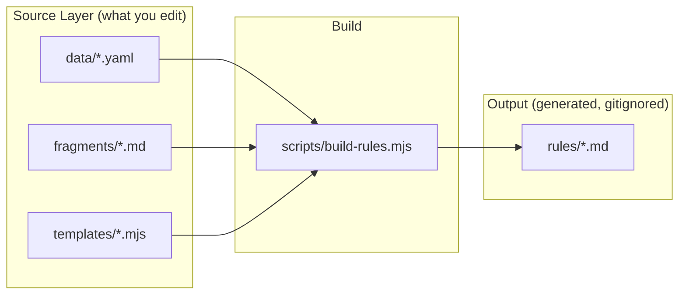

# Rules Build Pipeline

## Architecture

The build produces the same 7 output `.md` files that exist today, from three source layers:




All source files live under `packages/interact/_content/`. The build script reads them and writes the final `.md` files to `packages/interact/rules/`.

## Source Layer

### 1. Data files (`_content/data/`)

`**triggers.yaml**` — one entry per trigger, capturing everything that varies:

```yaml
triggers:
  - name: hover
    a11yAlias: interest
    a11yNote: "Use `trigger: 'interest'` instead of `trigger: 'hover'` to also respond to keyboard focus."
    category: event           # event | viewport | scroll | pointer | chain
    supportsTimeEffect: true
    supportsStateEffect: true
    supportsScrubEffect: false
    supportsCustomEffect: true
    params: []                # no trigger params
    pitfalls:
      - id: hit-area          # references fragments/pitfalls/hit-area.md
    templateFields:            # which optional fields to show in config templates
      timeEffect: [triggerType, keyframeEffect, namedEffect, fill, duration, easing, delay, iterations, alternate]
      stateEffect: [stateAction, transition, transitionProperties]
      customEffect: [triggerType, customEffect, duration, easing]
      sequence: [triggerType, offset, offsetEasing]
    triggerTypeDescriptions:   # trigger-specific wording for each triggerType value
      alternate: "plays forward on enter, reverses on leave"
      repeat: "restarts the animation from the beginning on each enter. On leave, jumps to the beginning and pauses"
      once: "plays once on the first enter and never again"
      state: "resumes on enter, pauses on leave. Useful for continuous loops (`iterations: Infinity`)"
    stateActionDescriptions:
      toggle: "applies the style state on enter, removes on leave"
      add: "applies the style state on enter. Leave does NOT remove it"
      remove: "removes a previously applied style state on enter"
      clear: "clears all previously applied style states on enter"
    fillNote: "while hovering"  # trigger-specific fill context

  - name: click
    a11yAlias: activate
    a11yNote: "Use `trigger: 'activate'` instead of `trigger: 'click'` to also respond to keyboard activation (Enter / Space)."
    category: event
    supportsTimeEffect: true
    supportsStateEffect: true
    supportsScrubEffect: false
    supportsCustomEffect: true
    params: []
    pitfalls: []
    templateFields:
      timeEffect: [triggerType, keyframeEffect, namedEffect, fill, reversed, duration, easing, delay, iterations, alternate, effectId]
      # ... (click includes reversed + effectId that hover omits)
    triggerTypeDescriptions:
      alternate: "plays forward on first click, reverses on next click"
      repeat: "restarts the animation from the beginning on each click"
      once: "plays once on the first click and never again"
      state: "resumes/pauses the animation on each click. Useful for continuous loops (`iterations: Infinity`)"
    stateActionDescriptions:
      toggle: "applies the style state, removes it on next click"
      add: "applies the style state. Does not remove on subsequent clicks"
      remove: "removes a previously applied style state"
      clear: "clears all previously applied style states. Useful for resetting multiple stacked style states at once"
    fillNote: "while finished"
    # ... viewEnter, viewProgress, pointerMove, animationEnd entries follow
```

The trigger entries for `viewEnter`, `viewProgress`, `pointerMove`, and `animationEnd` follow the same shape but will include their `params` definitions (from the real TypeScript types in `[packages/interact/src/types/triggers.ts](packages/interact/src/types/triggers.ts)`).

`**effects.yaml**` — shared effect field definitions, fill guidance, easing list:

```yaml
fillGuidance:
  both: "use for scroll-driven, pointer-driven, and toggling effects (alternate, repeat, state)"
  backwards: "use for entrance animations with triggerType 'once' when the final keyframe matches the element's base style"

triggerTypes: [once, repeat, alternate, state]
stateActions: [toggle, add, remove, clear]

easings:
  - linear
  - ease
  # ... full list from full-lean.md line 350

presets:
  entrance: [FadeIn, GlideIn, SlideIn, ...]
  ongoing: [Pulse, Spin, Breathe, ...]
  scroll: [FadeScroll, RevealScroll, ...]
  mouse: [TrackMouse, Tilt3DMouse, ...]

rangeNames:
  entry: "Element entering viewport"
  exit: "Element exiting viewport"
  contain: "After entry range and before exit range"
  cover: "Full range from entry through contain and exit"
  entry-crossing: "From element's leading edge entering to trailing edge entering"
  exit-crossing: "From element's leading edge exiting to trailing edge exiting"
```

`**meta.yaml**` — package metadata:

```yaml
packageName: "@wix/interact"
presetsPackage: "@wix/motion-presets"
installCommand: "npm install @wix/interact @wix/motion-presets"
entryPoints:
  web: "@wix/interact/web"
  react: "@wix/interact/react"
  vanilla: "@wix/interact"
```

### 2. Markdown fragments (`_content/fragments/`)

Each fragment has `<!-- #section -->` markers for different detail levels.

**Planned fragments** (extracted from the ~15 duplicated concepts):


| Fragment file                        | Sections                                                                                   | Used by                                     |
| ------------------------------------ | ------------------------------------------------------------------------------------------ | ------------------------------------------- |
| `fouc.md`                            | `#short`, `#long`, `#code-generate`, `#code-web`, `#code-react`, `#code-vanilla`, `#rules` | full-lean, integration, viewenter           |
| `element-resolution.md`              | `#source`, `#target`, `#intro`                                                             | full-lean, integration                      |
| `pitfalls/hit-area.md`               | `#hover`, `#pointermove`, `#full-lean-hover`, `#full-lean-pointermove`                     | hover, pointermove, full-lean               |
| `pitfalls/overflow-clip.md`          | `#short`, `#long`                                                                          | viewprogress, full-lean                     |
| `pitfalls/same-element-viewenter.md` | `#short`, `#long`                                                                          | viewenter, full-lean                        |
| `pitfalls/dont-guess-presets.md`     | `#default`                                                                                 | full-lean, pointermove (Rule 1 variables)   |
| `pitfalls/reduced-motion.md`         | `#default`                                                                                 | full-lean                                   |
| `pitfalls/perspective.md`            | `#default`                                                                                 | full-lean                                   |
| `quick-start.md`                     | `#web`, `#react`, `#vanilla`, `#cdn`, `#register-presets`                                  | full-lean, integration                      |
| `multiple-effects-note.md`           | `#default` (parameterized with `{{triggerName}}`)                                          | hover, viewenter, viewprogress, pointermove |
| `custom-effect-intro.md`             | `#default`                                                                                 | click, hover, viewenter                     |
| `sequences-intro.md`                 | `#short` (parameterized with `{{triggerName}}`)                                            | click, hover, viewenter                     |


### 3. Templates (`_content/templates/`)

Each template is a `.mjs` file exporting a function that receives data + fragments and returns a markdown string.


| Template                 | Generates              | Key logic                                                                                                                                                                                                                                  |
| ------------------------ | ---------------------- | ------------------------------------------------------------------------------------------------------------------------------------------------------------------------------------------------------------------------------------------ |
| `event-trigger-rule.mjs` | `click.md`, `hover.md` | Parameterized by trigger data. Generates Rule 1 (TimeEffect), Rule 2 (StateEffect), Rule 3 (customEffect), Rule 4 (sequences). The config block fields, variable descriptions, and trigger-specific wording all come from `triggers.yaml`. |
| `viewenter-rule.mjs`     | `viewenter.md`         | Includes FOUC section (from fragment), params on every template, no StateEffect rule.                                                                                                                                                      |
| `viewprogress-rule.mjs`  | `viewprogress.md`      | Scrub effects, range semantics, sticky pattern.                                                                                                                                                                                            |
| `pointermove-rule.mjs`   | `pointermove.md`       | Progress type, centering, device conditions, composite pattern.                                                                                                                                                                            |
| `full-lean.mjs`          | `full-lean.md`         | Comprehensive reference. Pulls from all data + fragments.                                                                                                                                                                                  |
| `integration.mjs`        | `integration.md`       | Integration guide. Pulls from meta + triggers data + fragments.                                                                                                                                                                            |


**Template function signature:**

```javascript
// event-trigger-rule.mjs
export function render(trigger, data, fragments) {
  return `# ${capitalize(trigger.name)} Trigger Rules for ${data.meta.packageName}
...
${trigger.a11yAlias ? `**CRITICAL — Accessible ${trigger.name}**: ${trigger.a11yNote}` : ''}
${trigger.pitfalls.map(p => fragments.get(`pitfalls/${p.id}`, trigger.name)).join('\n')}
...`;
}
```

## Build Script (`scripts/build-rules.mjs`)

~150 lines of Node.js ESM. Core flow:

1. Load all YAML files from `_content/data/` using `js-yaml`
2. Load all fragment `.md` files, parse `<!-- #section -->` markers into a `Map<path, Map<section, string>>`
3. For each template, call its `render()` function with the appropriate data and fragments
4. Write output to `packages/interact/rules/`
5. Report what was generated

**Fragment resolution with parameterization:**

```javascript
class Fragments {
  get(path, section = 'default', params = {}) {
    let content = this.store.get(path)?.get(section);
    for (const [key, val] of Object.entries(params)) {
      content = content.replaceAll(`{{${key}}}`, val);
    }
    return content;
  }
}
```

**Dependencies:** Add `js-yaml` as a devDependency in `packages/interact/package.json`. No other new dependencies needed — Node 22 ESM handles everything.

## Integration with Existing Pipeline

- Add script to `[packages/interact/package.json](packages/interact/package.json)`:

```json
  "build:rules": "node scripts/build-rules.mjs"
  

```

- Add `build:rules` as a `prebuild` step or keep it manual (recommend manual for now — rules change infrequently)
- Update `[.github/workflows/interactdocs.yml](/.github/workflows/interactdocs.yml)` to run `build:rules` before copying rules to `_site/rules/`
- Generated `rules/*.md` files can be either committed (simpler CI) or gitignored (cleaner repo) — recommend **committed** initially so the npm package always has them, with a CI check that verifies they're up to date (`build:rules && git diff --exit-code rules/`)

## Known Fixes Included in Migration

These existing issues will be fixed as a natural consequence of the migration:

- `[EFFECT_DEFINTION]` typo in click/hover/viewenter sequence blocks (fix in template once)
- `hitAea` typo in pointermove.md (fix in fragment once)
- `type: 'once'` vs `triggerType: 'once'` inconsistency in full-lean.md FOUC section
- hover.md missing `reversed` and `effectId` fields in TimeEffect template (decide once in `triggers.yaml` whether they belong)
- `generate` import path inconsistency (`@wix/interact` vs `@wix/interact/web`) — standardize in FOUC fragment
- Missing "Multiple effects" note in click.md (present in hover.md but absent in click.md)
- Inconsistent "additional effects" comments across files

## Future Extension Points

- **docs/**: Same `_content/data/` feeds docs templates — add `_content/templates/docs/` later
- **README**: Same meta.yaml + triggers.yaml generates README sections
- **Validation**: Add `scripts/validate-rules.mjs` that imports actual TS types and cross-checks trigger names, param fields, effect fields against the YAML data
- **motion-presets rules**: The build mechanism is scoped to `packages/interact/` but the architecture (YAML + fragments + templates) can be replicated in `packages/motion-presets/` with shared fragments if needed

