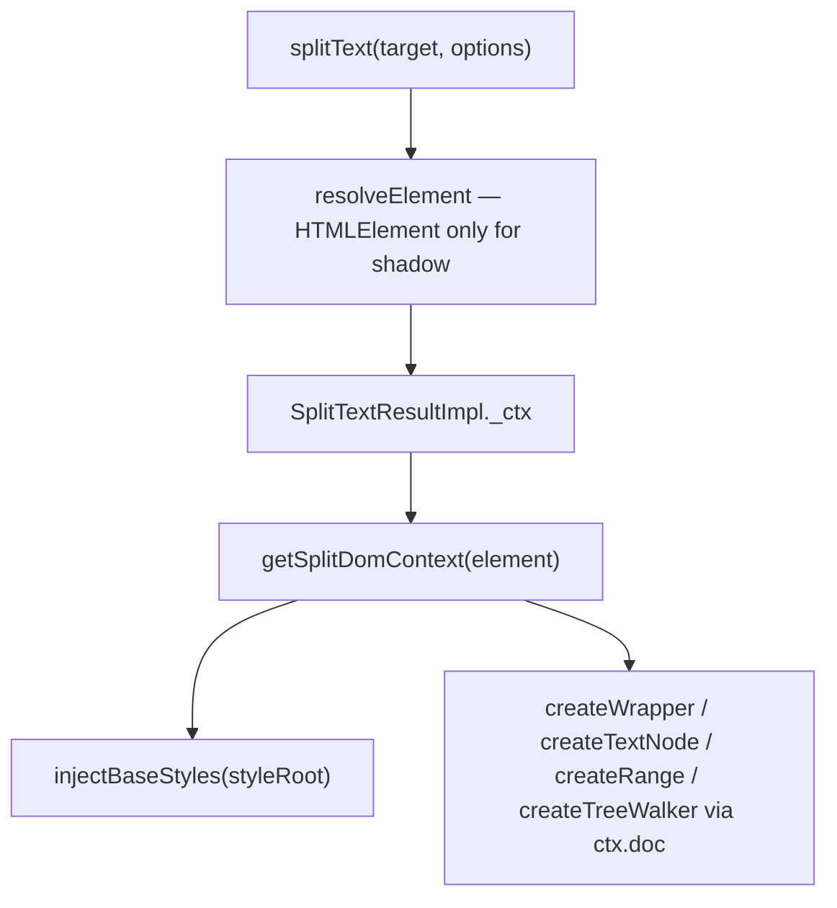

# Shadow DOM and DOM-context fix for SplitText

## Problem

Several modules use the global `document` for node creation, ranges, tree walking, style injection, and selector resolution. This breaks or degrades behavior in two scenarios:

1. **Shadow DOM / custom elements** — `document.querySelector` cannot find shadow-internal targets; document-level styles do not penetrate shadow boundaries (`.split-c`, `.sr-only`, etc. never apply).
2. **Iframes / multi-document** — global `document` may not match `element.ownerDocument`, causing wrong or invalid node adoption.

Only [`_buildDomPreserve`](packages/splittext/src/splitText.ts) already uses `element.ownerDocument.createElement` correctly.

## Architecture

Introduce a small internal helper module and store context on the result instance:



### New file: [`packages/splittext/src/domContext.ts`](packages/splittext/src/domContext.ts)

```ts
export interface SplitDomContext {
  doc: Document;
  styleRoot: Document | ShadowRoot;
}

export function getSplitDomContext(element: HTMLElement): SplitDomContext {
  const doc = element.ownerDocument;
  const root = element.getRootNode();
  return {
    doc,
    styleRoot: root instanceof ShadowRoot ? root : doc,
  };
}
```

Keep this **internal** (not exported from [`index.ts`](packages/splittext/src/index.ts)).

---

## Code changes

### 1. Style injection — [`wrappers.ts`](packages/splittext/src/wrappers.ts)

Refactor `injectBaseStyles` to accept `styleRoot: Document | ShadowRoot` instead of `doc: Document = document`.

- Replace the per-document boolean marker with a **`WeakSet<Document | ShadowRoot>`** so multiple shadow roots on one page each get styles once.
- **Document path** (unchanged behavior): `adoptedStyleSheets` on `doc`, fallback `<style>` in `doc.head ?? doc.documentElement`.
- **ShadowRoot path** (new): `shadowRoot.adoptedStyleSheets.push(sheet)`, fallback append `<style>` directly to the shadow root.
- Remove the `document` default parameter entirely — callers must pass an explicit root.

Constructor change in [`splitText.ts`](packages/splittext/src/splitText.ts):

```ts
// before
injectBaseStyles(element.ownerDocument);
// after
const ctx = getSplitDomContext(element);
injectBaseStyles(ctx.styleRoot);
```

Store `ctx` as `private readonly _ctx: SplitDomContext` on `SplitTextResultImpl`.

### 2. Node factories — thread `ctx.doc`

Add a final `doc: Document` parameter to internal helpers (or pass full `SplitDomContext` where both are needed). Replace every `document.createElement` / `createTextNode` / `createRange` / `createTreeWalker` with `doc.*` equivalents.

| File | Changes |
|------|---------|
| [`wrappers.ts`](packages/splittext/src/wrappers.ts) | `createWrapper(..., doc)` |
| [`accessibility.ts`](packages/splittext/src/accessibility.ts) | `applyAccessibility(..., doc)` |
| [`utils.ts`](packages/splittext/src/utils.ts) | `walkTextNodes(root, cb, ignore, doc)`, `flattenBeyondDepth(..., doc)` |
| [`lineDetection.ts`](packages/splittext/src/lineDetection.ts) | `detectLinesFromTextNode` uses `textNode.ownerDocument.createRange()`; `detectLines` passes `doc` to `walkTextNodes` |
| [`splitText.ts`](packages/splittext/src/splitText.ts) | Top-level `splitChars` / `splitWordsWithSpacing` / `splitSentences`, `_applyBidi`, all `createWrapper` / `walkTextNodes` / `applyAccessibility` / `detectLines` call sites pass `this._ctx.doc` |
| [`nestedSplit.ts`](packages/splittext/src/nestedSplit.ts) | Add `doc` param to `buildNestedNodes`, `buildNestedFromLines`, and internal split helpers; thread from `splitText.ts` |

**`_buildDomPreserve`**: replace bare `createElement('div')` pattern with `this._ctx.doc` (already uses `ownerDocument` — unify on `_ctx.doc`).

### 3. Font observer — [`splitText.ts`](packages/splittext/src/splitText.ts)

In `_attachObservers`, replace global `document.fonts` with `this._ctx.doc.fonts`:

```ts
const fonts = this._ctx.doc.fonts;
if (fonts) fonts.ready.then(() => this._resplit());
```

### 4. String selectors — no API change (per your choice)

Keep `resolveElement` using `document.querySelector` for string targets. **Do not** add a `queryRoot` option.

Document clearly in AGENTS.md (and a brief JSDoc on `splitText`'s `target` param) that:
- String selectors only resolve in the **light DOM**.
- Targets inside Shadow DOM **must** be passed as an `HTMLElement` ref (e.g. via `useSplitText(ref)` or `host.shadowRoot.querySelector(...)` called by the consumer).

---

## Tests

Add [`packages/splittext/test/shadowDom.spec.ts`](packages/splittext/test/shadowDom.spec.ts):

| Test | Asserts |
|------|---------|
| Open shadow root + `HTMLElement` target | Split produces `.split-c` spans inside shadow |
| Base styles in shadow | After split, wrapper has expected layout (e.g. `getComputedStyle(span).display === 'inline-block'`) — may need to check injected `<style>` or `adoptedStyleSheets` depending on jsdom support |
| String selector inside shadow | Throws or returns not found (existing error path) — confirms documented limitation |
| `aria: 'auto'` in shadow | `.sr-only` span exists and is visually hidden via injected shadow styles |

Reuse existing test helpers from [`splitText.spec.ts`](packages/splittext/test/splitText.spec.ts) where practical (extract `el()` helper to a shared `test/helpers.ts` only if duplication is significant — optional).

Run: `nvm use && yarn workspace @wix/splittext test`

---

## New AGENTS.md — [`packages/splittext/AGENTS.md`](packages/splittext/AGENTS.md)

Follow the tone/structure of [`apps/website/AGENTS.md`](apps/website/AGENTS.md). Suggested sections:

1. **What this is** — `@wix/splittext` package map (`src/`, `test/`, entry points).
2. **DOM context rules (mandatory for contributors)**
   - Never use the global `document` for node creation, ranges, tree walkers, or font observers.
   - Always derive context from the target element via `getSplitDomContext(element)`.
   - `doc` = `element.ownerDocument` (node factories, ranges, fonts).
   - `styleRoot` = `ShadowRoot` if `element.getRootNode()` is a `ShadowRoot`, else `doc` (stylesheet injection only).
3. **Shadow DOM / custom elements**
   - Pass `HTMLElement`, not CSS selector strings.
   - Custom elements must either use open shadow + element ref, or duplicate base CSS in their shadow stylesheet if they opt out of auto-injection.
   - Element-scoped `querySelector` on the target container is fine; `document.querySelector` is not.
4. **Style injection** — explain `injectBaseStyles(styleRoot)`, WeakSet dedup, adoptedStyleSheets + fallback.
5. **Key files table** — `splitText.ts`, `domContext.ts`, `wrappers.ts`, `nestedSplit.ts`, `lineDetection.ts`, `accessibility.ts`, `utils.ts`.
6. **Testing** — `vitest` + jsdom, shadow DOM spec location, line-detection mock pattern.
7. **CLI** — `nvm use`, `yarn workspace @wix/splittext test/build`.

Optionally add `packages/splittext/CLAUDE.md` symlink to AGENTS.md (matches website convention) — only if you want tooling parity.

---

## Out of scope

- README user-facing docs update (AGENTS.md is contributor-facing; a one-line shadow DOM note in README can be a follow-up).
- Root [`AGENTS.md`](AGENTS.md) cross-link (optional follow-up).
- Closed shadow root access from outside the CE (inherently impossible — document as limitation).

## Risk notes

- jsdom may not fully support `ShadowRoot.adoptedStyleSheets`; the `<style>` fallback path must be exercised in tests.
- `getComputedStyle` in jsdom shadow trees can be flaky — prefer asserting presence of injected `<style>` in shadow root and correct span class/DOM structure as primary signals.
